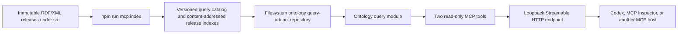

# Local Universal Ontology MCP server

The local Universal Ontology MCP server gives MCP-capable hosts read-only,
page-independent access to authored ontology labels, identifiers, and lexical
definitions. It runs directly from generated repository artifacts at
`http://127.0.0.1:8000/mcp`; no website, browser tab, frontend development
server, AWS resource, or Google Cloud resource is involved.

The implementation's primary protocol revision is MCP `2026-07-28`. It also
retains stateless legacy compatibility for hosts that have not yet negotiated
that revision.

## Quick start

Prerequisites:

- Node.js 24.
- npm, using the lockfile in this repository.
- A local checkout containing the extensionless RDF/XML ontology release
  artifacts under `src/`.

From the repository root, install the pinned dependencies, generate the query
artifacts, and start the server:

```powershell
npm ci
npm run mcp:index
npm run mcp:serve
```

The server validates and loads the generated catalog before it opens the TCP
listener. A successful startup emits a structured `mcp_server_listening` event
with address `127.0.0.1`, port `8000`, and MCP path `/mcp`.

In another PowerShell terminal, verify readiness:

```powershell
Invoke-RestMethod -Uri "http://127.0.0.1:8000/healthz"
```

Expected fields:

```json
{
  "status": "ready",
  "catalogReady": true,
  "primaryMcpProtocolVersion": "2026-07-28"
}
```

The development runner never listens in a `not_ready` state. If catalog or
index validation fails, startup rejects and the process exits non-zero without
opening the port.

Stop the server with Ctrl+C. `SIGINT` and `SIGTERM` both begin the same
idempotent shutdown operation: the listener stops accepting connections first,
idle connections close, and active requests receive up to ten seconds to
finish. Only after that deadline are outstanding query signals aborted and
active connections force-closed. A forced or failed shutdown sets a non-zero
process exit code.

## Runtime and artifact boundaries



This layering is intentional:

- The generator parses RDF/XML and creates a deterministic, query-oriented
  projection. Runtime requests do not parse the source ontology again.
- The filesystem adapter returns untrusted bytes and enforces path containment
  and symlink rejection. It does not interpret ontology semantics.
- The query module verifies digests, validates complete documents, resolves
  releases, applies language preference, ranks matches, and owns the bounded
  in-memory query-index cache.
- MCP and HTTP are outer adapters. They contain no ontology interpretation
  rules, which leaves the same query contract usable by a future S3 adapter and
  production runner.

## Generate and refresh query artifacts

Run the deterministic generator explicitly:

```powershell
npm run mcp:index
```

The default output root is `dist/query/v1`:

```text
dist/query/v1/
├── catalog.json
└── releases/<ontologyArtifactFamilyId>/<versionTag>/<queryIndexSha256>.json
```

`catalog.json` has `queryArtifactKind` value
`universal_ontology_query_catalog` and `queryArtifactFormatVersion` value `1`.
Each referenced release document has kind
`universal_ontology_release_query_index` and the same format version. The
catalog records both the source-artifact SHA-256 digest and the generated
query-index SHA-256 digest. Release-index filenames are content addressed by
the latter digest.

Generation follows a publish-last rule:

1. Discover eligible immutable source artifacts.
2. Parse and semantically project every selected release.
3. Validate and serialize each release index deterministically.
4. Write every content-addressed release index.
5. Atomically replace `catalog.json` only after all referenced indexes exist.

A failed run therefore leaves the preceding catalog usable. A later run can
leave unreferenced content-addressed files in place; they are unreachable from
the new catalog and are not selected by the server.

Use the combined development command when the source ontology or projection
code may have changed:

```powershell
npm run mcp:dev
```

That command regenerates the artifacts and then starts the server. Regenerate
after any change to:

- an eligible source release under `src/`;
- release-discovery or latest-stable selection policy;
- RDF-to-query projection semantics;
- a query-artifact schema; or
- deterministic serialization.

The running process loads one catalog snapshot and caches parsed immutable
release query indexes in memory. It does not watch the filesystem. Stop and
restart it after regeneration. If the representation changes incompatibly,
introduce a new format version and query-root directory instead of silently
reinterpreting format version `1`.

The repository-local `stdio` installation uses this same `dist/query/v1` tree
by default, but it does **not** require the loopback development server. Running
`scripts/set_up_mcp_servers.py` invokes the authoritative `mcp:index` generator,
installs the application bundle, and configures the MCP host to let that bundle
open the filesystem artifacts directly. See the
[local installation guide](local-installation.md#select-the-repository-local-query-artifact-source)
for the explicit HTTP alternative.

## Local runner configuration

The local security boundary is intentionally narrow. Only these environment
variables are supported:

| Environment variable                           |                      Default | Constraint and effect                                                                                                                     |
| ---------------------------------------------- | ---------------------------: | ----------------------------------------------------------------------------------------------------------------------------------------- |
| `UNIVERSAL_ONTOLOGY_MCP_PORT`                  |                       `8000` | Decimal integer from `1` through `65535`. Changes both `/mcp` and `/healthz`; update the host URL to match.                               |
| `UNIVERSAL_ONTOLOGY_QUERY_ROOT`                | `<repository>/dist/query/v1` | Filesystem root containing `catalog.json` and its referenced release indexes. Relative values resolve from the process working directory. |
| `UNIVERSAL_ONTOLOGY_QUERY_CACHE_MAXIMUM_BYTES` |                   `67108864` | Positive safe integer giving the in-memory parsed query-index LRU byte budget. Accounting uses validated raw index byte lengths.          |

For example, to use port 8001 in the current PowerShell session:

```powershell
$env:UNIVERSAL_ONTOLOGY_MCP_PORT = "8001"
npm run mcp:serve
```

There is deliberately no bind-address variable. The local runner always binds
the IPv4 loopback address `127.0.0.1`. A production runner is a separate entry
point with a different security model; do not repurpose this runner for a LAN,
container ingress, tunnel, or public endpoint.

## Public tool contracts

The catalog exposes exactly two tools, in this order:

1. `search_entities`
2. `resolve_entity`

The names do not repeat `ontology` or `universal_ontology` because the visible
server identity already supplies that namespace. Both tools are annotated as
read-only, non-destructive, idempotent, and closed-world with respect to the
selected generated releases.

### `search_entities`

Use `search_entities` when the user supplies a name, phrase, identifier, IRI
local name, or definition text. It searches authored values and returns ranked
matches with enough selected lexical-definition and release provenance data to
answer a definition question in one call.

Input fields:

- `queryText` is required, must contain a non-whitespace character, and is at
  most 256 characters.
- `ontologyReleaseSelection` is optional. Omission selects the latest stable
  releases of `universal/core`, `universal/extended`, and
  `universal/reference-data`.
- `entityKinds` can restrict results to one or more of `owl_class`,
  `owl_object_property`, `owl_datatype_property`,
  `owl_annotation_property`, `owl_named_individual`, and `rdfs_datatype`.
- `preferredLanguageTags` defaults to `['en-GB', 'en']` and applies RFC 4647
  basic language filtering in caller order.
- `maximumResultCount` defaults to `10` and accepts integers from `1` through
  `20`.

The structured success result reports the normalized caller query, every
concrete release selected, total and returned match counts, truncation, the
deterministic match kind, the exact matched ontology value, and aggregated
ontology-entity descriptions. It never exposes a private normalized search
key as ontology-authored text.

### `resolve_entity`

Use `resolve_entity` after the intended entity is known. Its required
`entityIdentifier` is one of:

- `{"identifierKind":"entity_iri","identifierValue":"<absolute IRI>"}`;
- `{"identifierKind":"uuid_urn","identifierValue":"<UUID URN>"}`; or
- `{"identifierKind":"preferred_label","identifierValue":"<label>"}`.

It accepts the same optional release selection and preferred language tags as
search. A preferred label is not globally unique: the success result's
`resolutionStatus` is explicitly `found`, `ambiguous`, or `not_found`.
Ambiguity and absence are normal successful query outcomes, not permission to
select an arbitrary candidate or invent a definition.

### Release selection

To limit a query to latest stable releases in named families:

```json
{
  "selectionKind": "latest_stable_releases",
  "ontologyArtifactFamilyIds": ["universal/core"]
}
```

To select immutable releases exactly:

```json
{
  "selectionKind": "specified_releases",
  "ontologyReleases": [
    {
      "ontologyArtifactFamilyId": "universal/core",
      "versionTag": "20260714"
    }
  ]
}
```

Unknown but syntactically valid families or releases return actionable domain
failures. They are never silently omitted or replaced with a nearby version.

Every application-produced tool result contains validated structured content
and one plain-text rendering. The text starts by framing ontology-authored
content as untrusted data. The pinned SDK's own pre-callback argument-validation
error is the deliberate exception: it is an `isError: true` correction result
without application structured content, and the query module is not called.

## Reproducible `Person` acceptance case

For a release-stable check, call `search_entities` with an explicit family:

```json
{
  "queryText": "Person",
  "ontologyReleaseSelection": {
    "selectionKind": "latest_stable_releases",
    "ontologyArtifactFamilyIds": ["universal/core"]
  },
  "preferredLanguageTags": ["en-GB", "en"],
  "maximumResultCount": 10
}
```

The current generated corpus resolves the following authored assertions:

| Result field            | Exact value                                                        |
| ----------------------- | ------------------------------------------------------------------ |
| Entity IRI              | `https://haddenindustries.com/ontology/universal/core/Person`      |
| Entity kind             | `owl_class`                                                        |
| Preferred label         | `Person` (`en`)                                                    |
| Definition property     | `http://www.w3.org/2004/02/skos/core#definition`                   |
| Definition language     | `en-gb`                                                            |
| Assertion scope         | `source_artifact_graph`                                            |
| Artifact family         | `universal/core`                                                   |
| Immutable release       | `20260714`                                                         |
| Source-artifact URL     | `https://haddenindustries.com/ontology/universal/core/20260714`    |
| Source-artifact SHA-256 | `9cb764f62461835c2ea9d309a9a4d8aca362d464cd3aa43145c3a1d01a8ee228` |
| Entity source IRI       | `urn:iso:std:iso-iec:14662:ed-3:v1:term:3.24`                      |

The exact definition lexical form is:

> Entity, i.e. a natural or legal person, recognised by law as having legal
> rights and duties, able to make commitment(s), assume and fulfil resulting
> obligation(s), and able to be held accountable for its action(s)

Describe this as an **asserted lexical definition** carried by
`skos:definition` in the selected **source-artifact graph**. Do not describe it
as an inferred OWL fact or a logical class definition. The entity-level source
IRI is a separate `dcterms:source` assertion about the entity description; it
does not, by itself, prove provenance for the individual definition assertion.

A useful host acceptance prompt is:

```text
Find the definition of Person in the Universal Ontology and cite the ontology release and source IRI.
```

Run that prompt with every website and browser page closed. The result must be
unchanged because the MCP capability is owned by the standalone process, not a
page lifecycle.

## Connect Codex to the loopback HTTP server manually

The repository-local installation command documented in
[the local installation guide](local-installation.md#install-both-repository-local-mcp-servers)
manages a page-independent `stdio` entry named `universal_ontology`. It does
not point that entry at this loopback HTTP development topology.

When specifically testing the Streamable HTTP adapter, add the following
separate project-scoped entry manually. The name `universal_ontology_loopback`
identifies the transport and lifecycle precisely and avoids colliding with the
installed `stdio` server:

```toml
[mcp_servers.universal_ontology_loopback]
url = "http://127.0.0.1:8000/mcp"
startup_timeout_sec = 10
tool_timeout_sec = 30
required = true
default_tools_approval_mode = "writes"
enabled_tools = [
  "search_entities",
  "resolve_entity",
]
```

`default_tools_approval_mode = "writes"` is deliberate. These two annotated
read-only tools can run without a write prompt, while any future write-capable
tool would require approval. Restart or reload the relevant Codex host after a
manual configuration change, then confirm that exactly the two tools above are
visible under the loopback entry. Remove the entry when HTTP-adapter testing is
complete; it is not an installed-server configuration.

## Inspect the server with MCP Inspector

Keep `npm run mcp:serve` running in one terminal. To open MCP Inspector's UI:

```powershell
npx --yes @modelcontextprotocol/inspector@2.4.0 --server-url http://127.0.0.1:8000/mcp --transport http
```

Inspect the server identity, instructions, and the two tool schemas. For a
machine-checkable catalog probe:

```powershell
npx --yes @modelcontextprotocol/inspector@2.4.0 --cli --server-url http://127.0.0.1:8000/mcp --transport http --method tools/list
```

The tool list must contain `search_entities` followed by `resolve_entity`, with
no resource or prompt catalog in this first release.

To reproduce the real-corpus `Person` call from PowerShell without relying on
an interactive host:

```powershell
npx --yes @modelcontextprotocol/inspector@2.4.0 --cli --server-url http://127.0.0.1:8000/mcp --transport http --method tools/call --tool-name search_entities --tool-args-json '{"queryText":"Person","ontologyReleaseSelection":{"selectionKind":"latest_stable_releases","ontologyArtifactFamilyIds":["universal/core"]},"preferredLanguageTags":["en-GB","en"],"maximumResultCount":10}' --format json
```

The first match must be the `Person` entity documented above, with
`matchBasis: preferred_label_exact`.

## Loopback security and resource bounds

Loopback is a security boundary, but it is not sufficient by itself. The
runner applies these controls before ontology query dispatch:

- Fixed bind address `127.0.0.1`; no non-loopback override.
- Official localhost Host validation to block DNS rebinding.
- Official localhost Origin validation to block calls from hostile browser
  origins. Native clients without an `Origin` header are allowed.
- Exact routing: only `/mcp` and `/healthz` exist.
- JSON request bodies bounded at 131072 bytes before SDK parsing.
- A per-loopback-address monotonic token bucket: 120 requests per minute with
  burst 30. Wall-clock changes cannot replenish it.
- At most eight active MCP requests. A ninth request is not queued and its body
  is not read.
- Cancellation propagation from disconnected clients and forced shutdown into
  query-artifact repository reads and query execution.

Host, Origin, route, rate, and concurrency failures can occur before a request
body is consumed. Their responses are fixed, never echo a request identifier or
request-derived text, set `Connection: close`, and disable HTTP persistence so
unread bytes cannot be reinterpreted as a pipelined request. Rate exhaustion
returns HTTP 429 with `Retry-After`; concurrency exhaustion returns HTTP 503
with `Retry-After: 1`.

There is no authentication on this local endpoint. Do not expose it through a
port-forward, reverse proxy, public tunnel, shared container network, or
non-loopback bind. Production authorization is a separate adapter concern.

Application request and lifecycle events are emitted to stderr as one JSON
object per event with timestamp, severity, event name, correlation identifier,
monotonic duration, outcome, and a safe error code. Query text, definitions,
labels, entity IRIs, UUIDs, source IRIs, stack traces, and local paths are not
logged by default. The pinned MCP SDK may additionally print one informational
startup warning explaining that JSON response mode drops mid-call
notifications; this server exposes neither subscriptions nor mid-call
notifications, so the selected behavior is intentional.

## Semantic limits

The server provides a precise projection, not an OWL reasoner or general SPARQL
endpoint:

- **Asserted source graph only.** Returned descriptions represent assertions
  in each selected immutable source artifact. They are not a merged inferred
  graph.
- **No import closure.** The query does not dereference `owl:imports`, external
  entity IRIs, source IRIs, or `seeAlso` IRIs at request time.
- **No inference.** Direct named superclasses and class memberships are
  asserted relations only. The server does not compute subclass closure,
  equivalent-class consequences, domain/range consequences, or consistency.
- **Lexical is not logical.** A `skos:definition` or retained historical
  definition-property literal is a lexical definition. It is not an OWL class
  expression such as a restriction, intersection, or equivalence axiom.
- **Punning is preserved.** One IRI can have several asserted OWL/RDFS entity
  kinds; the projection does not force it into one database-record type.
- **Authored text is data.** Labels, definitions, scope notes, and query text
  remain untrusted strings even after integrity verification and must never be
  interpreted as host instructions.
- **Language selection is deterministic.** Preferred tags choose display
  values, while complete assertion arrays retain other authored language
  variants and historical properties.
- **No broad query language.** There is intentionally no generic `query`,
  `run_sparql`, `ask`, or mutation tool.

## Common errors

| Symptom                                                                         | Meaning and action                                                                                                                                    |
| ------------------------------------------------------------------------------- | ----------------------------------------------------------------------------------------------------------------------------------------------------- |
| Startup exits with `SERVER_STARTUP_FAILED` or `QUERY_INDEX_CATALOG_UNAVAILABLE` | Generate artifacts with `npm run mcp:index`, verify `UNIVERSAL_ONTOLOGY_QUERY_ROOT`, and restart. The port was not opened.                            |
| Startup reports `EADDRINUSE`                                                    | Another process owns the requested port. Stop that process or select another valid `UNIVERSAL_ONTOLOGY_MCP_PORT` and update the host URL.             |
| HTTP 403                                                                        | Host or Origin validation rejected the request. Connect directly to `127.0.0.1` and do not synthesize a non-local Host or browser Origin.             |
| HTTP 404                                                                        | The path is not exactly `/mcp` or `/healthz`. Query strings are not part of the v1 route contract.                                                    |
| HTTP 406                                                                        | A Streamable HTTP POST must advertise both `application/json` and `text/event-stream` in `Accept`. Prefer an official MCP client.                     |
| HTTP 415                                                                        | A POST did not use `Content-Type: application/json`.                                                                                                  |
| HTTP 413                                                                        | The body exceeded 131072 bytes. Reduce the call; ontology lookup inputs are intentionally small.                                                      |
| HTTP 429                                                                        | The local token bucket is exhausted. Respect `Retry-After`; do not spin.                                                                              |
| HTTP 503                                                                        | The server is draining or already has eight active MCP requests. Respect `Retry-After` and retry after capacity is available.                         |
| `UNKNOWN_ONTOLOGY_ARTIFACT_FAMILY` or `UNKNOWN_ONTOLOGY_RELEASE`                | The selection is syntactically valid but absent from the catalog. Inspect `catalog.json` and supply an exact catalog identity.                        |
| `QUERY_INDEX_DIGEST_MISMATCH` or `QUERY_INDEX_SCHEMA_UNSUPPORTED`               | Treat the generated query artifacts as untrusted or stale. Regenerate; if the problem persists, investigate before serving. Do not bypass validation. |
| Results do not reflect regenerated files                                        | The process intentionally holds one catalog snapshot. Stop and restart it.                                                                            |
| Process exits 1 after shutdown                                                  | Active work exceeded the ten-second deadline or cleanup failed. Inspect safe structured lifecycle events; the forced exit is intentional.             |

## Distribution and optional hosted adapters

The accepted distribution design makes a locally launched `stdio` process the
page-independent server topology. Query execution needs no hosted MCP compute:
the local process retrieves independently changing ontology artifacts from the
configured origin, then verifies, caches, searches, and resolves them locally.
Development software remains in a trusted checkout, local build output, or a
short-lived GitHub Actions artifact; it is not published to a package, image,
Registry, release, or cloud namespace.

See the accepted
[distributable local MCP server design](../specs/2026-08-31-distributable-local-universal-ontology-mcp-server-design.md)
and its
[implementation plan](../plans/2026-08-31-distributable-local-universal-ontology-mcp-server.md)
for the normative boundaries. The separate
[local installation guide](local-installation.md) covers installed `stdio`
operation; this page remains the repository-only loopback HTTP guide.

Hosted compute is an optional future adapter for clients that cannot launch a
local process, not the chosen production requirement. A later, separately
approved design may add an authenticated HTTP transport while reusing the
query module and semantic tool contracts. It must not weaken this runner's
fixed loopback boundary or silently rename `search_entities` and
`resolve_entity`. The current work makes no AWS stack, AgentCore, Gateway, ECR,
Cognito, S3, CloudFront, or other remote deployment change.

## Relevant specifications and guidance

- [MCP specification `2026-07-28`](https://modelcontextprotocol.io/specification/2026-07-28)
- [MCP tools](https://modelcontextprotocol.io/specification/2026-07-28/server/tools)
- [MCP Streamable HTTP transport](https://modelcontextprotocol.io/specification/2026-07-28/basic/transports)
- [MCP Inspector](https://github.com/modelcontextprotocol/inspector)
- [Connect Codex to tools and data with MCP](https://learn.chatgpt.com/docs/extend/mcp?surface=cli)
