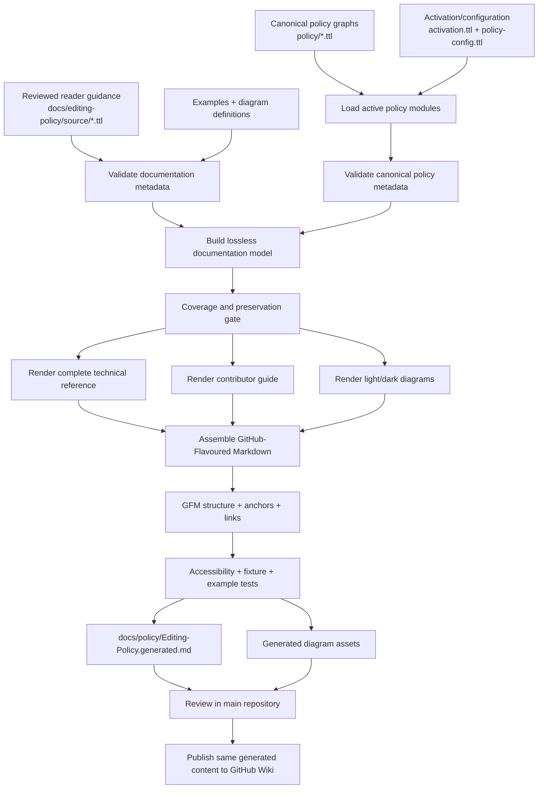

# Implementation Plan: Editing Policy Documentation Redesign

**Plan date:** 2026-09-19  
**Repository:** `Hadden-Industries/universal-ontology`  
**Plan location:** `docs/plans/2026-09-18-editing-policy-redesign.md`  
**Canonical policy:** `policy/*.ttl`, with `policy/editing-policy.ttl` as the editing-policy root  
**Current generated projection:** `docs/policy/Editing-Policy.generated.md`  
**Existing generation commands:** `npm run generate:editing-policy` and `npm run check:editing-policy`  
**Publication target:** GitHub Wiki, with the reviewable generated artefact retained in the main repository  
**Documentation language:** en-GB, except where canonical policy literals, examples, identifiers or quoted source material must remain byte-for-byte or semantically unchanged

## Executive summary and evidence

The editing policy is now substantially better as an engineering artefact than its earlier hand-authored predecessor: its requirements are represented in SHACL, its implementation and provenance are substantially more traceable, and its human-readable form can be generated rather than maintained independently.
The redesign must preserve that improvement.
It must **not** restore a hand-maintained Wiki document, create a second normative policy, weaken exact requirements in the name of readability, or allow the Wiki presentation to become a source of truth.

The problem to solve is therefore an information-design problem rather than a policy-design problem:

> Preserve a complete, lossless, auditable technical projection of the policy while creating a second, explicitly non-normative task-oriented reading path that lets contributors understand what they need to do without first learning the policy's validation machinery.

The target experience has two routes on the same generated Editing Policy page:

1. **Contributor guide** — task-oriented, plain-language, deliberately selective explanation of what a contributor normally needs to know.
   Every policy simplification is visibly labelled **Contributor summary — non-normative** and links to one or more preserved `EP-*` technical clauses.
2. **Technical reference** — the complete policy reference.
   Every active `EP-*` clause, exact normative description, applicability condition, exception, executable-constraint item, human-review obligation, example and provenance item is preserved without semantic weakening.

The supplied design artefacts establish a useful migration baseline.
The September design verification material records **35 `EP-*` clauses, 77 executable-constraint bullets and 224 non-title source-text blocks**.
Those figures are migration evidence, not eternal magic numbers: CI must compare the current active policy to its generated projection so that an authorised future addition or removal is handled deliberately rather than defeated by a permanently hard-coded count.

The supplied policy archive identifies the policy modules that need to remain authoritative:

- `policy/editing-policy.ttl`
- `policy/entity-policy.ttl`
- `policy/ontology-policy.ttl`
- `policy/axiom-policy.ttl`
- `policy/dataset-distribution-policy.ttl`
- `policy/activation.ttl`
- `policy/policy-config.ttl`
- `policy/policy-metadata-shapes.ttl`
- `policy/validation-context-shapes.ttl`
- `policy/policy-test-fixture.ttl`
- `policy/universal-ontology-pinning.ttl`

Repository inspection also confirms that the live repository already documents the editing-policy shapes as the source of truth, keeps its generated human projection under `docs/policy/`, and has Python policy tooling under `scripts/ontology_policy/`.
See:

- canonical root: https://github.com/Hadden-Industries/universal-ontology/blob/main/policy/editing-policy.ttl
- policy documentation README: https://github.com/Hadden-Industries/universal-ontology/blob/main/docs/policy/README.md
- existing generator package: https://github.com/Hadden-Industries/universal-ontology/tree/main/scripts/ontology_policy
- existing namespace/module configuration: https://github.com/Hadden-Industries/universal-ontology/blob/main/scripts/ontology_policy/namespaces.py
- existing implementation plan: https://github.com/Hadden-Industries/universal-ontology/blob/main/docs/plans/2026-09-18-editing-policy-redesign.md

The redesign should therefore **extend the existing generator and paths rather than introduce a competing documentation stack**.
`docs/editing-policy/` is introduced for authored documentation metadata, diagrams and fixtures; the published generated Markdown remains under the existing `docs/policy/` location.

**Decision hierarchy**

When implementation choices conflict, decisions shall be made in this order:

| Priority | Authority                                                          | How it is used                                                                                                                                                                                   |
| -------- | ------------------------------------------------------------------ | ------------------------------------------------------------------------------------------------------------------------------------------------------------------------------------------------ |
| First    | Canonical Universal Ontology policy and first-principles usability | Preserve meaning, minimise unnecessary cognitive load, optimise for contributor tasks, eliminate duplicated authority, make errors detectable, and make provenance inspectable.                  |
| Second   | Primary standards/specifications                                   | WCAG 2.2, GFM, SHACL, RDF 1.1, DCAT 2 and IANA Media Types determine accessibility, syntax and semantic correctness.                                                                             |
| Third    | Host/platform and mature documentation guidance                    | GitHub Docs, Mermaid documentation, GOV.UK Design System, Diátaxis, MDN and Read the Docs guide presentation and operating practice where the primary specifications do not determine an answer. |
| Fourth   | Community/tooling convention                                       | Used only where higher-authority material is silent; such choices must remain replaceable implementation details rather than policy semantics.                                                   |

The principal specifications and guidance are:

- **WCAG 2.2:** https://www.w3.org/TR/WCAG22/
- **GitHub Flavoured Markdown:** https://github.github.com/gfm/
- **SHACL Recommendation:** https://www.w3.org/TR/shacl/
- **RDF 1.1 Concepts and Abstract Syntax:** https://www.w3.org/TR/rdf11-concepts/
- **DCAT 2 Recommendation:** https://www.w3.org/TR/vocab-dcat-2/
- **IANA Media Types registry:** https://www.iana.org/assignments/media-types/media-types.xhtml
- **GitHub Wikis:** https://docs.github.com/en/communities/documenting-your-project-with-wikis/about-wikis
- **Editing Wikis locally:** https://docs.github.com/en/communities/documenting-your-project-with-wikis/adding-or-editing-wiki-pages
- **GitHub diagrams/Mermaid:** https://docs.github.com/en/get-started/writing-on-github/working-with-advanced-formatting/creating-diagrams
- **GitHub collapsed sections:** https://docs.github.com/en/get-started/writing-on-github/working-with-advanced-formatting/organizing-information-with-collapsed-sections
- **GitHub theme-aware images:** https://docs.github.com/en/get-started/writing-on-github/working-with-advanced-formatting/attaching-files#specifying-the-theme-an-image-is-shown-to
- **GitHub alerts:** https://docs.github.com/en/get-started/writing-on-github/working-with-advanced-formatting/basic-writing-and-formatting-syntax#alerts
- **Mermaid documentation:** https://mermaid.js.org/
- **GOV.UK Details component:** https://design-system.service.gov.uk/components/details/
- **GOV.UK Accordion component:** https://design-system.service.gov.uk/components/accordion/
- **GOV.UK content design:** https://www.gov.uk/guidance/content-design
- **Diátaxis:** https://diataxis.fr/
- **MDN `<details>`:** https://developer.mozilla.org/en-US/docs/Web/HTML/Reference/Elements/details
- **MDN `<picture>`:** https://developer.mozilla.org/en-US/docs/Web/HTML/Reference/Elements/picture
- **Read the Docs documentation guidance:** https://docs.readthedocs.io/en/stable/guides/

The design follows several first-principles rules before applying any visual treatment:

- **One fact, one authority.**
  A contributor summary may explain a rule but may never become a second normative representation of it.
- **Task before machinery.**
  A contributor should encounter “does this concept already exist?”
  before encountering SHACL target semantics.
- **Recognition before recall.**
  Describe familiar contribution activities and concepts; do not require users to remember opaque predicates or internal validation architecture before they can act.
- **Progressive disclosure for secondary information only.**
  Do not hide information that a reader needs to make a correct contribution.
  GOV.UK explicitly cautions against using disclosure merely to make a page shorter: https://design-system.service.gov.uk/components/details/
- **Separate concerns that are logically independent.**
  In particular, normative strength, property presence, assessment mechanism and evaluation state must never be conflated.
- **Accessibility is a property of the source design, not a final compliance pass.**
  WCAG 2.2 requirements influence diagrams, headings, labels, contrast and responsive presentation from the start: https://www.w3.org/TR/WCAG22/
- **Documentation generation must be deterministic and testable.**
  The same policy inputs and documentation metadata must produce byte-identical publication artefacts.
- **A generated page is a projection, not the policy.**
  Any mismatch between the projection and the canonical RDF/SHACL graphs is a build failure.

## Goals, scope and architecture

**Goals**

The implementation must:

1. Preserve every active technical-reference `EP-*` clause.
2. Preserve every executable constraint represented in the current technical projection.
3. Preserve every policy provenance item and every existing technical example.
4. Preserve applicability conditions, exclusions, exceptions, cardinalities, datatype requirements, node-kind requirements, regex/lexical requirements, logical branches, severities, comparison-context dependencies and human-review obligations even where they are not repeated in a generated “constraint bullet”.
5. Make contributor-facing prose substantially less intimidating without changing normative meaning.
6. Make the difference between **optional presence** and **mandatory correctness when present** immediately understandable.
7. Make the difference between **automated validation**, **human review**, **mixed assessment** and **unevaluated due to unavailable context** immediately understandable.
8. Make provenance inspectable without making lineage metadata dominate every first reading.
9. Provide diagrams for the conceptual structures and decisions that currently require too much textual decoding.
10. Produce light- and dark-theme diagram assets with accessible text equivalents.
11. Keep all publication material generated from reviewable repository artefacts.
12. Make accidental omission or semantic weakening detectable in CI.
13. Test SHACL rules using positive and negative fixtures that assert rule identity and severity, not merely process exit status.
14. Publish to the GitHub Wiki without making the Wiki repository a second authoring location.
15. Keep documentation generation independent of live IANA or other external network services by using the repository's pinned authority material where the policy requires a pinned snapshot.

**Non-goals**

This project does not:

- alter the semantics of an existing editing-policy rule merely to make the documentation easier to explain;
- silently weaken `MUST`, `SHOULD`, `MAY`, warning or violation behaviour;
- reinterpret the policy's own normative vocabulary as RFC 2119/BCP 14 unless the policy itself explicitly makes that declaration;
- add new automated contribution workflows and then describe them as though they already exist;
- turn conceptual adequacy, duplicate-concept review or other human judgements into fictitious automated guarantees;
- infer that SHACL conformance means that an ontology contribution is conceptually good;
- replace the repository's pinned IANA authority snapshot with live network lookup during validation or documentation generation;
- alter RDF language tags in policy examples to match the documentation's en-GB prose;
- use custom CSS or JavaScript as a prerequisite for understanding the Wiki;
- make colours, badges or icons the sole carrier of normative meaning;
- require readers to open diagrams to obtain information that exists nowhere in text;
- create manually edited copies of generated technical rules;
- expose RDF blank-node labels as stable identifiers; RDF blank-node identifiers are graph-local implementation artefacts rather than globally meaningful names, as defined by RDF 1.1: https://www.w3.org/TR/rdf11-concepts/

**Semantic invariants**

These are hard implementation invariants:

- `policy/*.ttl` remains authoritative for policy semantics.
- Documentation metadata must not add SHACL targets or constraints to the policy data graph used by the validator.
- Reader guidance must be loaded as a **separate documentation graph** by the renderer.
- No `owl:imports`, implicit graph merge or build step may make reader guidance part of production validation merely because documentation is generated.
- The renderer may **describe** a SHACL constraint but cannot alter it.
- Technical rule ordering may be improved for reading by explicit documentation ordering, but ordering has no RDF-semantic significance unless the policy explicitly gives it one.
- `sh:order`, `sh:name`, `sh:description`, `sh:group` and related presentation-oriented SHACL characteristics can be consumed by the documentation system without treating them as additional validation constraints.
  SHACL distinguishes validation semantics from such non-validating characteristics: https://www.w3.org/TR/shacl/
- When the local editing policy is stricter than the general DCAT model, the local policy wins.
  DCAT 2 defines the vocabulary; it does not override a local application profile: https://www.w3.org/TR/vocab-dcat-2/
- Where `dcat:mediaType` is locally constrained to a repository-pinned IANA set, the renderer describes that local rule and links to IANA as the external authority; generation does not fetch the contemporary registry and thereby change the build: https://www.iana.org/assignments/media-types/media-types.xhtml
- Exact technical examples from the existing projection remain intact.
  New explanatory examples are separately labelled and cannot replace them.

**Repository layout**

Use existing discovered paths where they exist; introduce new locations only for concerns that do not currently have a suitable home.

```text
universal-ontology/
├── policy/
│   ├── editing-policy.ttl                    # existing canonical policy root
│   ├── entity-policy.ttl                     # existing
│   ├── ontology-policy.ttl                   # existing
│   ├── axiom-policy.ttl                      # existing
│   ├── dataset-distribution-policy.ttl       # existing
│   ├── activation.ttl                        # existing active-module definition
│   ├── policy-config.ttl                     # existing
│   ├── policy-metadata-shapes.ttl            # existing policy metadata validation
│   ├── validation-context-shapes.ttl         # existing
│   ├── policy-test-fixture.ttl               # existing
│   ├── universal-ontology-pinning.ttl        # existing
│   └── authorities/                          # existing pinned external authorities
│
├── docs/
│   ├── editing-policy/                       # new authored documentation inputs
│   │   ├── README.md
│   │   ├── source/
│   │   │   ├── reader-guidance.ttl
│   │   │   ├── reader-guidance-shapes.ttl
│   │   │   ├── diagram-views.json
│   │   │   └── baseline-policy-docs.json
│   │   ├── diagrams/
│   │   │   ├── policy-journey.mmd
│   │   │   ├── policy-journey.md
│   │   │   ├── entity-anatomy.mmd
│   │   │   ├── entity-anatomy.md
│   │   │   ├── dataset-access-guide.mmd
│   │   │   ├── dataset-access-guide.md
│   │   │   ├── scope-validation.mmd
│   │   │   ├── scope-validation.md
│   │   │   ├── label-correspondence.mmd
│   │   │   ├── label-correspondence.md
│   │   │   ├── modification-obligation.mmd
│   │   │   ├── modification-obligation.md
│   │   │   ├── dcat-profile-constraints.mmd
│   │   │   └── dcat-profile-constraints.md
│   │   ├── examples/
│   │   │   ├── manifest.json
│   │   │   ├── preserved/
│   │   │   └── contributor/
│   │   ├── fixtures/
│   │   │   ├── manifest.json
│   │   │   ├── golden/
│   │   │   ├── mutations/
│   │   │   └── expected/
│   │   └── usability/
│   │       ├── test-script.md
│   │       └── acceptance-results.md
│   │
│   ├── policy/
│   │   ├── README.md                         # existing
│   │   ├── Editing-Policy.generated.md       # existing path; redesigned generated output
│   │   ├── Editing-Policy.expanded.md        # optional generated all-expanded mirror
│   │   ├── Editing-Policy.sidebar.md         # generated Wiki sidebar fragment
│   │   └── assets/
│   │       └── editing-policy/
│   │           ├── *.svg
│   │           └── *.png
│   │
│   ├── plans/
│   │   └── 2026-09-18-editing-policy-redesign.md
│   │
│   └── reviews/
│       └── editing-policy-design/            # existing design/research evidence
│
├── scripts/
│   └── ontology_policy/                      # existing package
│       ├── namespaces.py                     # existing module inventory/configuration
│       ├── documentation_model.py            # new
│       ├── documentation_extract.py          # new
│       ├── render_editing_policy.py           # new/refactored current generator
│       ├── render_diagrams.py                 # new
│       ├── check_documentation.py             # new
│       ├── test_policy_fixtures.py            # new
│       ├── render_preview.py                  # new
│       └── publish_wiki.py                    # new
│
├── tests/
│   └── policy_documentation/
│       ├── test_policy_coverage.py
│       ├── test_contributor_links.py
│       ├── test_generation_determinism.py
│       ├── test_gfm_structure.py
│       ├── test_diagram_manifest.py
│       ├── test_examples.py
│       └── test_validation_fixtures.py
│
└── .github/
    └── workflows/
        └── editing-policy-docs.yml
```

Do **not** relocate the canonical policy merely to make the paths resemble the documentation paths.
Repository inspection has established that `policy/` and `scripts/ontology_policy/` already exist and are meaningful.

**Migration baseline**

Create `docs/editing-policy/source/baseline-policy-docs.json` from the supplied September snapshot and verification material:

```json
{
  "schemaVersion": 1,
  "baselineDate": "2026-09-12",
  "source": "Editing-Policy [2026-09-12].md",
  "verificationEvidence": [
    "editing-policy-design/verification/baseline-metrics.json",
    "editing-policy-design/verification/clause-inventory.json",
    "editing-policy-design/verification/preservation-report.json"
  ],
  "counts": {
    "technicalClauses": 35,
    "executableConstraintBullets": 77,
    "nonTitleSourceBlocks": 224
  },
  "ruleIds": [
    "EP-HEADER-ONTOLOGY-IRI",
    "EP-HEADER-VERSION-IRI",
    "EP-HEADER-COMPATIBILITY",
    "EP-HEADER-VERSION-INFO",
    "EP-NAMING-PASCAL",
    "EP-NAMING-CAMEL",
    "EP-LABEL-PREF",
    "EP-LABEL-REGIONAL",
    "EP-LABEL-RDFS",
    "EP-DEFINITION",
    "EP-IDENTIFIER",
    "EP-DESCRIPTION",
    "EP-PROVENANCE-CREATED",
    "EP-PROVENANCE-MODIFIED",
    "EP-SOURCE",
    "EP-EXTERNAL-CROSSREF",
    "EP-SEE-ALSO",
    "EP-DEFINED-BY",
    "EP-DATASET-TYPE",
    "EP-DATASET-TITLE",
    "EP-DATASET-DESCRIPTION",
    "EP-DATASET-LANGUAGES",
    "EP-DATASET-DISTRIBUTION",
    "EP-DISTRIBUTION-TYPE",
    "EP-DISTRIBUTION-FORMAT",
    "EP-DISTRIBUTION-MEDIA",
    "EP-DISTRIBUTION-PAGE",
    "EP-DISTRIBUTION-ACCESS-URL",
    "EP-DISTRIBUTION-DOWNLOAD-URL",
    "EP-DISTRIBUTION-DATA-SERVICE",
    "EP-DISTRIBUTION-ACCESS-SERVICE",
    "EP-DISTRIBUTION-ACCESS-FIELDS",
    "EP-AXIOM-CREATOR",
    "EP-AXIOM-CREATED",
    "EP-AXIOM-SOURCE"
  ]
}
```

The baseline test must distinguish two conditions:

- **accidental regression:** current source still contains a rule/detail but generated output has lost it → fail unconditionally;
- **authorised policy evolution:** canonical source has deliberately added, changed or removed a rule → require an explicit baseline/fixture/documentation change in the same reviewed pull request.

The 35/77/224 figures therefore function as a migration tripwire, while source-to-output bijection becomes the long-term correctness criterion.

## Information architecture and content model

**Top-level page architecture**

The generated Wiki page must use this order:

```text
Editing Policy
│
├── Purpose, policy status and two reading paths
│
├── Contributor guide
│   ├── Start with the meaning
│   ├── Choose the kind of change
│   ├── Add or describe an ordinary ontology entity
│   ├── Change an existing entity
│   ├── Describe datasets and distributions
│   └── Review before proposing the change
│
└── Technical reference
    ├── How to read the reference
    ├── Scope, applicability and human review
    ├── Ontology header
    ├── Naming
    ├── Labels and definitions
    ├── Descriptive metadata
    ├── Provenance
    ├── Datasets and distributions
    └── Axiom annotations
```

The page must begin with a short orientation rather than with build internals:

> **Make the model clearer. Keep its structure trustworthy.**
>
> Use the **Contributor guide** to understand what information your change normally needs and why.
> Use the **Technical reference** for exact requirements, exceptions, validation behaviour and provenance.
>
> The Contributor guide contains non-normative summaries.
> The Technical reference is the complete human-readable projection of the policy.

Do not call the first route “for non-technical readers”.
Domain expertise and SHACL expertise are independent dimensions.
“Contributor guide” and “Technical reference” identify tasks rather than classifying people.

This task/reference separation follows the underlying distinction made by Diátaxis between goal-oriented guidance and information-oriented reference: https://diataxis.fr/

**Contributor guide principles**

The contributor guide should restore the strongest usability characteristic of the earlier hand-authored document: it starts from contribution activities rather than validation implementation.

Its first conceptual step is:

> **Start with the meaning.**
>
> Before creating a new concept, search for the meaning you intend to represent, including likely synonyms and alternative spellings.
> Reuse an existing concept where it already represents that meaning; otherwise determine an appropriate broader concept and record the judgement needed by the contribution process.

Any exact requirement behind this wording must immediately link to the relevant technical rule(s).

Every summary unit must render in this form:

<!-- prettier-ignore -->
```markdown
**Contributor summary — non-normative.**  
Classes and named individuals need a definition; properties may omit one.

[Technical requirement: EP-DEFINITION](#ep-definition)
```

Where a summary synthesises several clauses:

<!-- prettier-ignore -->
```markdown
**Contributor summary — non-normative.**  
An ordinary entity normally needs an identifier, creator information and a creation timestamp. Different rules govern modifications and specialist dataset/distribution resources.

Technical requirements:
[EP-IDENTIFIER](#ep-identifier) ·
[EP-PROVENANCE-CREATED](#ep-provenance-created) ·
[EP-PROVENANCE-MODIFIED](#ep-provenance-modified)
```

The renderer, not the author, adds the standard “Contributor summary — non-normative” label and constructs the links.
This removes the possibility of an author forgetting the disclaimer or linking to a misspelt anchor.

Contributor summaries must retain the important exceptions that change behaviour.
In particular:

- Classes and NamedIndividuals requiring definitions must not be paraphrased into “every entity needs a definition” if properties may omit one.
- English/regional language-tag distinctions must remain distinguishable.
- The requirement for a corresponding ordinary label must not be confused with local-name normalisation.
- Literal identifier exceptions must not disappear.
- New-resource creation and modification of an existing resource must not be presented as the same provenance case.
- Comparison-context-dependent obligations must not be presented as always automatically evaluated.
- Dataset and Distribution profiles must not be collapsed into the ordinary-entity checklist.
- Optional fields that become constrained when supplied must not be called “required”.
- Human conceptual review must not be described as an automated validator guarantee.

**Technical-reference rule template**

Use a stable ID-only heading so that changing a human title does not change its GitHub-generated anchor:

<!-- prettier-ignore -->
```markdown
### EP-DISTRIBUTION-MEDIA

**Media type**

**Applies to:** Distribution resources in the editing-policy scope  
**Normative strength:** MUST  
**Presence:** Optional  
**Assessment:** Executable validation  
**Evaluation context:** Standard validation context

[Exact normative description from canonical policy, unweakened.]

**Validation behaviour**

- [Every executable constraint item, complete and in policy order.]
- [No constraint bullet may disappear because a prose generator considers it redundant.]

**Examples**

[Every existing technical example for this rule, unchanged.]

<details>
<summary>Source and provenance</summary>

[Complete provenance information.]
[Canonical module and policy resource/node identifier.]
[Original source references and lineage.]
</details>
```

Using `### EP-DISTRIBUTION-MEDIA` rather than a heading such as `### EP-DISTRIBUTION-MEDIA — Media type` gives GitHub a stable `#ep-distribution-media` anchor even if the display title later changes.
This avoids relying on undocumented custom-ID behaviour.

The main requirement, exceptions, applicability, human-review conditions and executable behaviour should **not** be hidden in a disclosure.
Progressive disclosure is appropriate for lineage/supporting implementation detail, not for content that a technical reader needs to decide whether a contribution conforms. GitHub supports native `<details>`/`<summary>` sections: https://docs.github.com/en/get-started/writing-on-github/working-with-advanced-formatting/organizing-information-with-collapsed-sections and MDN documents their native disclosure semantics: https://developer.mozilla.org/en-US/docs/Web/HTML/Reference/Elements/details

**Four dimensions that must remain separate**

The renderer's intermediate model shall represent these fields independently:

| Dimension          | Question                                              | Allowed examples                                            |
| ------------------ | ----------------------------------------------------- | ----------------------------------------------------------- |
| Normative strength | How strongly does the policy require this behaviour?  | `MUST`, `SHOULD`, `MAY`, or the exact canonical value       |
| Presence           | Must this property/resource be present?               | required, optional, conditional, prohibited, not applicable |
| Assessment         | How can compliance be established?                    | executable, human review, mixed                             |
| Evaluation state   | Was the obligation assessable in this validation run? | evaluated, unevaluated because required context was absent  |

Never infer one from another unless the canonical model explicitly supplies that relationship.

The media-type case is the canonical UX example:

```text
Normative strength: MUST
Presence: Optional

Meaning:
You do not have to supply the field.
If you do supply it, its value MUST satisfy the policy.
```

The UI must therefore never use a lone “MUST” badge as shorthand for required presence.

Likewise:

```text
Human review ≠ optional
Warning ≠ irrelevant
Unevaluated ≠ passed
SHACL-conformant ≠ conceptually adequate
```

For a clause with multiple sub-obligations having different characteristics, do not create a misleading clause-level badge.
Render a compact obligation table instead.

**Canonical documentation model**

Create an intermediate representation so that RDF extraction and Markdown layout are independently testable.
The renderer should first produce:

`build/editing-policy/policy-documentation-model.json`

Representative schema:

```json
{
  "schemaVersion": 1,
  "policy": {
    "policyIri": "canonical IRI from RDF",
    "title": "Universal Ontology Editing Policy",
    "inputDigest": "sha256:...",
    "activeModules": [
      "policy/editing-policy.ttl",
      "policy/entity-policy.ttl",
      "policy/ontology-policy.ttl",
      "policy/axiom-policy.ttl",
      "policy/dataset-distribution-policy.ttl"
    ]
  },
  "groups": [],
  "rules": [
    {
      "id": "EP-LABEL-PREF",
      "title": "Preferred label required",
      "group": "Labels and definitions",
      "order": 0,
      "source": {
        "module": "policy/entity-policy.ttl",
        "resourceIri": "canonical policy resource IRI"
      },
      "obligations": [
        {
          "normativeStrength": "MUST",
          "presence": "required",
          "assessment": ["executable"],
          "evaluationDependencies": []
        }
      ],
      "technical": {
        "normativeBlocks": [],
        "executableConstraints": [],
        "humanReviewBlocks": [],
        "examples": [],
        "provenance": []
      },
      "contributorSummaries": [],
      "relatedDiagrams": []
    }
  ]
}
```

The JSON model is a **build artefact**, not a source of truth.
It may be retained in CI artefacts for diagnosis but should not be hand edited.

The extractor must preserve RDF distinctions required by RDF 1.1:

- IRI values remain IRIs;
- language-tagged strings preserve language tags;
- typed literals preserve datatype IRIs;
- lexical forms needed by the policy remain available;
- blank-node implementation labels do not become public stable identifiers;
- source serialisation order is not mistaken for semantic order.

RDF authority: https://www.w3.org/TR/rdf11-concepts/

**Reader-guidance graph**

Keep human-reviewed contributor guidance in a separate RDF document:

`docs/editing-policy/source/reader-guidance.ttl`

Example:

```ttl
@prefix doc: <urn:universal-ontology:docs:editing-policy:> .
@prefix xsd: <http://www.w3.org/2001/XMLSchema#> .

doc:ordinary-entity-definition-summary
    a doc:ContributorSummary ;
    doc:summary """
Classes and named individuals need a definition; properties may omit one.
"""@en-GB ;
    doc:referencesRequirement "EP-DEFINITION" ;
    doc:nonNormative true ;
    doc:order 30 .

doc:distribution-media-summary
    a doc:ContributorSummary ;
    doc:summary """
A distribution does not have to state a media type. When it does, the value
has to satisfy the policy's pinned media-type vocabulary.
"""@en-GB ;
    doc:referencesRequirement "EP-DISTRIBUTION-MEDIA" ;
    doc:nonNormative true ;
    doc:order 70 .
```

The build-time documentation namespace is deliberately separated from the ontology/policy namespace so that it cannot plausibly be mistaken for ontology semantics.

Validate this guidance with:

`docs/editing-policy/source/reader-guidance-shapes.ttl`

Representative SHACL:

```ttl
@prefix sh: <http://www.w3.org/ns/shacl#> .
@prefix doc: <urn:universal-ontology:docs:editing-policy:> .
@prefix xsd: <http://www.w3.org/2001/XMLSchema#> .

doc:ContributorSummaryShape
    a sh:NodeShape ;
    sh:targetClass doc:ContributorSummary ;

    sh:property [
        sh:path doc:summary ;
        sh:minCount 1 ;
        sh:maxCount 1 ;
        sh:uniqueLang true
    ] ;

    sh:property [
        sh:path doc:referencesRequirement ;
        sh:minCount 1 ;
        sh:datatype xsd:string ;
        sh:pattern "^EP-[A-Z0-9-]+$"
    ] ;

    sh:property [
        sh:path doc:nonNormative ;
        sh:minCount 1 ;
        sh:maxCount 1 ;
        sh:hasValue true
    ] .
```

This metadata SHACL is **documentation validation**, not editing-policy validation.
Run it in a separate validation invocation.

**Technical clause inventory**

The renderer must produce exactly one stable technical-reference section for each active baseline requirement unless an explicit policy change changes the active set.

| Rule ID                          | Technical-reference group |
| -------------------------------- | ------------------------- |
| `EP-HEADER-ONTOLOGY-IRI`         | Ontology header           |
| `EP-HEADER-VERSION-IRI`          | Ontology header           |
| `EP-HEADER-COMPATIBILITY`        | Ontology header           |
| `EP-HEADER-VERSION-INFO`         | Ontology header           |
| `EP-NAMING-PASCAL`               | Naming                    |
| `EP-NAMING-CAMEL`                | Naming                    |
| `EP-LABEL-PREF`                  | Labels and definitions    |
| `EP-LABEL-REGIONAL`              | Labels and definitions    |
| `EP-LABEL-RDFS`                  | Labels and definitions    |
| `EP-DEFINITION`                  | Labels and definitions    |
| `EP-IDENTIFIER`                  | Descriptive metadata      |
| `EP-DESCRIPTION`                 | Descriptive metadata      |
| `EP-PROVENANCE-CREATED`          | Provenance                |
| `EP-PROVENANCE-MODIFIED`         | Provenance                |
| `EP-SOURCE`                      | Provenance                |
| `EP-EXTERNAL-CROSSREF`           | Provenance                |
| `EP-SEE-ALSO`                    | Provenance                |
| `EP-DEFINED-BY`                  | Provenance                |
| `EP-DATASET-TYPE`                | Dataset and distribution  |
| `EP-DATASET-TITLE`               | Dataset and distribution  |
| `EP-DATASET-DESCRIPTION`         | Dataset and distribution  |
| `EP-DATASET-LANGUAGES`           | Dataset and distribution  |
| `EP-DATASET-DISTRIBUTION`        | Dataset and distribution  |
| `EP-DISTRIBUTION-TYPE`           | Dataset and distribution  |
| `EP-DISTRIBUTION-FORMAT`         | Dataset and distribution  |
| `EP-DISTRIBUTION-MEDIA`          | Dataset and distribution  |
| `EP-DISTRIBUTION-PAGE`           | Dataset and distribution  |
| `EP-DISTRIBUTION-ACCESS-URL`     | Dataset and distribution  |
| `EP-DISTRIBUTION-DOWNLOAD-URL`   | Dataset and distribution  |
| `EP-DISTRIBUTION-DATA-SERVICE`   | Dataset and distribution  |
| `EP-DISTRIBUTION-ACCESS-SERVICE` | Dataset and distribution  |
| `EP-DISTRIBUTION-ACCESS-FIELDS`  | Dataset and distribution  |
| `EP-AXIOM-CREATOR`               | Axiom annotations         |
| `EP-AXIOM-CREATED`               | Axiom annotations         |
| `EP-AXIOM-SOURCE`                | Axiom annotations         |

Do not treat the 77 previously generated executable-constraint bullets as a complete semantic inventory.
A requirement can contain material in its description, target, logical expression or context dependency that is not repeated in the bullet projection.
Preservation testing therefore operates on structured policy characteristics as well as rendered source blocks.

**Examples**

Examples have three explicit classes:

| Class                       | Purpose                                                            | Normative status                                           | Validation                                          |
| --------------------------- | ------------------------------------------------------------------ | ---------------------------------------------------------- | --------------------------------------------------- |
| Preserved technical example | Existing example already present in technical policy documentation | Preserve exactly; does not independently redefine the rule | Test when machine-executable                        |
| Contributor illustration    | Makes a concept understandable                                     | Explicitly non-normative                                   | Validate against the active policy where applicable |
| SHACL fixture               | Proves validator behaviour                                         | Test artefact, not explanatory policy prose                | Mandatory automated assertion                       |

Do not silently “improve” an existing technical example.
If an old example is misleading, first preserve it as the baseline, then resolve it through a separately reviewed policy/documentation change.

`docs/editing-policy/examples/manifest.json`:

```json
{
  "schemaVersion": 1,
  "examples": [
    {
      "id": "example-ep-label-pref-001",
      "requirementIds": ["EP-LABEL-PREF"],
      "class": "preserved-technical",
      "source": "preserved/example-ep-label-pref-001.ttl",
      "expectedConformance": true,
      "nonNormative": false
    },
    {
      "id": "example-distribution-media-plain-language",
      "requirementIds": ["EP-DISTRIBUTION-MEDIA"],
      "class": "contributor-illustration",
      "source": "contributor/distribution-media.ttl",
      "expectedConformance": true,
      "nonNormative": true
    }
  ]
}
```

## Generation, renderer and visual system

**End-to-end architecture**



**Pipeline stages**

The generator must execute these stages in this order:

1. Resolve the active policy module set using the repository's existing activation/configuration logic rather than maintaining a second file list in the documentation generator.
2. Load the canonical policy graphs.
3. Validate policy metadata using the existing policy metadata shapes.
4. Load the separate reader-guidance graph.
5. Validate reader guidance against `reader-guidance-shapes.ttl`.
6. Load the diagram manifest and example/fixture manifests.
7. Build the intermediate documentation model.
8. Validate requirement-ID uniqueness and all cross-references.
9. Run the losslessness/preservation checks before rendering.
10. Render the complete technical reference.
11. Render contributor summaries from reviewed guidance metadata.
12. Render diagrams from version-controlled source.
13. Assemble the one-page Wiki Markdown projection.
14. Render the optional expanded technical mirror from the same model.
15. Run structural GFM checks.
16. Run example and SHACL fixture tests.
17. Run local accessibility checks against a rendered HTML preview.
18. Produce a publication manifest and input digest.
19. In `--check` mode, compare generated bytes with committed generated artefacts and fail on drift.
20. Only after all checks pass may the Wiki publication job run.

**Determinism**

Generation must not depend on:

- current wall-clock time;
- RDF parser blank-node labels;
- filesystem traversal order;
- dictionary/hash iteration order;
- live IANA registry state;
- live network resources;
- the GitHub Wiki's current contents except during the final managed publication step.

Ordering rules:

1. explicit `sh:order` or policy documentation order where present;
2. stable group order;
3. stable `EP-*` requirement ID as deterministic fallback.

Use LF newlines and UTF-8.

If a build timestamp is desired operationally, put it in the CI artefact metadata, not into the checked-in generated Markdown.
The generated document should expose a deterministic **input digest** rather than a volatile timestamp.

Example manifest:

`docs/policy/Editing-Policy.manifest.json`

```json
{
  "schemaVersion": 1,
  "generator": "scripts.ontology_policy.render_editing_policy",
  "inputs": [
    "policy/editing-policy.ttl",
    "policy/entity-policy.ttl",
    "policy/ontology-policy.ttl",
    "policy/axiom-policy.ttl",
    "policy/dataset-distribution-policy.ttl",
    "policy/activation.ttl",
    "policy/policy-config.ttl",
    "docs/editing-policy/source/reader-guidance.ttl",
    "docs/editing-policy/source/diagram-views.json"
  ],
  "inputDigestAlgorithm": "sha256",
  "inputDigest": "sha256:...",
  "outputs": [
    "docs/policy/Editing-Policy.generated.md",
    "docs/policy/Editing-Policy.sidebar.md"
  ]
}
```

**Renderer responsibilities**

Add/refactor:

`scripts/ontology_policy/documentation_extract.py`

Responsibilities:

- load active RDF graphs;
- identify primary documentation-bearing rule resources;
- extract `pd:requirementId` and other policy metadata;
- preserve canonical literal values and provenance;
- identify executable SHACL characteristics;
- identify human/procedural clauses;
- resolve source module and resource IRI;
- reject duplicate requirement IDs;
- reject active requirements without documentation identity.

`scripts/ontology_policy/documentation_model.py`

Responsibilities:

- immutable typed data model;
- separate normative prose from executable characteristics;
- represent applicability and exceptions;
- represent normative strength, presence, assessment and evaluation dependencies independently;
- attach examples, provenance, diagrams and contributor summaries by stable ID;
- make it impossible for renderer layout code to invent policy content.

`scripts/ontology_policy/render_editing_policy.py`

Responsibilities:

- turn documentation model into GFM;
- create stable ID-only `### EP-*` headings;
- preserve all technical blocks;
- add contributor-summary labels and links automatically;
- render a short generated table of contents;
- render provenance disclosures;
- escape Markdown safely where canonical literals contain Markdown-significant characters;
- never rewrite policy wording through an LLM or uncontrolled paraphraser.

`scripts/ontology_policy/check_documentation.py`

Responsibilities:

- preservation;
- uniqueness;
- contributor-reference completeness;
- internal anchors;
- generated-file freshness;
- deterministic output;
- manifest integrity.

Keep the repository's existing public commands:

```bash
npm run generate:editing-policy
npm run check:editing-policy
```

Add these granular commands:

```bash
npm run render:editing-policy:diagrams
npm run test:editing-policy
npm run test:editing-policy:fixtures
npm run test:editing-policy:a11y
npm run preview:editing-policy
```

Representative `package.json` scripts:

```json
{
  "scripts": {
    "generate:editing-policy": "python -m scripts.ontology_policy.render_editing_policy",
    "check:editing-policy": "python -m scripts.ontology_policy.render_editing_policy --check",
    "render:editing-policy:diagrams": "python -m scripts.ontology_policy.render_diagrams",
    "test:editing-policy:fixtures": "python -m scripts.ontology_policy.test_policy_fixtures",
    "test:editing-policy:a11y": "node scripts/editing-policy-a11y.mjs",
    "test:editing-policy": "pytest -q tests/policy_documentation && npm run test:editing-policy:fixtures && npm run test:editing-policy:a11y",
    "preview:editing-policy": "python -m scripts.ontology_policy.render_preview"
  }
}
```

Retain `package-lock.json` and a Python dependency lock used by CI.
Do not use unpinned `npx <package>@latest` commands in the actual build.
Installation-time dependency updates are separate reviewed changes.

**Technical preservation algorithm**

For every active `EP-*` rule, create a structured fingerprint containing at least:

```text
requirement ID
title/name
group
order
normative-strength metadata
scope/targets
target exclusions
normative description blocks
property paths
minimum/maximum counts
classes
datatypes
node kinds
language requirements
patterns
in/value sets
logical operators
SPARQL constraints
severity
messages
comparison-context dependencies
human-review/procedural obligations
source/provenance statements
examples
```

The test should compare **source model to output model**, not source Markdown to new Markdown formatting.

The migration additionally checks the supplied September snapshot's 224 source blocks to catch information that has not yet been structurally modelled.

Any source detail that cannot yet be represented structurally gets a `technical.verbatimBlocks[]` entry.
It may not simply be omitted.

A preservation report shall be generated in CI:

`build/editing-policy/preservation-report.json`

```json
{
  "activeRules": 35,
  "renderedRules": 35,
  "missingRules": [],
  "duplicateRules": [],
  "sourceBlocksExpected": 224,
  "sourceBlocksPreserved": 224,
  "missingSourceBlocks": [],
  "executableCharacteristicsUnrepresented": [],
  "provenanceItemsUnrepresented": [],
  "examplesUnrepresented": [],
  "contributorReferencesUnresolved": []
}
```

The exact counts may legitimately grow after policy evolution, but every “missing” array must always be empty.

**GFM constraints**

Use GitHub Flavoured Markdown according to https://github.github.com/gfm/ and constructs explicitly supported by GitHub documentation.

Preferred primitives:

- ordinary headings;
- paragraphs;
- short lists;
- code blocks;
- small comparison tables;
- links;
- `<details>/<summary>` for supporting provenance;
- `<picture>/<source>/` for theme-aware diagrams;
- GitHub alerts sparingly for exceptional information.

Avoid:

- custom CSS;
- custom JavaScript;
- custom interactive tabs;
- layout tables;
- giant multi-column tables for entire rules;
- deeply nested disclosures;
- disclosure around the whole technical reference;
- emoji as the only state indicator;
- coloured badges as the only expression of `MUST`, `SHOULD`, warning, required or optional;
- HTML whose behaviour has not been tested in the actual Wiki renderer.

Tables should be reserved for genuinely tabular comparisons.
Long prose, examples, constraint groups and code must remain block content rather than being forced into cells.

**Diagram set**

Retain and productionise the seven diagram concepts demonstrated by the supplied design archive:

| Diagram ID                 | Primary audience | Question answered                                                                              |
| -------------------------- | ---------------- | ---------------------------------------------------------------------------------------------- |
| `policy-journey`           | Contributor      | What do I do from concept search through review?                                               |
| `entity-anatomy`           | Contributor      | What kinds of information describe an ordinary ontology entity?                                |
| `dataset-access-guide`     | Contributor      | What is the difference between a dataset, a distribution and its access routes?                |
| `scope-validation`         | Technical        | Which policy targets overlap, and which resources are excluded from ordinary-entity targeting? |
| `label-correspondence`     | Technical        | How does local-name correspondence differ from exact preferred/ordinary-label correspondence?  |
| `modification-obligation`  | Technical        | When do modification metadata obligations become applicable or unevaluated?                    |
| `dcat-profile-constraints` | Technical        | How does the local dataset/distribution profile constrain DCAT resources?                      |

The scope diagram must not depict selectors as mutually exclusive where the SHACL design allows overlap.

The DCAT diagram must distinguish **local validation cardinality/profile rules** from general statements about the DCAT vocabulary.
DCAT vocabulary semantics are defined by https://www.w3.org/TR/vocab-dcat-2/

**Diagram rendering options**

| Option                             | Strengths                                                                                                         | Weaknesses                                                                                                                            | Decision                                                                           |
| ---------------------------------- | ----------------------------------------------------------------------------------------------------------------- | ------------------------------------------------------------------------------------------------------------------------------------- | ---------------------------------------------------------------------------------- |
| Live Mermaid only in Wiki          | Text source is diffable; GitHub renders it natively                                                               | GitHub's deployed Mermaid version can lag upstream; rendering can change independently; fine-grained accessibility control is limited | Use for the implementation-plan pipeline diagram and simple low-risk diagrams only |
| Mermaid source → committed SVG/PNG | Diffable semantic source plus deterministic reviewed assets; predictable appearance; explicit light/dark variants | Adds build step                                                                                                                       | **Preferred production strategy**                                                  |
| Hand-authored SVG/Figma/draw.io    | Highest bespoke visual polish                                                                                     | Harder to review semantically; easy for diagram and policy to drift                                                                   | Use only for an exceptional diagram that Mermaid cannot express clearly            |
| Graphviz → SVG/PNG                 | Deterministic and strong for complex graphs                                                                       | Adds a second diagram language/toolchain                                                                                              | Do not introduce unless Mermaid proves inadequate                                  |

GitHub's Mermaid support is documented at https://docs.github.com/en/get-started/writing-on-github/working-with-advanced-formatting/creating-diagrams.
Because the host's Mermaid implementation can differ from the latest upstream Mermaid release, static publication assets remove unnecessary host-version coupling.

Store Mermaid sources in `docs/editing-policy/diagrams/*.mmd`.

Pin `@mermaid-js/mermaid-cli` through `package-lock.json`.

Render both themes:

```bash
npm ci

npx --no-install mmdc \
  -i docs/editing-policy/diagrams/entity-anatomy.mmd \
  -o docs/policy/assets/editing-policy/entity-anatomy-light.svg \
  -t neutral

npx --no-install mmdc \
  -i docs/editing-policy/diagrams/entity-anatomy.mmd \
  -o docs/policy/assets/editing-policy/entity-anatomy-dark.svg \
  -t dark
```

Generate PNG fallback assets from the same source/rendered SVG in a deterministic conversion step:

```text
entity-anatomy-light.svg
entity-anatomy-light.png
entity-anatomy-dark.svg
entity-anatomy-dark.png
```

Do not use screenshots as the source of diagrams.

**Diagram manifest**

`docs/editing-policy/source/diagram-views.json`:

```json
{
  "schemaVersion": 1,
  "diagrams": [
    {
      "id": "entity-anatomy",
      "source": "docs/editing-policy/diagrams/entity-anatomy.mmd",
      "lightSvg": "docs/policy/assets/editing-policy/entity-anatomy-light.svg",
      "darkSvg": "docs/policy/assets/editing-policy/entity-anatomy-dark.svg",
      "lightPng": "docs/policy/assets/editing-policy/entity-anatomy-light.png",
      "darkPng": "docs/policy/assets/editing-policy/entity-anatomy-dark.png",
      "alt": "An ordinary ontology entity is described through identity, meaning, provenance and optional references, with exact requirements depending on entity type.",
      "textEquivalent": "docs/editing-policy/diagrams/entity-anatomy.md",
      "requirementIds": [
        "EP-IDENTIFIER",
        "EP-LABEL-PREF",
        "EP-DEFINITION",
        "EP-PROVENANCE-CREATED"
      ]
    }
  ]
}
```

Every diagram must have:

- source;
- light SVG;
- dark SVG;
- light PNG;
- dark PNG;
- meaningful `alt`;
- adjacent text equivalent;
- linked policy requirement IDs where applicable.

Render theme-aware images using GitHub's documented pattern, based on the HTML `<picture>` mechanism described by MDN at https://developer.mozilla.org/en-US/docs/Web/HTML/Reference/Elements/picture and GitHub's theme-aware image guidance at https://docs.github.com/en/get-started/writing-on-github/working-with-advanced-formatting/attaching-files#specifying-the-theme-an-image-is-shown-to

Example generated GFM:

```html
<picture>
  <source
    media="(prefers-color-scheme: dark)"
    srcset="assets/editing-policy/entity-anatomy-dark.svg">
  <source
    media="(prefers-color-scheme: light)"
    srcset="assets/editing-policy/entity-anatomy-light.svg">
  
</picture>
```

Immediately follow it with a visible one-paragraph takeaway and an accessible detailed text equivalent:

```markdown
The diagram groups the information around an ordinary entity into identity,
meaning, provenance and optional references. Exact applicability varies by rule.

<details>
<summary>Text equivalent of the entity-anatomy diagram</summary>

[Generated contents of docs/editing-policy/diagrams/entity-anatomy.md]

</details>
```

The text equivalent must describe relationships and decisions, not merely list every label in the graphic.

## Verification, accessibility and CI/CD

**WCAG 2.2 AA target**

The authored content targets WCAG 2.2 Level AA: https://www.w3.org/TR/WCAG22/

The GitHub host interface itself is not under repository control.
Acceptance therefore distinguishes:

- accessibility of authored Markdown, diagrams and generated HTML;
- host-level GitHub UI behaviour, which is verified through smoke testing but cannot be altered by this project.

Checklist:

| WCAG criterion                      | Authored-content requirement                                                                                                                            | Automated/manual                             |
| ----------------------------------- | ------------------------------------------------------------------------------------------------------------------------------------------------------- | -------------------------------------------- |
| 1.1.1 Non-text Content              | Every informative diagram has meaningful alt text and a complete text equivalent; decorative images use empty alt text                                  | Automated manifest check + manual review     |
| 1.3.1 Info and Relationships        | Correct heading hierarchy; lists are lists; tables contain genuinely tabular information; labels are textual                                            | Automated structural lint + manual           |
| 1.3.2 Meaningful Sequence           | Page remains comprehensible in source/document order without visual positioning                                                                         | Manual                                       |
| 1.4.1 Use of Colour                 | No meaning conveyed by colour alone; shape, label or text expresses every status                                                                        | Manual + diagram checklist                   |
| 1.4.3 Contrast (Minimum)            | Authored text in generated diagram assets targets at least 4.5:1 for normal text and 3:1 for qualifying large text                                      | Automated contrast where measurable + manual |
| 1.4.5 Images of Text                | Do not turn ordinary prose into raster images; text in diagrams is limited to diagram labels and always has text equivalent                             | Manual                                       |
| 1.4.10 Reflow                       | Core authored page works at 320 CSS px without page-level two-dimensional scrolling; code may scroll inside its own block where intrinsically necessary | Browser test                                 |
| 1.4.11 Non-text Contrast            | Meaningful graphical boundaries/indicators achieve at least 3:1 where the criterion applies                                                             | Diagram review                               |
| 1.4.12 Text Spacing                 | No custom layout/CSS that breaks when users alter text spacing                                                                                          | Structural                                   |
| 2.1.1 Keyboard                      | Authored interactive elements are native links/details only; no custom keyboard interactions                                                            | Browser/keyboard smoke                       |
| 2.4.2 Page Titled                   | Wiki page has a clear Editing Policy title                                                                                                              | Structural                                   |
| 2.4.4 Link Purpose                  | Link text identifies the rule or destination, rather than repeated “click here” labels                                                                  | Lint/manual                                  |
| 2.4.6 Headings and Labels           | Headings describe content and use consistent hierarchy                                                                                                  | Structural/manual                            |
| 2.4.7 Focus Visible                 | No authored CSS suppresses host focus treatment                                                                                                         | Structural                                   |
| 2.4.11 Focus Not Obscured (Minimum) | No authored sticky/fixed overlays exist that can cover focused content                                                                                  | Structural/manual                            |
| 2.5.8 Target Size (Minimum)         | Do not create tiny custom controls; rely on GitHub's standard links/disclosures                                                                         | Manual host smoke                            |
| 3.1.2 Language of Parts             | Preserve RDF language tags accurately; documentation prose consistently uses en-GB                                                                      | Manual                                       |
| 3.2.3 Consistent Navigation         | Contributor/technical navigation and rule links remain consistent                                                                                       | Structural                                   |
| 3.2.4 Consistent Identification     | The same policy concepts use the same labels throughout generated content                                                                               | Content test/manual                          |

WCAG criterion details and normative wording come from https://www.w3.org/TR/WCAG22/

An accessibility statement in the documentation should avoid claiming that the whole GitHub platform is WCAG-conformant.
It should instead state that the **authored Editing Policy content is designed and tested against WCAG 2.2 AA criteria within the capabilities of GitHub Wiki rendering**.

**Policy coverage tests**

`tests/policy_documentation/test_policy_coverage.py` must assert:

```python
def test_every_active_ep_rule_has_exactly_one_technical_section(model):
    source_ids = set(model.active_requirement_ids)
    rendered_ids = set(model.rendered_requirement_ids)

    assert rendered_ids == source_ids
    assert len(model.rendered_requirement_ids) == len(rendered_ids)


def test_no_technical_information_is_unrepresented(model):
    assert model.unrepresented_normative_blocks == []
    assert model.unrepresented_constraints == []
    assert model.unrepresented_human_obligations == []
    assert model.unrepresented_provenance == []
    assert model.unrepresented_examples == []


def test_migration_baseline_not_silently_weakened(model, baseline):
    assert not baseline.rule_ids - model.active_requirement_ids, (
        "A baseline EP-* rule disappeared. This requires an explicit "
        "policy-change acknowledgement, not a renderer change."
    )
```

A policy PR intentionally removing a rule supplies an explicit reviewed baseline migration record rather than weakening this assertion with `>= 35`.

**Contributor-guide tests**

Every generated contributor summary must:

- be represented by a validated `doc:ContributorSummary`;
- be automatically labelled non-normative;
- reference at least one active `EP-*` ID;
- resolve to one or more technical anchors;
- not contain an unlinked `EP-*` reference;
- not make an applicability claim broader than the linked rule;
- be reviewed when any linked rule's technical fingerprint changes.

Store the last-reviewed fingerprint of linked rules in the generated metadata.
If `EP-DEFINITION` changes, every contributor summary that references it is marked stale and CI fails until it is re-reviewed.

Example guidance review record:

```json
{
  "summary": "ordinary-entity-definition-summary",
  "requirements": {
    "EP-DEFINITION": "sha256:4f..."
  },
  "reviewStatus": "current"
}
```

**Fixture strategy**

A simple “validator exits non-zero” test is insufficient.
Every executable rule must have tests proving:

1. the intended focus node is actually in validation scope;
2. a positive case does not produce the targeted rule result;
3. a negative case produces the expected `EP-*` requirement;
4. the result severity equals the canonical policy severity;
5. no unexpected policy results are accidentally introduced by the fixture mutation;
6. conditional rules have applicable and non-applicable/context-unavailable cases where relevant.

Avoid fixtures that pass only because their focus nodes sit outside the SHACL target.

The most robust pattern is:

```text
known-valid golden graph
        +
one controlled mutation
        ↓
validation
        ↓
expected result ID + severity + focus node
```

This avoids creating 77 unrelated partial graphs that accidentally violate many other requirements.

Fixture layout:

```text
docs/editing-policy/fixtures/
├── manifest.json
├── golden/
│   ├── ordinary-entity.ttl
│   ├── ontology-header.ttl
│   ├── dataset.ttl
│   ├── distribution.ttl
│   └── axiom-annotation.ttl
├── mutations/
│   ├── ep-label-pref-missing.json
│   ├── ep-definition-missing.json
│   ├── ep-identifier-invalid-uuid.json
│   ├── ep-distribution-media-invalid.json
│   └── ...
└── expected/
    ├── ep-label-pref-missing.json
    ├── ep-definition-missing.json
    └── ...
```

Representative mutation:

```json
{
  "id": "ep-label-pref-missing",
  "base": "../golden/ordinary-entity.ttl",
  "operations": [
    {
      "op": "delete",
      "subject": "urn:test:owned:ExampleClass",
      "predicate": "http://www.w3.org/2004/02/skos/core#prefLabel",
      "object": {
        "value": "Example class",
        "language": "en"
      }
    }
  ]
}
```

Expected result:

```json
{
  "case": "ep-label-pref-missing",
  "conforms": false,
  "focusNode": "urn:test:owned:ExampleClass",
  "requiredResults": [
    {
      "requirementId": "EP-LABEL-PREF",
      "severity": "http://www.w3.org/ns/shacl#Violation"
    }
  ],
  "unexpectedRequirementIds": []
}
```

Do **not** globally hard-code `MUST → sh:Violation` or `SHOULD → sh:Warning` in the fixture framework.
Read the expected severity from the source policy and make the expected JSON explicitly acknowledge it.
This permits the tests to detect an accidental severity change instead of normalising it away.

For human-only obligations, the fixture coverage entry is different:

```json
{
  "requirementId": "EP-SOME-HUMAN-REVIEW-RULE",
  "assessment": "human",
  "automatedNegativeFixture": null,
  "requiredHumanTest": "docs/editing-policy/usability/human-review-checks.md#..."
}
```

A human-only requirement must not be given a fake SHACL negative fixture merely to achieve 100% fixture count.

**Fixture manifest**

```json
{
  "schemaVersion": 1,
  "coverage": [
    {
      "requirementId": "EP-LABEL-PREF",
      "assessment": "executable",
      "positive": ["golden/ordinary-entity.ttl"],
      "negative": ["ep-label-pref-missing"],
      "severityAsserted": true
    },
    {
      "requirementId": "EP-DISTRIBUTION-MEDIA",
      "assessment": "executable",
      "positive": ["golden/distribution.ttl"],
      "negative": ["ep-distribution-media-invalid"],
      "severityAsserted": true
    }
  ]
}
```

CI fails when an executable constraint has no fixture coverage record.

**Validation-result mapping**

SHACL validation reports identify `sh:sourceShape` and `sh:resultSeverity`.
Resolve the result back to a requirement ID through the documentation-bearing shape or its owning node shape.

Representative diagnostic SPARQL:

```sparql
PREFIX sh: <http://www.w3.org/ns/shacl#>
PREFIX pd: <https://data.haddenindustries.com/core/policy/policy-definition/>

SELECT
  ?result
  ?focusNode
  ?resultPath
  ?severity
  ?requirementId
  ?message
WHERE {
  ?result
      a sh:ValidationResult ;
      sh:focusNode ?focusNode ;
      sh:sourceShape ?sourceShape ;
      sh:resultSeverity ?severity .

  OPTIONAL { ?result sh:resultPath ?resultPath }
  OPTIONAL { ?result sh:resultMessage ?message }

  {
    ?sourceShape pd:requirementId ?requirementId .
  }
  UNION
  {
    ?ownerShape
        sh:property ?sourceShape ;
        pd:requirementId ?requirementId .
  }
}
ORDER BY ?requirementId ?focusNode ?resultPath
```

If the repository's canonical policy model uses a different ownership relation for a particular SPARQL/property shape, centralise that resolution in one tested resolver rather than teaching every fixture its own joining logic.

**Requirement-ID integrity SPARQL**

Use a build-time query as an additional sanity check:

```sparql
PREFIX pd: <https://data.haddenindustries.com/core/policy/policy-definition/>

SELECT ?requirementId (COUNT(DISTINCT ?resource) AS ?count)
WHERE {
  ?resource pd:requirementId ?requirementId .
  FILTER(STRSTARTS(STR(?requirementId), "EP-"))
}
GROUP BY ?requirementId
HAVING (COUNT(DISTINCT ?resource) != 1)
ORDER BY ?requirementId
```

If the canonical model intentionally permits more than one RDF resource to share a requirement ID, replace this with an explicit primary-rule relation rather than simply disabling uniqueness checking.

**Validation command**

CI should invoke the same validation code path as production, not a documentation-only approximation:

```bash
python -m scripts.ontology_policy.test_policy_fixtures \
  --manifest docs/editing-policy/fixtures/manifest.json \
  --policy-root policy/editing-policy.ttl \
  --activation policy/activation.ttl
```

A raw `pyshacl` invocation is useful for diagnostics, but the authoritative test runner must assemble exactly the same active modules, external authority snapshots and validation context as the real policy runner.

Diagnostic example:

```bash
pyshacl \
  --shacl build/editing-policy/active-policy.ttl \
  --data build/editing-policy/fixture.ttl \
  --format turtle \
  --output build/editing-policy/report.ttl
```

**Example validation**

Every new machine-readable contributor example must be tested.
A conforming example outside the intended targets is not sufficient.

For each positive example, assert both:

```text
expected focus node was targeted
AND
no unexpected validation results occurred
```

For a deliberately invalid example, assert:

```text
expected focus node was targeted
AND
expected EP-* result(s) occurred
AND
expected severity occurred
```

**Anchor and link checks**

Parse the generated Markdown and assert:

- every `### EP-*` heading is unique;
- every active policy ID has one heading;
- every contributor link points to an existing technical anchor;
- every internal asset exists;
- no technical source/provenance link is empty;
- no duplicate generated heading causes GitHub slug suffixes such as `-1`;
- no contributor link uses the human-readable title as the stable identifier.

External HTTP links should be checked in a **scheduled** workflow as well as during release qualification.
A transient W3C/GitHub/IANA outage should not unnecessarily block an unrelated policy pull request.
Internal links remain blocking on every PR.

**GFM structure checks**

Use a GFM-capable parser/linter.
The test should reject:

- skipped heading levels;
- empty headings;
- malformed fenced code blocks;
- unclosed `<details>`;
- HTML layout tables;
- missing image alt text;
- duplicate technical IDs;
- unsupported inline scripts/styles;
- bare “click here” link text;
- accidental horizontal-rule-heavy visual layouts;
- raw absolute local filesystem paths such as `/mnt/data/...`.

**Determinism check**

CI generates twice into separate directories:

```bash
rm -rf build/run-a build/run-b

python -m scripts.ontology_policy.render_editing_policy \
  --output-dir build/run-a

python -m scripts.ontology_policy.render_editing_policy \
  --output-dir build/run-b

diff -ru build/run-a build/run-b
```

Then verify committed output:

```bash
npm run generate:editing-policy

git diff --exit-code -- \
  docs/policy/Editing-Policy.generated.md \
  docs/policy/Editing-Policy.sidebar.md \
  docs/policy/Editing-Policy.manifest.json \
  docs/policy/assets/editing-policy/
```

**Local accessibility test**

Render a local HTML approximation from the GFM and run Axe in Chromium.
This does not certify GitHub itself; it catches authored-content defects.

At minimum test viewports:

```text
320 × 800
390 × 844
768 × 1024
1440 × 900
```

Test:

- no document-level horizontal overflow caused by authored content;
- all images have alt attributes;
- every `<details>` can be reached and operated from the keyboard;
- heading order;
- link-name quality;
- Axe serious/critical issues;
- diagram presence in light/dark test pages.

Code blocks may use their own horizontal scroll where long lexical strings genuinely require it; the entire page must not.

**Diagram tests**

For every `diagram-views.json` entry:

```text
source exists
light SVG exists
dark SVG exists
light PNG exists
dark PNG exists
alt is non-empty and not the filename
text equivalent exists and is non-empty
referenced EP-* IDs all exist
SVG contains no external network dependency
light and dark files differ when theme treatment requires it
PNG files are decodable
```

Manual diagram review must additionally verify:

- no colour-only distinctions;
- line/shape semantics remain recognisable in greyscale;
- no misleading arrows;
- target-overlap semantics are correct;
- local DCAT cardinalities are labelled as local/profile validation constraints;
- text is legible at normal desktop display;
- mobile readers can obtain all meaning from adjacent prose/text equivalent even when the graphic scales down.

**GitHub Actions workflow**

Add `.github/workflows/editing-policy-docs.yml`:

```yaml
name: Editing policy documentation

on:
  pull_request:
    paths:
      - "policy/**"
      - "docs/editing-policy/**"
      - "docs/policy/**"
      - "scripts/ontology_policy/**"
      - "tests/policy_documentation/**"
      - "package.json"
      - "package-lock.json"
      - ".github/workflows/editing-policy-docs.yml"

  push:
    branches:
      - main
    paths:
      - "policy/**"
      - "docs/editing-policy/**"
      - "docs/policy/**"
      - "scripts/ontology_policy/**"
      - "tests/policy_documentation/**"
      - "package.json"
      - "package-lock.json"
      - ".github/workflows/editing-policy-docs.yml"

  workflow_dispatch:

permissions:
  contents: read

concurrency:
  group: editing-policy-${{ github.ref }}
  cancel-in-progress: true

jobs:
  verify:
    name: Generate and verify editing-policy documentation
    runs-on: ubuntu-latest
    timeout-minutes: 20

    steps:
      - name: Check out repository
        uses: actions/checkout@v4
        with:
          fetch-depth: 0

      - name: Set up Python
        uses: actions/setup-python@v5
        with:
          python-version: "3.12"
          cache: pip

      - name: Install Python documentation dependencies
        run: |
          python -m pip install --upgrade pip
          python -m pip install --require-hashes \
            -r scripts/ontology_policy/requirements-docs.lock

      - name: Set up Node
        uses: actions/setup-node@v4
        with:
          node-version-file: ".nvmrc"
          cache: npm

      - name: Install Node dependencies
        run: npm ci

      - name: Install Chromium for accessibility tests
        run: npx --no-install playwright install --with-deps chromium

      - name: Generate editing-policy documentation
        run: npm run generate:editing-policy

      - name: Verify generated files are current
        run: npm run check:editing-policy

      - name: Verify deterministic generation
        run: |
          rm -rf build/determinism-a build/determinism-b

          python -m scripts.ontology_policy.render_editing_policy \
            --output-dir build/determinism-a

          python -m scripts.ontology_policy.render_editing_policy \
            --output-dir build/determinism-b

          diff -ru build/determinism-a build/determinism-b

      - name: Run policy documentation tests
        run: pytest -q tests/policy_documentation

      - name: Run SHACL fixture tests
        run: npm run test:editing-policy:fixtures

      - name: Render local preview
        run: npm run preview:editing-policy

      - name: Run authored-content accessibility tests
        run: npm run test:editing-policy:a11y

      - name: Ensure generated tree is committed
        run: |
          git diff --exit-code -- \
            docs/policy/Editing-Policy.generated.md \
            docs/policy/Editing-Policy.sidebar.md \
            docs/policy/Editing-Policy.manifest.json \
            docs/policy/assets/editing-policy/

      - name: Upload verification evidence
        if: always()
        uses: actions/upload-artifact@v4
        with:
          name: editing-policy-verification
          path: |
            build/editing-policy/
            build/preview/
            docs/policy/Editing-Policy.generated.md
            docs/policy/Editing-Policy.manifest.json
          if-no-files-found: error

  publish-wiki:
    name: Publish verified editing policy to Wiki
    if: github.event_name == 'push' && github.ref == 'refs/heads/main'
    needs:
      - verify
    runs-on: ubuntu-latest
    timeout-minutes: 10
    environment: wiki-production

    steps:
      - name: Check out repository
        uses: actions/checkout@v4

      - name: Set up Python
        uses: actions/setup-python@v5
        with:
          python-version: "3.12"
          cache: pip

      - name: Install Wiki publication dependencies
        run: |
          python -m pip install --require-hashes \
            -r scripts/ontology_policy/requirements-docs.lock

      - name: Publish only managed Wiki files
        env:
          WIKI_PUSH_TOKEN: ${{ secrets.WIKI_PUSH_TOKEN }}
        run: |
          python -m scripts.ontology_policy.publish_wiki \
            --repository Hadden-Industries/universal-ontology \
            --source docs/policy/Editing-Policy.generated.md \
            --sidebar-fragment docs/policy/Editing-Policy.sidebar.md \
            --assets docs/policy/assets/editing-policy \
            --manifest docs/policy/Editing-Policy.manifest.json
```

Before merging this workflow, inspect the repository's existing runtime/version files.
If `.nvmrc` is not present, add one as a separately reviewed dependency-runtime decision rather than silently embedding two Node versions in different workflows.

For supply-chain hardening, repository policy should ultimately pin actions to reviewed immutable commit SHAs and let dependency automation propose SHA updates.
GitHub's security guidance explains that full-length commit SHA pinning is the immutable option for actions: https://docs.github.com/en/actions/security-for-github-actions/security-guides/security-hardening-for-github-actions

**Wiki publication model**

GitHub Wikis are Git-backed and can be edited locally, as documented by GitHub: https://docs.github.com/en/communities/documenting-your-project-with-wikis/adding-or-editing-wiki-pages

Treat the Wiki as a deployment target:

```text
main-repository policy + guidance
        ↓
reviewed pull request
        ↓
verified generated Markdown/assets
        ↓
merge to main
        ↓
publication job
        ↓
<repository>.wiki.git
```

Never make changes directly in the Wiki and later “sync them back”.

The publisher owns only:

```text
Editing-Policy.md
assets/editing-policy/**
managed Editing Policy fragment inside _Sidebar.md
.editing-policy-publication-manifest.json
```

It must not use an unrestricted:

```bash
rsync --delete
```

against the Wiki root, because that could delete unrelated Wiki pages.

The Wiki publication manifest records exactly which files this generator owns.

For `_Sidebar.md`, merge only the bounded generated block:

```markdown
<!-- BEGIN GENERATED EDITING POLICY NAVIGATION -->
[Editing Policy](Editing-Policy)

- [Contributor guide](Editing-Policy#contributor-guide)
- [Technical reference](Editing-Policy#technical-reference)
<!-- END GENERATED EDITING POLICY NAVIGATION -->
```

Everything outside those markers remains untouched.

`publish_wiki.py` must:

1. clone the Wiki repository into a temporary directory using `WIKI_PUSH_TOKEN`;
2. read the prior publication manifest;
3. remove only files owned by the prior Editing Policy publication;
4. copy current generated files;
5. update only the marked sidebar block;
6. write the new publication manifest;
7. run a final internal-link/asset existence check;
8. commit only if bytes changed;
9. push;
10. fail rather than force-push if the remote changed concurrently.

The Wiki write credential is an operational prerequisite that cannot be inferred from source files.
It must be a least-privilege credential with proven write access to the repository Wiki, stored as a GitHub Actions secret and restricted by the `wiki-production` environment.
Wiki publishing runs only on trusted `main` pushes, never on pull requests from forks.

**External-link health**

Add a scheduled workflow weekly for:

- W3C specifications;
- GitHub Docs;
- IANA;
- GOV.UK;
- Diátaxis;
- MDN;
- Mermaid;
- Read the Docs;
- external provenance URLs embedded by the policy.

Report external failures without immediately rewriting historical provenance.
A broken historical source link is provenance information to investigate, not permission for the renderer to delete the provenance item.

## Rollout, governance and operations

**Implementation sequence**

Use gated increments so that usability work can never outrun preservation.

**Baseline and freeze**

Actions:

```bash
npm ci
npm run generate:editing-policy
npm run check:editing-policy
```

Capture:

- current active `EP-*` IDs;
- source module for each rule;
- existing generated paragraphs;
- executable-constraint items;
- provenance;
- examples;
- rule severities;
- human-review statements;
- current diagrams/prototypes from the supplied design archive.

Produce:

```text
docs/editing-policy/source/baseline-policy-docs.json
build/editing-policy/baseline-preservation-report.json
```

Exit gate:

```text
35 supplied-baseline EP-* IDs accounted for
77 supplied-baseline executable-constraint bullets accounted for
224 supplied-baseline source blocks accounted for
all baseline examples inventoried
all baseline provenance items inventoried
```

Do not start contributor simplification until this inventory is machine-checkable.

**Lossless technical model**

Implement extraction and intermediate JSON first.

Exit gate:

```text
Every active source rule appears exactly once
No active source characteristic is classified as "unrepresented"
Every technical example is represented
Every provenance item is represented
Two runs produce identical JSON
```

**Technical renderer**

Render the complete technical reference before implementing the contributor route.

Exit gate:

```text
All EP-* anchors resolve
No technical block omitted
Exact technical wording preserved where source provides wording
Applicability/exceptions visible
Executable constraints visible
Human-review obligations visible
Provenance preserved
```

This ordering is deliberate: the simplified route should be built on top of a proven complete representation rather than becoming the basis from which completeness is inferred.

**Contributor guide**

Add reviewed summaries mapped to stable IDs.

Mandatory contributor tasks:

```text
Find out whether a concept already exists
Determine what kind of resource is being changed
Understand minimum descriptive information
Understand labels/definitions
Understand creation provenance
Understand modification provenance
Understand dataset versus distribution
Understand access URL/download URL/service distinctions
Recognise when human judgement is still required
Reach the full technical requirement in one link
```

Exit gate:

```text
100% of contributor summary units labelled non-normative
100% have at least one active EP-* reference
0 unresolved links
0 contributor-only policy requirements
```

**Diagrams**

Port the supplied diagram concepts to reproducible sources and generated assets.

Exit gate:

```text
7/7 diagram families represented
7/7 have light SVG
7/7 have dark SVG
7/7 have light PNG
7/7 have dark PNG
7/7 have alt text
7/7 have complete text equivalents
0 colour-only semantic distinctions
```

**Fixtures and CI**

Build golden fixtures and controlled mutations.

Exit gate:

```text
Every executable rule/constraint family mapped to fixture coverage
Every negative fixture asserts EP-* identity
Every negative fixture asserts severity
Every positive fixture proves target participation rather than vacuous pass
Conditional/context-dependent cases represented
Human-only requirements explicitly marked as human rather than fake-automated
```

**Initial publication**

For the first release:

1. Merge generated source-controlled artefacts.
2. Publish an unlinked `Editing-Policy-Preview` Wiki page using the exact intended renderer/publisher.
3. Test GitHub light mode.
4. Test GitHub dark mode.
5. Test narrow browser width.
6. Test keyboard access to disclosures/links.
7. Test direct `#ep-*` anchors.
8. Test images when GitHub's selected theme differs from the operating system where practicable.
9. Verify all seven diagram families.
10. Compare Wiki text to `docs/policy/Editing-Policy.generated.md`.
11. Promote the exact verified content to `Editing-Policy`.
12. Add/update the managed sidebar block.
13. Remove the temporary preview page.
14. Retain the prior Wiki revision through Git history rather than publishing an obsolete competing policy page.

After the initial renderer has been proven against actual Wiki behaviour, normal `main` publication can become automatic subject to the protected `wiki-production` environment.

**Change classes**

Every future change is classified before review:

| Change class              | Examples                                                                               | Required review                                                                |
| ------------------------- | -------------------------------------------------------------------------------------- | ------------------------------------------------------------------------------ |
| Policy semantic           | cardinality, target, pattern, allowed value, severity, human obligation, applicability | Ontology/policy owner + SHACL reviewer + fixture update + documentation review |
| Policy editorial metadata | clearer canonical description with same semantics                                      | Policy owner + documentation review + preservation diff                        |
| Contributor guidance      | explanation or navigation only                                                         | Documentation/UX owner + linked-rule owner                                     |
| Diagram                   | visual explanation                                                                     | Documentation/UX + relevant policy owner + accessibility review                |
| Renderer                  | formatting/generation behaviour                                                        | Tooling reviewer + snapshot/preservation tests                                 |
| Accessibility             | alt text, structure, contrast, text equivalent                                         | Accessibility reviewer + docs owner                                            |
| Publication               | Wiki pipeline/credential/sidebar                                                       | Repository maintainer + GitHub/DevOps owner                                    |

**Change-control invariants**

A PR changing a policy rule must automatically answer:

```text
Did the rule fingerprint change?
Did severity change?
Did target/applicability change?
Did a contributor summary reference this rule?
Did a diagram reference this rule?
Did an example reference this rule?
Did fixture expectations change?
Did provenance change?
```

CI prints an impact report, for example:

```text
EP-PROVENANCE-MODIFIED changed

Affected generated technical section:
  yes

Contributor summaries requiring review:
  modification-existing-entity
  provenance-overview

Diagrams requiring review:
  modification-obligation

Fixtures requiring review:
  ep-provenance-modified-changed
  ep-provenance-modified-no-comparison-context

Examples requiring review:
  example-ep-provenance-modified-001
```

A contributor-summary reviewer then updates the stored rule fingerprint after confirming the summary remains faithful.

**Governance roles**

- **Ontology policy owner:** accountable for normative meaning.
- **SHACL/RDF maintainer:** accountable for executable-policy correctness and rule/result mapping.
- **Documentation/UX owner:** accountable for contributor-guide information architecture, language and navigability.
- **Accessibility reviewer:** accountable for authored-content WCAG 2.2 AA review.
- **Tooling maintainer:** accountable for deterministic extraction/rendering/testing.
- **Repository/DevOps maintainer:** accountable for CI and Wiki publication credentials.
- **Domain contributor representative:** tests whether a subject-matter expert without SHACL expertise can complete contributor tasks.
- **Technical consumer representative:** tests whether implementers can find exact constraints, exceptions and lineage without ambiguity.

Map these roles to actual GitHub teams/users in `CODEOWNERS`; do not invent personal usernames in the implementation plan.

Recommended ownership boundaries:

```text
/policy/**                                      ontology policy + SHACL owners
/docs/editing-policy/source/**                  docs/UX + ontology policy owner
/docs/editing-policy/diagrams/**                docs/UX + accessibility + relevant policy owner
/docs/editing-policy/examples/**                docs/UX + SHACL owner
/docs/editing-policy/fixtures/**                SHACL owner
/scripts/ontology_policy/**                     tooling + SHACL owner
/tests/policy_documentation/**                  tooling + SHACL/docs owners
/.github/workflows/editing-policy-docs.yml      DevOps + tooling owner
/docs/policy/Editing-Policy.generated.md         generated; review diff, never hand edit
```

**Review policy**

Generated output is committed so reviewers can inspect exactly what will be published, but edits to generated files are prohibited.

A PR that changes generated output without changing a recognised generator input fails CI.

A PR that changes a recognised input without updating generated output fails CI.

Policy semantic review should focus on RDF/SHACL and fixture changes.
Documentation review should focus on the generated diff and guidance source.
This prevents reviewers from having to infer generator behaviour.

**Human-review boundary**

The page must explicitly state that automation cannot establish all ontology quality properties.

In particular:

> Passing executable validation means that the tested machine-checkable constraints were satisfied in the available validation context.
> It does not by itself establish conceptual adequacy, prove that no equivalent concept already exists, or satisfy any human-review obligation identified by the policy.

Where comparison context is unavailable, the renderer must use the exact concept **unevaluated** or equivalent canonical policy term rather than “passed”.

**DCAT and media-type governance**

The local policy may narrow DCAT usage beyond DCAT's generic vocabulary semantics.
The technical reference therefore uses wording such as:

> “The Universal Ontology editing-policy profile requires …”

rather than:

> “DCAT requires …”

unless the latter statement is actually true in DCAT 2.

Reference DCAT 2 at https://www.w3.org/TR/vocab-dcat-2/

For IANA media types:

- the validation source is the repository-pinned authority snapshot;
- the technical reference reports the pinned authority lineage;
- the current public registry is linked as contextual authority at https://www.iana.org/assignments/media-types/media-types.xhtml;
- build reproducibility never depends on a live IANA request.

**Operational recovery**

If Wiki publication fails after main is merged:

- main-repository generated artefacts remain authoritative publication inputs;
- do not manually edit the Wiki to “finish” the deployment;
- fix the deployment failure or rerun the workflow;
- the publisher's managed-file manifest allows idempotent replay.

If a bad Wiki publication succeeds:

1. identify the main-repository commit/input digest;
2. revert or correct the source/generator in the main repository;
3. regenerate and pass all tests;
4. republish;
5. use Wiki Git history for forensic comparison, not as the correction source.

If the generator loses information, block publication even if the resulting Markdown looks better.

## Delivery plan, resourcing and acceptance

**Concrete implementation work packages**

| Work package                                                                                    | Deliverables                                                                        | Primary skills                             |        Person-days |
| ----------------------------------------------------------------------------------------------- | ----------------------------------------------------------------------------------- | ------------------------------------------ | -----------------: |
| Baseline/inventory                                                                              | migration manifest, clause/source/example/provenance inventory, source fingerprints | RDF/SHACL, Python                          |                  2 |
| Documentation model                                                                             | extractor, typed IR, reader-guidance vocabulary/shapes                              | RDF, SHACL, Python architecture            |                  4 |
| Lossless technical renderer                                                                     | technical section templates, anchors, provenance, preservation checks               | Python, GFM, policy expertise              |                  6 |
| Contributor guide                                                                               | task IA, reviewed summaries, cross-reference model                                  | content design, ontology domain knowledge  |                  4 |
| Technical UX refinements                                                                        | strength/presence/assessment/evaluation presentation, glossary/navigation           | UX/documentation, ontology                 |                  3 |
| Diagram system                                                                                  | seven Mermaid sources, text equivalents, light/dark SVG/PNG pipeline                | information design, Mermaid, accessibility |                  5 |
| SHACL fixture suite                                                                             | golden graphs, mutation harness, expected results, severity/rule assertions         | SHACL, RDF, Python/SPARQL                  |                  6 |
| Accessibility                                                                                   | WCAG review, Axe integration, responsive tests, diagram review                      | accessibility, frontend testing            |                  3 |
| CI/Wiki publication                                                                             | workflow, managed-file publisher, manifest, credentials integration                 | GitHub Actions, Python, Git                |                  4 |
| Usability test and remediation                                                                  | contributor/technical task script, findings, fixes                                  | UX research, documentation                 |                  4 |
| Governance/release                                                                              | CODEOWNERS mapping, change classification, runbook, first Wiki publication          | technical governance, DevOps               |                  2 |
| **Core total**                                                                                  |                                                                                     |                                            |             **43** |
| Contingency for legacy-generator integration, Wiki-rendering differences and fixture edge cases |                                                                                     |                                            |              **9** |
| **Planning envelope**                                                                           |                                                                                     |                                            | **52 person-days** |

These are engineering effort estimates, not elapsed-time promises.
Several streams can run concurrently after the lossless content model is stable.

**Skills required**

The implementation should not be assigned solely as a Markdown-writing task.
It needs:

```text
RDF 1.1 modelling
SHACL Core and SPARQL constraints
SPARQL querying
Python build/tooling
GitHub-Flavoured Markdown
GitHub Actions and Git
information architecture/content design
diagram/information visualisation
WCAG 2.2 accessibility
DCAT 2
automated test design
ontology-domain review
```

**Contributor usability acceptance tasks**

Run structured task testing with at least five contributor-oriented participants and five technical-reference-oriented participants, where practicable including people who did not implement the policy.

Contributor tasks:

```text
C1  Determine what to do before creating a new concept.
C2  Determine whether a property needs a definition.
C3  Find what identity/provenance metadata an ordinary new entity needs.
C4  Determine what changes when editing an existing entity.
C5  Determine whether media type is mandatory for every Distribution.
C6  Explain the distinction between Dataset and Distribution.
C7  Find the exact technical rule behind one contributor summary.
C8  Identify something the validator cannot decide without human judgement.
```

Technical tasks:

```text
T1  Find EP-LABEL-RDFS from a direct anchor.
T2  Explain local-name/label normalisation versus exact label correspondence.
T3  Identify every executable constraint for EP-DISTRIBUTION-MEDIA.
T4  Find the canonical source/provenance of EP-PROVENANCE-MODIFIED.
T5  Explain what happens when required comparison context is unavailable.
T6  Determine the severity of a chosen failing rule.
T7  Identify which scope selectors can overlap.
T8  Find and interpret a preserved example without reading contributor prose.
```

Usability release gate:

- at least 90% of scripted task attempts complete without moderator instruction;
- every participant can reach a linked technical rule from a contributor summary;
- no participant interprets “optional” as “unconstrained when present” after reading the relevant explanation;
- no participant interprets “unevaluated” as “passed” after reading the relevant explanation;
- no severity-1 usability problem remains;
- no misleading diagram interpretation remains;
- qualitative findings and remediations are recorded in `docs/editing-policy/usability/acceptance-results.md`.

The percentage is an operational acceptance threshold, not a claim of statistical population confidence.

**Machine-verifiable acceptance criteria**

The redesign is complete only when all of these are true.

**Authority and preservation**

- [ ] `policy/*.ttl` remains the sole normative policy source.
- [ ] Documentation guidance is stored separately and cannot alter validation target membership.
- [ ] All active `EP-*` IDs have exactly one technical-reference section.
- [ ] All 35 supplied September-baseline IDs are accounted for unless an explicit policy migration has been approved.
- [ ] All 77 supplied September executable-constraint bullets are accounted for in migration preservation tests.
- [ ] All 224 supplied September non-title source blocks are accounted for in migration preservation tests.
- [ ] Every current canonical normative description is represented.
- [ ] Every current executable SHACL characteristic intended for documentation is represented.
- [ ] Every current human-review obligation is represented.
- [ ] Every current comparison-context dependency is represented.
- [ ] Every current provenance item is represented.
- [ ] Every current technical example is represented.
- [ ] No renderer code downgrades, rewrites or infers normative strength.
- [ ] No technical clause's presence semantics are inferred solely from normative strength.
- [ ] Two clean generator runs are byte-identical.

**Contributor-guide integrity**

- [ ] Every summary is automatically marked **Contributor summary — non-normative**.
- [ ] Every summary references at least one active `EP-*` rule.
- [ ] Every rule reference resolves to a technical anchor.
- [ ] Every contributor summary whose linked rule changed has been explicitly re-reviewed.
- [ ] Contributor guidance contains no policy obligation lacking a technical source.
- [ ] Important exceptions needed for correct contributor action remain in the summary.
- [ ] Dataset/Distribution guidance is not represented as ordinary-entity policy.
- [ ] Human-review requirements remain visible.

**Technical-reference usability**

- [ ] Stable technical headings use the `### EP-ID` form.
- [ ] Exact technical requirement text is visible without opening provenance disclosures.
- [ ] Applicability and exceptions are visible.
- [ ] Executable validation behaviour is visible.
- [ ] Human-review obligations are visible.
- [ ] Existing examples remain present.
- [ ] Full provenance remains present.
- [ ] Normative strength, presence, assessment and evaluation state are independently represented.
- [ ] Mixed sub-obligations are not collapsed into a misleading single badge/state.

**Diagrams**

- [ ] All seven planned diagram families exist.
- [ ] Each has a version-controlled semantic source.
- [ ] Each has light SVG and PNG.
- [ ] Each has dark SVG and PNG.
- [ ] Each has meaningful alt text.
- [ ] Each has a complete text equivalent.
- [ ] Each relevant diagram links to its `EP-*` source rules.
- [ ] Colour is not the only carrier of information.
- [ ] Local validation constraints are not mislabelled as general RDF/DCAT semantics.
- [ ] Scope overlap is represented correctly.

**WCAG/authored accessibility**

- [ ] No missing alt text on informative images.
- [ ] No heading-level skips.
- [ ] No authored colour-only status.
- [ ] Authored diagram text and meaningful graphical objects meet the relevant WCAG 2.2 contrast targets.
- [ ] Core page content reflows at 320 CSS px without page-level horizontal scrolling.
- [ ] Native links/details are keyboard operable in test rendering and live Wiki smoke tests.
- [ ] Link text is meaningful out of immediate sentence context where practicable.
- [ ] No serious or critical Axe violations attributable to authored content.
- [ ] Every diagram remains understandable without seeing the graphic.
- [ ] No custom CSS/JavaScript is required for comprehension.

**Fixtures**

- [ ] Every executable rule/constraint family has positive coverage.
- [ ] Every executable rule/constraint family has a negative/applicability fixture where meaningful.
- [ ] Every negative result asserts expected `EP-*` requirement ID.
- [ ] Every negative result asserts expected severity.
- [ ] Fixture tests assert intended target participation.
- [ ] Fixture tests reject unexpected results.
- [ ] Conditional rules include applicable/non-applicable/context-unavailable cases as appropriate.
- [ ] Human-only rules are explicitly documented as human-only rather than receiving fake automated coverage.

**GFM and publication**

- [ ] Generated Markdown parses cleanly as GFM.
- [ ] No duplicate technical anchors.
- [ ] No broken internal links.
- [ ] No missing local assets.
- [ ] No generated file contains `/mnt/data/` or another workstation-specific path.
- [ ] Wiki publication manages only its declared files.
- [ ] Existing unrelated Wiki sidebar content survives publication unchanged.
- [ ] Wiki production deploy occurs only after CI succeeds on `main`.
- [ ] Wiki publication can be rerun idempotently.
- [ ] The generated main-repository artefact and published Wiki policy have the same documentation-model/input digest.

**Live GitHub smoke test**

- [ ] Contributor and Technical Reference links work on the Wiki.
- [ ] Direct `#ep-*` links work.
- [ ] `<details>` blocks render and operate correctly.
- [ ] Light-theme assets render.
- [ ] Dark-theme assets render.
- [ ] PNG fallback renders where SVG selection is unavailable.
- [ ] Narrow-screen rendering remains usable.
- [ ] GitHub rendering does not strip any HTML element required by the design.
- [ ] The sidebar links to the correct policy page and anchors.
- [ ] No essential information depends on a feature GitHub Wiki does not render.

**Risks and mitigations**

| Risk                                                    | Consequence                                    | Mitigation                                                                                                              |
| ------------------------------------------------------- | ---------------------------------------------- | ----------------------------------------------------------------------------------------------------------------------- |
| Contributor simplification changes meaning              | Readers follow a weaker/different policy       | Separate non-normative guidance graph; mandatory EP links; linked-rule fingerprints; ontology-owner review              |
| Generator drops a condition not represented as a bullet | Technically incomplete reference               | Structured extraction of targets/cardinalities/logical/SPARQL/context semantics plus baseline source-block preservation |
| Hard-coded 35/77/224 counts block legitimate evolution  | Tests become obstacles and get disabled        | Treat counts as migration baseline; long-term source↔output bijection is authoritative                                  |
| Documentation graph contaminates validation             | Presentation metadata changes policy behaviour | Load guidance separately; never import it into production validation graph                                              |
| SHACL result cannot be mapped to EP ID                  | Fixture assertions become vague                | Central result-to-requirement resolver; source-shape/owner-shape tests                                                  |
| Fixture “passes” because node is outside target         | False confidence                               | Assert target participation/focus node explicitly                                                                       |
| Negative fixture triggers several rules                 | Ambiguous test                                 | Golden valid fixture + single mutation; declare any intentionally correlated expected results                           |
| `MUST` is mistaken for required presence                | Contributors add unnecessary fields            | Separate strength/presence dimensions and make media type a canonical explanation                                       |
| `unevaluated` is mistaken for conformant                | Missed modification obligation                 | Distinct evaluation-state wording; context-unavailable fixtures                                                         |
| Human review is treated as optional                     | Conceptual errors pass workflow                | Human-review section remains visible; never derive optionality from assessment mechanism                                |
| GitHub changes Mermaid version                          | Diagram appearance/behaviour changes           | Pin Mermaid CLI and publish reviewed static SVG/PNG                                                                     |
| GitHub theme differs from OS preference                 | Wrong-theme image in some configurations       | Use GitHub-documented theme-aware pattern; initial live light/dark/theme smoke testing                                  |
| SVG inaccessible or too dense on mobile                 | Users cannot understand graphic                | Complete text equivalent and visible takeaway adjacent to every diagram                                                 |
| Dark/light palettes rely on colour                      | Accessibility failure                          | Labels, shapes and line styles carry meaning; contrast review                                                           |
| Custom HTML is sanitised by GitHub                      | Lost interaction/content                       | Depend only on GitHub-documented constructs and live smoke test                                                         |
| Wiki is edited manually                                 | Source/Wiki divergence                         | Treat Wiki as deployment target; main-repo generated artefact is review surface                                         |
| Wiki publication deletes unrelated pages                | Data loss                                      | Managed-file manifest; never delete outside owned paths                                                                 |
| Wiki push credential unavailable/overprivileged         | Deployment failure/security risk               | Protected environment + least-privilege secret + pre-production credential test                                         |
| External IANA registry changes                          | Non-reproducible policy/doc build              | Use repository-pinned authority snapshot for validation/generation                                                      |
| External source link dies                               | Provenance appears broken                      | Scheduled link health report; do not silently delete historical source                                                  |
| RDF blank-node labels change between parses             | Non-deterministic output                       | Never expose blank-node labels as IDs; deterministic structural extraction                                              |
| Renderer timestamps cause permanent diffs               | Noisy generated commits                        | Deterministic input digest; keep CI timestamps out of checked-in Markdown                                               |
| Page becomes extremely long                             | Readers lose orientation                       | Two reading paths, local TOC, task-first contributor section, stable anchors, limited provenance disclosure             |
| Progressive disclosure hides critical constraints       | Technical reader misses requirement            | Keep normative text, applicability and executable behaviour visible; collapse only secondary provenance                 |
| Visual redesign becomes “dashboard chrome”              | More scanning overhead, less clarity           | GitHub-native typography; use diagrams and compact metadata only where they clarify a decision                          |
| Local HTML accessibility test differs from GitHub       | False assurance                                | Local automated checks plus mandatory live Wiki smoke test                                                              |
| DCAT local profile is described as universal DCAT       | Incorrect standards claim                      | Wording explicitly distinguishes local policy from DCAT vocabulary semantics                                            |
| New example quietly changes rule meaning                | Documentation becomes shadow policy            | Examples labelled by class and validated; preserved technical examples never silently replaced                          |

**Definition of done**

The project is done when:

```text
canonical SHACL/RDF policy
        =
all normative source information represented in documentation model
        =
all normative information represented in generated technical reference

AND

every contributor simplification
        →
explicitly non-normative
        →
links to preserved technical clause(s)
        →
is invalidated for review if those clauses change

AND

every executable rule
        →
has real in-scope fixture coverage
        →
asserts requirement identity
        →
asserts severity

AND

every diagram
        →
has reproducible source
        →
light/dark assets
        →
alt text
        →
complete text equivalent

AND

generated output
        →
is deterministic
        →
passes structural/accessibility tests
        →
is reviewed in the main repository
        →
is published unchanged as the managed GitHub Wiki projection.
```

The success criterion is not that the new Editing Policy “looks less technical”.
It is that two very different readers can use the **same authoritative policy projection without paying the same cognitive cost**: a contributor can understand the next correct action and reach its exact authority immediately, while a technical consumer can inspect every requirement, executable constraint, exception, example and lineage item without any information having been simplified away.
