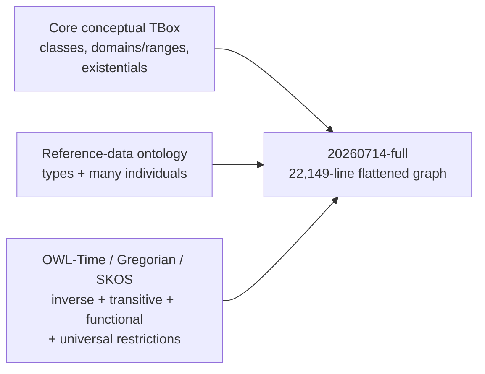
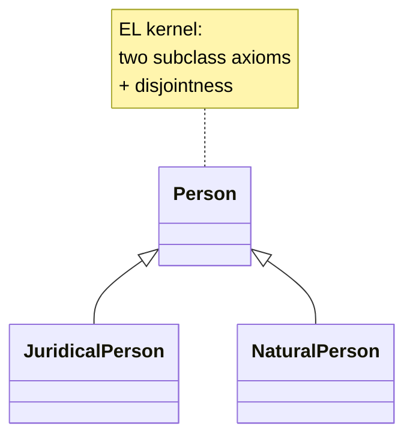
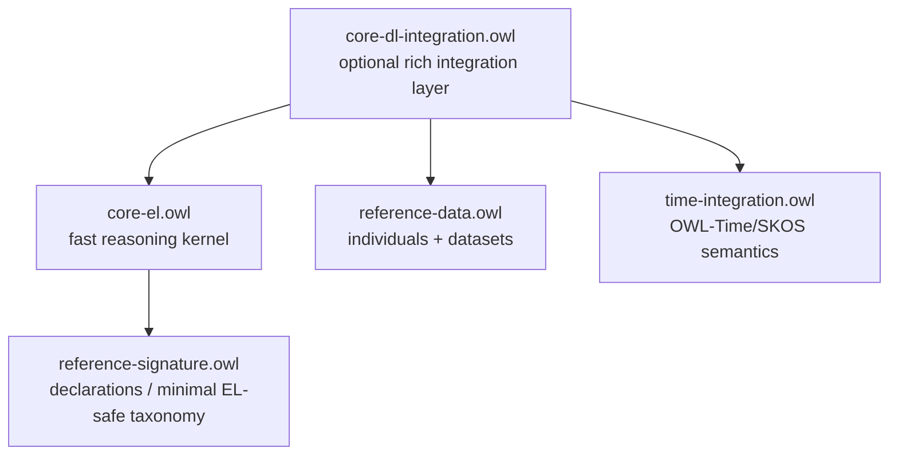
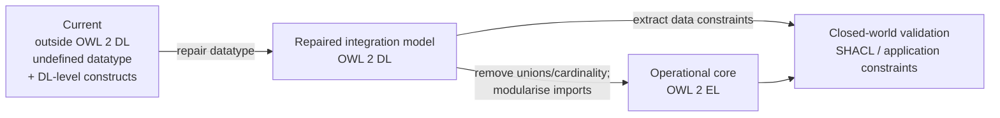

# OWL 2 Profile and Reasoning Analysis of the Hadden Industries Universal Core Ontology

## Executive summary

The supplied URL, `https://github.com/Hadden-Industries/universal-ontology/raw/refs/heads/main/src/universal/core/20260714-`, does **not identify an existing file**: the repository currently contains both `20260714` and `20260714-full`. I have treated **`20260714-full` as the intended target**, because it is the existing artefact whose name begins with the supplied `20260714-` prefix, while also analysing `20260714` separately to distinguish locally authored core axioms from imported/flattened content. The base ontology imports W3C Gregorian Time reference data and the Hadden Universal reference-data ontology; the `-full` artefact has no `owl:imports` statements and contains those external/reference axioms inline, consistent with a flattened import closure. citeturn0view0turn5view0turn8view0turn29view0

**Strict result: the ontology as currently published conforms to none of the four choices EL, QL, RL or DL.** It is unequivocally outside OWL 2 EL, QL and RL because its logical axioms contain qualified exact cardinalities, unions and, in the flattened build, further imported constructs such as universal restrictions, inverse properties, functional object properties and transitive properties. More importantly, it also fails a global requirement of **OWL 2 DL**: the core declares `core:Position` as a custom `rdfs:Datatype`, but gives it no `DatatypeDefinition`. OWL 2 DL requires every datatype occurring in the axiom closure either to be `rdfs:Literal`, to belong to the OWL 2 datatype map, or to be defined by exactly one datatype-definition axiom. citeturn24view0turn26view0

That DL failure is readily repairable. **After repairing/removing the undefined custom datatype, the natural classification of the existing model is OWL 2 DL, not EL, QL or RL.** The important distinction is therefore:

| Artefact/state | Precise classification |
|---|---|
| `20260714-full` as published | **None of EL / QL / RL / DL** |
| `20260714` as published | **None of EL / QL / RL / DL**, for the same undefined `core:Position` datatype plus profile-specific violations |
| After giving `core:Position` a valid datatype definition or remodelling it as an object/class | **OWL 2 DL**, but still not EL / QL / RL |
| Recommended reasoning kernel after the changes below | **OWL 2 EL** |

This distinction matters. OWL 2 EL guarantees polynomial-time consistency, class satisfiability, subsumption and instance checking, while unrestricted OWL 2 Direct Semantics has N2EXPTIME-complete worst-case complexity for these basic reasoning problems. These are worst-case theoretical bounds rather than predictions of elapsed runtime, but moving the operational TBox into EL gives a materially stronger scalability guarantee. citeturn26view2turn27view2

My principal architectural recommendation is therefore **not merely to “make it valid DL”**. It is to maintain two products:

1. a semantically rich **integration ontology** retaining any genuinely necessary DL constructs; and
2. a deliberately constrained **OWL 2 EL reasoning kernel** for routine classification and high-volume use.

For the EL kernel, remove the tautological minimum-cardinality-zero axioms, replace exact cardinality `= 1` by existential restrictions plus SHACL/application constraints for uniqueness, replace union-based covering definitions by ordinary subclass/disjointness axioms, correct the `Position` modelling, and stop flattening large reference/ABox vocabularies such as SKOS/OWL-Time into the runtime reasoning module. These changes preserve most of the useful taxonomy and existential semantics while eliminating the most consequential profile blockers. OWL 2 EL expressly supports existential restrictions, class disjointness, role hierarchies, transitivity and even property chains, but excludes cardinalities, disjunction, inverse properties and functional object properties. citeturn26view2turn27view0

## Scope, artefacts and method

### Artefacts examined

The base core ontology declares ontology IRI `https://haddenindustries.com/ontology/universal/core/`, version IRI ending in `/20260714`, and imports:

```text
http://www.w3.org/ns/time/gregorian
https://haddenindustries.com/ontology/universal/reference-data/20260714
```

The same source records a modification date of 14 July 2026. citeturn8view0

The base source is 4,305 raw lines. Its serialisation ends with an OWL API generator comment identifying **OWL API 4.5.29.2024-05-13T12:11:03Z**. That establishes the serializer used; it is **not evidence that an OWL API profile checker or reasoner was actually run**. citeturn19view2

The `20260714-full` file is substantially larger, at 22,149 lines, incorporates W3C Time, SKOS, Hadden reference-data and numerous named individuals, and contains no `owl:imports` token. For example, it contains Gregorian/Time individuals, SKOS property semantics and large `owl:AllDifferent` blocks directly in the document. I therefore interpret it as the flattened or self-contained build of the base import closure. citeturn9view0turn29view0turn29view2

### Conformance method

I performed a **static syntactic profile audit against the normative W3C OWL 2 Structural Specification and OWL 2 Profiles Recommendation**, rather than inferring a profile from ontology size or from the file's use of the term “OWL”. The three standard profiles are independent syntactic subsets—none is a subset of another—and profile membership depends both on which constructs occur and, for QL and RL especially, **where they occur within an axiom**. citeturn26view2turn27view0turn27view1

I did not execute a third-party reasoner or OWLAPI profile checker in this environment, so there are **no invented “reasoner results” in this report**. The findings below are direct source-level findings against the W3C grammar. For continuous integration, I recommend subsequently making the OWLAPI `OWL2DLProfile` and `OWL2ELProfile` checks release gates; importantly, that machine check should be applied to both the authored module and its intended imports closure.

There is also an important terminology point. W3C defines **OWL 2 EL, QL and RL as profiles**. “OWL 2 DL” is more properly the decidable Direct-Semantics fragment of OWL 2 subject to structural/global restrictions, rather than a fourth profile peer in exactly the same sense. The distinction is material here because the current ontology trips one of those global DL restrictions. citeturn26view0turn26view1

## Profile conformance and exact violations

### OWL 2 DL

The current ontology is **not strictly an OWL 2 DL ontology** because of this declaration in the authored core:

```xml
<rdfs:Datatype rdf:about=
  "https://haddenindustries.com/ontology/universal/core/Position">
    ...
</rdfs:Datatype>
```

There is no datatype definition attached to this datatype in the core; instead it consists of annotations describing it as a datatype capable of describing “a point or geometry potentially occupied by an object or person”. citeturn24view0

The corresponding W3C restriction is explicit: every datatype in the axiom closure must be `rdfs:Literal`, be in the OWL 2 datatype map, or be defined by a **single** `DatatypeDefinition`; datatype definitions must also be acyclic. W3C illustrates the RDF representation of a legal user-defined datatype using `owl:equivalentClass`, `owl:onDatatype` and `owl:withRestrictions`. citeturn26view0turn26view1

Thus the decisive violation is, in Functional Syntax terms:

```text
Declaration(
  Datatype(
    <https://haddenindustries.com/ontology/universal/core/Position>
  )
)
```

without a corresponding:

```text
DatatypeDefinition(core:Position ...)
```

Because this declaration originates in the core itself, flattening/import resolution does not repair the problem.

The `-full` build also contains other custom datatype declarations from imported material, for example ISO/IEC 11179 `phone_NumberDatatype` and `notationDatatype`, while OWL-Time custom datatypes such as `generalMonth` and `generalYear` are explicitly defined using `owl:onDatatype` and restrictions. This illustrates precisely the distinction that should be checked systematically across the closure. citeturn24view1turn24view2turn24view3

**After fixing the datatype issue**, I found no property-chain regularity violation in the target—indeed no active `owl:propertyChainAxiom` occurs in the flattened file—and the cardinality-bearing local object properties are not shown as transitive or chain-defined. That removes two common OWL 2 DL global-restriction hazards: cardinalities on non-simple roles and irregular role chains. OWL 2 DL permits cardinality restrictions only on simple object properties and imposes a regularity ordering on chain/property hierarchies. citeturn21view3turn26view1

### OWL 2 EL

The ontology is definitely **not OWL 2 EL**. W3C permits existential restrictions, intersections, class disjointness, role inclusion/property chains, transitivity, reflexivity and keys in EL, but explicitly excludes universal restrictions, all cardinality restrictions, disjunction, inverse properties, functional/inverse-functional object properties, symmetric properties, asymmetric properties and disjoint properties. citeturn26view2

The locally authored core already violates EL without considering imports.

**Disjunctions.** Three important covering definitions use `ObjectUnionOf`:

```text
Person ≡ JuridicalPerson ⊔ NaturalPerson

ProductOrService ≡ Product ⊔ Service

ProductOrServiceIndividual ≡
    ProductOrServiceIndividualMaterial
  ⊔ ProductOrServiceIndividualNonMaterial
```

The RDF/XML source contains the first and the latter product/service unions explicitly; `ObjectUnionOf` is prohibited in EL. citeturn10view0turn21view0turn26view2

**Exact qualified cardinalities.** The model extensively uses the relationship-object pattern:

```text
AddressToEventRelationship
  ⊑ (=1 AddressToEventRelationship_hasAddress.Address)
  ⊓ (=1 hasAddressToEventRelationshipType.AddressToEventRelationshipType)
  ⊓ (=1 AddressToEventRelationship_hasEvent.Event)
```

Those three restrictions are visible directly in the source, and analogous restrictions occur on `AddressToDocumentRelationship`, `MaterialObjectRelationship`, `MeansOfTransport`, `OrganisationToProductOrServiceRelationship`, `OutputToProcessRelationship`, `ProductOrServicePreference` and many other core classes. Any one `ObjectExactCardinality` is sufficient to violate EL; EL excludes **all min/max/exact cardinality constructors**. citeturn30view0turn30view1turn30view2turn30view3turn26view2

The `ProductOrServiceProvision` axioms are especially useful diagnostically:

```text
ProductOrServiceProvision
    ⊑ (≥0 hasProductOrService.ProductOrService)
    ⊑ (≥0 hasProductOrServiceIndividual.ProductOrServiceIndividual)
    ⊑ (=1 hasContractualCommitment.ContractualCommitment)
    ⊑ (=1 hasLegalRight.LegalRight)
    ⊑ (≤1 hasProductOrService.ProductOrService)
    ⊑ (≤1 hasProductOrServiceIndividual.ProductOrServiceIndividual)
```

Both `≥0` axioms are logically vacuous: every individual has at least zero fillers. They nevertheless introduce forbidden cardinality syntax and should simply be deleted. The exact and maximum cardinalities are meaningful but remain outside EL. citeturn30view3

The full closure adds further EL blockers:

* OWL-Time uses `owl:allValuesFrom`, including decimal-valued duration components and `gDay`/`gMonth` date components. Universal restrictions are prohibited in EL. citeturn22view0turn26view2
* SKOS and OWL-Time contain inverse-property axioms, such as `skos:broadMatch inverseOf skos:narrowMatch` and `time:before inverseOf time:after`. EL excludes inverse object properties. citeturn21view2turn26view2
* `skos:memberList` and `time:hasTRS` occur as functional object properties. EL excludes functional object properties. citeturn28view1turn26view2
* SKOS includes symmetric properties including `relatedMatch`, `closeMatch`, `related` and `exactMatch`; `exactMatch` is also transitive. Symmetry is outside EL even though transitivity itself is allowed. citeturn28view0turn29view1turn26view2
* OWL-Time contains disjoint-object-property assertions such as `propertyDisjointWith` on interval relations; EL excludes disjoint object properties. citeturn29view3turn26view2

There is **no active `ObjectOneOf` nominal axiom** detected in the full build: the `owl:oneOf` strings found are in OWL-Time change-note prose explaining a removed historical constraint, not actual RDF/XML constructors. This is favourable for EL. citeturn21view1

### OWL 2 QL

The ontology is also **not OWL 2 QL**. QL is designed for first-order rewritable database-style query answering and has AC⁰ data complexity for the relevant query regime. It excludes cardinality restrictions, disjunction, property chains, functional object properties, transitivity, keys and universal restrictions. It does permit inverse properties, so the mere presence of `owl:inverseOf` is not a QL violation. citeturn27view0turn27view2

The decisive local violations are again the exact/minimum/maximum qualified cardinalities and three union-based definitions. Thus the base core cannot be QL even before imports are resolved. citeturn10view0turn30view0turn30view3turn27view0

The flattened closure adds exact QL violations such as:

```text
TransitiveObjectProperty(time:before)
TransitiveObjectProperty(skos:exactMatch)
FunctionalObjectProperty(skos:memberList)
FunctionalObjectProperty(time:hasTRS)
```

and OWL-Time universal restrictions. QL explicitly disallows transitive and functional object properties and `ObjectAllValuesFrom`/`DataAllValuesFrom`. citeturn28view0turn28view1turn22view0turn27view0

Conversely, two features that might superficially appear suspicious are **not** the reason QL fails. Inverse object properties are supported in QL, and ordinary non-chain `SubObjectPropertyOf` axioms are supported. citeturn27view0

### OWL 2 RL

The ontology is **not OWL 2 RL**, and here syntactic *position* matters.

RL allows unions and existential restrictions on the **subclass/antecedent side** of implications, while its superclass/ consequent grammar is deliberately much narrower. A superclass can contain universals and maximum cardinality zero or one, but not `ObjectSomeValuesFrom`, exact cardinality or minimum cardinality. `EquivalentClasses` is narrower still: its permitted class-expression grammar does not contain union. citeturn27view1

Consequently, the three local union equivalences are exact RL violations:

```text
EquivalentClasses(
  Person
  ObjectUnionOf(JuridicalPerson NaturalPerson)
)

EquivalentClasses(
  ProductOrService
  ObjectUnionOf(Product Service)
)

EquivalentClasses(
  ProductOrServiceIndividual
  ObjectUnionOf(
    ProductOrServiceIndividualMaterial
    ProductOrServiceIndividualNonMaterial
  )
)
```

A union can occur on the left side of a suitable RL `SubClassOf`, but it cannot occur as the expression in these `EquivalentClasses` axioms. citeturn21view0turn27view1

Every local `ObjectExactCardinality(1 ...)` and `ObjectMinCardinality(...)` restriction is also outside RL. Maximum cardinality `≤1`, by contrast, **can** be RL-compatible when it occurs in the superclass position, so the two `ProductOrServiceProvision` max-one axioms are not themselves the problem. citeturn30view3turn27view1

A further local RL blocker is easy to overlook: the core uses existential restrictions on the **right-hand side** of subclass axioms. Examples detected in the authored source include:

```text
Location
  ⊑ ∃ hasGeometry.Geometry

Measurement
  ⊑ ∃ hasMeasurementResult.MeasurementResult
  ⊑ ∃ hasQuantity.Quantity

MeasurementResult
  ⊑ ∃ hasMeasuredQuantityValue.MeasuredQuantityValue

Offer
  ⊑ ∃ Offer_hasOffering.Offering

Offering
  ⊑ ∃ hasPriceSpecification.PriceSpecification

Task
  ⊑ ∃ Task_hasActivity.Activity
```

These are excellent EL axioms, but not RL superclass expressions. This restriction is intentional: RL is designed to avoid rules that have to infer the existence of previously unnamed individuals. citeturn16view3turn27view1

Imported inverse, symmetric, functional and transitive properties are **not automatically RL violations**—RL supports those property-axiom types subject to global restrictions. This is another reason simply grepping for “advanced OWL constructs” is not a sound profile checker. citeturn27view1

### Compact conformance matrix

| Construct actually present | EL | QL | RL | DL after datatype repair |
|---|---:|---:|---:|---:|
| `ObjectUnionOf` in local `EquivalentClasses` | ❌ | ❌ | ❌ in equivalence position | ✅ |
| Qualified `=1` cardinality | ❌ | ❌ | ❌ | ✅ on simple roles |
| Qualified `≥0` | ❌ | ❌ | ❌ | ✅, but pointless |
| Qualified `≤1` on superclass | ❌ | ❌ | ✅ | ✅ |
| RHS existential `A ⊑ ∃R.B` | ✅ | ✅ | ❌ | ✅ |
| Universal restrictions from OWL-Time | ❌ | ❌ | ✅ in permitted superclass positions | ✅ |
| Inverse object properties from imports | ❌ | ✅ | ✅ | ✅ |
| Transitive properties from imports | ✅ | ❌ | ✅ | ✅ |
| Functional object properties from imports | ❌ | ❌ | ✅ | ✅ |
| Symmetric object properties from SKOS | ❌ | ✅ | ✅ | ✅ |
| Disjoint object properties from OWL-Time | ❌ | ✅ | ✅ | ✅ |
| Property chains | Not found | — | — | Not found |
| `HasKey` | Not found | — | — | Not found |
| Active multi-individual `ObjectOneOf` | Not found | — | — | Not found |
| Undefined custom `core:Position` datatype | Violates global constraints | Violates global constraints | Violates global constraints | **❌ decisive current DL failure** |

The profile permissions in this table follow the W3C profile grammars and global restrictions. citeturn26view0turn26view2turn27view0turn27view1

## Construct-level complexity and reasoning performance

### Cardinality, equality and relationship reification

**Cardinality is the principal locally authored expressivity cost.** The ontology systematically reifies n-ary/binary relationships as classes and then requires the endpoint and relationship-type roles to have exactly one filler. The `AddressToEventRelationship` pattern is representative, and analogous patterns occur throughout the core. citeturn30view0turn30view1turn30view2

For a DL tableau reasoner, `=1 R.C` combines an existence requirement with an at-most-one constraint. Under OWL's open-world semantics, observing two fillers does not simply mean “constraint violation”; absent evidence that they are different, equality may have to be considered. Removing max-cardinality reasoning from the classification layer therefore does more than shorten syntax: it removes a source of equality/merging reasoning.

The two `≥0` restrictions on `ProductOrServiceProvision` deserve immediate deletion. They are semantically true for every individual regardless of its property values and therefore convey no domain information at all. citeturn30view3

### Existential and universal restrictions

The local core's existential restrictions are, from an EL perspective, **good modelling primitives**. EL was explicitly designed to permit existential restrictions while retaining polynomial-time basic reasoning. The `Location → some Geometry`, `Measurement → some MeasurementResult`, and similar axioms should therefore normally be retained in an EL optimisation. citeturn16view3turn26view2

The imported OWL-Time universal restrictions have a different computational character. They constrain every value of temporal-component properties to appropriate datatypes such as decimal, `gDay` or `gMonth`. Universals do not force a new filler to exist, but they propagate constraints to fillers that are known or subsequently inferred. They are outside EL and QL, although they fit suitable RL superclass positions. citeturn22view0turn26view2turn27view0turn27view1

For this ontology, that means **keeping core existential semantics while removing imported universal semantics from the high-performance kernel is a particularly attractive trade-off**.

### Nominals, individuals and `AllDifferent`

No active `ObjectOneOf` nominal was found. The two textual occurrences located in OWL-Time are change notes describing historical one-of constraints, not live axioms. Nominals therefore do not appear to be a current complexity driver. citeturn21view1

The flattened build does, however, contain substantial ABox content and numerous `owl:AllDifferent` sets—for example ISO/IEC 11179 status individuals, seasons, days of the week and classification-scheme values. `AllDifferent` is inequality information, not an `ObjectOneOf` class constructor. It can nevertheless increase the amount of equality/inequality bookkeeping when ABox reasoning is mixed with cardinality constraints. citeturn29view2

This is another argument against loading the entire reference-data ABox into every TBox classification operation.

### Inverses, transitivity and role hierarchies

The authored core scan found no active inverse-property declarations, whereas the flattened imports introduce many, notably SKOS mapping pairs and OWL-Time interval relations. Examples include:

```text
skos:broadMatch    inverseOf skos:narrowMatch
skos:hasTopConcept inverseOf skos:topConceptOf
time:before        inverseOf time:after
time:intervalStarts inverseOf time:intervalStartedBy
```

citeturn21view2

The full build also contains transitive role semantics such as `time:before`, `skos:exactMatch`, `skos:narrowerTransitive` and `skos:broaderTransitive`, plus substantial `rdfs:subPropertyOf` hierarchies. citeturn28view0turn28view3

Role hierarchies and transitivity can cause entailments to propagate over paths, but they are not inherently “bad”: EL explicitly supports transitive roles and property inclusion. The more important optimisation is to avoid importing unrelated SKOS/OWL-Time role systems into queries that only require Hadden core taxonomy. citeturn26view2

No `owl:propertyChainAxiom` was found in the 22,149-line flattened target. This is favourable. It also means property-chain regularity is not currently the reason the model is outside DL or the lightweight profiles. citeturn21view3

### Functional, symmetric and disjoint properties

Functional object-property semantics arrive through imports: examples are `skos:memberList` and `time:hasTRS`. SKOS also contributes symmetric properties including `related`, `relatedMatch`, `closeMatch` and `exactMatch`, while OWL-Time contains object-property disjointness. citeturn28view1turn29view1turn29view3

These constructs are particularly relevant to choosing a target profile. Removing the imported modules makes an EL conversion considerably easier because the local core itself does not appear to depend on these property characteristics.

Local **class disjointness**, by contrast, is worth retaining. Examples include `JuridicalPerson` versus `NaturalPerson`, `Product` versus `Service`, material versus non-material product/service individuals, `TransactionTime` versus `ValidTime`, and `VerbalContract` versus `WrittenContract`; there are also all-disjoint groups for several geometry and material-object categories. citeturn19view1turn19view2

Class disjointness is permitted in EL, QL and RL and provides useful consistency detection without being responsible for the current profile escalation. citeturn26view2turn27view0turn27view1

### Datatypes

Datatype modelling is currently both a **correctness issue and a profile issue**.

The core `Position` datatype is semantically suspicious even apart from its formal DL defect. Its own definition describes a “point or geometry potentially occupied by an object or person” and notes relationships to ISO 19107 geometry. Those are object-level notions with identity and structure, rather than an obvious lexical value space such as integer, date or constrained string. citeturn24view0

By comparison, OWL-Time's `generalMonth` and `generalYear` are modelled as genuine lexical datatypes: constrained strings defined using `owl:onDatatype` plus regular-expression facets. This is much closer to the intended OWL datatype mechanism. citeturn24view1turn24view3

EL's datatype vocabulary is deliberately restricted; it supports, among others, decimal, integer, string, URI and date-time types but excludes types such as boolean, float and double. RL has a broader but still enumerated datatype set. Consequently, an EL runtime ontology should keep datatype ranges deliberately simple and based on the EL list rather than carrying arbitrary imported datatype definitions. citeturn26view2turn27view1

### Keys, annotations and punning

No `owl:hasKey` axiom was found in the full target. Keys are therefore not a present reasoning factor. This is favourable because keys can interact with identity reasoning even though EL and RL both provide controlled support for them. citeturn22view2turn26view2turn27view1

The ontology is annotation-rich—definitions, provenance, identifiers, scope notes, examples, modification dates and axiom annotations are pervasive. For example, even the custom `Position` datatype and virtually every property/class carry extensive metadata. citeturn24view0turn30view0

These annotations are valuable documentation and governance metadata. They are not a reason to weaken the conceptual model. For operational deployments, however, a **reasoning distribution stripped of nonessential documentation annotations** can reduce RDF/XML parsing, object allocation and memory footprint even though it does not change the intended logical TBox.

I found no clear evidence of problematic local **punning**—that is, deliberately reusing one IRI as entities of different OWL entity kinds. The many reference-data instances in the full artefact should not be confused with punning merely because they are typed both as `owl:NamedIndividual` and as some domain class; that is ordinary class membership. A future automated profile gate should nevertheless check entity-type collisions, because punning and RDF-to-structural mapping problems are much easier to detect mechanically than by visual inspection.

### Overall performance picture

The current build combines three things that should ideally be separate:



This flattening means a reasoner asked merely to classify `Person`, `Organisation`, `ProductOrService` or relationship classes is also presented with temporal role semantics, SKOS mapping semantics, ABox inequality assertions and large quantities of reference metadata. The source itself demonstrates the mixture: local cardinalities coexist in the same full document with imported inverse/transitive SKOS and OWL-Time properties and `AllDifferent` ABox blocks. citeturn22view3turn28view0turn29view2

The W3C worst-case results put the architectural opportunity in perspective: basic reasoning in OWL 2 EL is PTIME-complete; QL offers AC⁰ data complexity for its database-query use case; RL has PTIME basic reasoning; full OWL 2 Direct Semantics reaches N2EXPTIME-complete worst case. These bounds are not benchmark results for this particular ontology, but they make a profile-constrained operational model a much safer scaling proposition. citeturn27view2

## Recommended modelling and declaration changes

### Make `Position` an object-level concept, not an undefined datatype

**Current:**

```text
Declaration(Datatype(core:Position))
```

with no `DatatypeDefinition`. citeturn24view0turn26view0

Because its documented meaning is a geometric/spatial position, my preferred model is:

```text
Declaration(Class(core:SpatialPosition))

SubClassOf(core:SpatialPosition core:Geometry)
```

or, if the intended ontology distinguishes points from arbitrary geometry:

```text
Declaration(Class(core:Position))
SubClassOf(core:DirectPosition core:Position)
SubClassOf(core:Position core:Geometry)
```

after first removing all uses of `core:Position` as a datatype. Do **not** retain simultaneous class and datatype use under the same IRI simply to preserve backwards compatibility; migrate consumers explicitly.

If `Position` really is meant to be a lexical datatype, then define it as one:

```text
DatatypeDefinition(
  core:Position
  DatatypeRestriction(
    xsd:string
    xsd:pattern "..."
  )
)
```

following the W3C user-defined-datatype pattern. That would repair DL conformance, although it would not by itself produce EL/QL/RL conformance. citeturn26view0

**Estimated impact:** very high correctness benefit; negligible-to-positive reasoning cost.  
**Effort:** approximately 1–3 person-days if currently unused as a data range; materially more if downstream data uses it.  
**Risk:** medium because changing an entity from datatype semantics to class/object semantics is an API/schema change.

### Replace exact-one OWL constraints with EL existentials plus validation

Current example:

```text
SubClassOf(
  core:AddressToEventRelationship
  ObjectExactCardinality(
    1
    core:AddressToEventRelationship_hasAddress
    core:Address
  )
)
```

The corresponding source restriction is explicit. citeturn30view0

Recommended EL axiom:

```text
SubClassOf(
  core:AddressToEventRelationship
  ObjectSomeValuesFrom(
    core:AddressToEventRelationship_hasAddress
    core:Address
  )
)
```

and move closed-world integrity to SHACL:

```turtle
core:AddressToEventRelationshipShape
    a sh:NodeShape ;
    sh:targetClass core:AddressToEventRelationship ;
    sh:property [
        sh:path core:AddressToEventRelationship_hasAddress ;
        sh:class core:Address ;
        sh:minCount 1 ;
        sh:maxCount 1
    ] .
```

This division is semantically cleaner for enterprise-data architecture: OWL says **what necessarily exists in every model**; SHACL/data validation says **what a submitted record must explicitly contain and how many values are acceptable**.

Apply this systematically to reified relationship endpoint and type properties.

**Estimated reasoning impact:** high. It removes exact-cardinality/equality reasoning and permits this entire axiom family to remain in OWL 2 EL. EL's basic reasoning problems have polynomial-time guarantees. citeturn26view2turn27view2

**Semantic caveat:** the OWL entailment “there can be at most one” is no longer present in the EL ontology. It becomes a validation invariant. That is an intentional change, not a logically equivalent rewriting.

### Delete minimum-cardinality-zero axioms outright

Current:

```text
ProductOrServiceProvision
  ⊑ (≥0 hasProductOrService.ProductOrService)

ProductOrServiceProvision
  ⊑ (≥0 hasProductOrServiceIndividual.ProductOrServiceIndividual)
```

citeturn30view3

Proposed:

```text
# delete both axioms
```

There is no replacement because “at least zero” contributes no constraint under OWL semantics.

**Estimated impact:** small in raw runtime, but unambiguously positive; removes two profile violations with **zero loss of semantics**.

### Refactor union covering axioms

Current:

```text
Person ≡ JuridicalPerson ⊔ NaturalPerson
```

citeturn21view0

For the EL reasoning kernel:

```text
JuridicalPerson ⊑ Person
NaturalPerson   ⊑ Person

DisjointClasses(
  JuridicalPerson
  NaturalPerson
)
```

The same pattern should be applied to:

```text
ProductOrService
ProductOrServiceIndividual
```

whose union definitions are also present in the core. citeturn21view0

Conceptually:



The proposed form preserves subclass classification and mutual exclusion but intentionally drops the **covering** inference that every `Person` must belong to one of the two subclasses. EL allows class disjointness but not disjunction. citeturn26view2

Where business rules require exhaustive coverage, express that separately as a SHACL `sh:or`, data-quality rule or integration-layer assertion.

**Estimated impact:** medium-to-high for classification predictability; removes nondisjunctive branching from these definitions and makes the class hierarchy EL-compatible.

### Preserve existential axioms in an EL target

Do **not** remove axioms such as:

```text
Location ⊑ ∃hasGeometry.Geometry
Measurement ⊑ ∃hasMeasurementResult.MeasurementResult
Offering ⊑ ∃hasPriceSpecification.PriceSpecification
Task ⊑ ∃Task_hasActivity.Activity
```

merely because they prevent RL conformance. They are native OWL 2 EL constructs and are semantically useful. citeturn16view3turn26view2

This is one reason I recommend **EL over RL as the primary target profile**. Converting to RL would require deleting or externalising these existence axioms, whereas EL lets you retain them after removing cardinalities and union/foreign-property constructs.

### Modularise the imports rather than flattening everything

The authored core directly imports Gregorian Time and Hadden reference data, while the `-full` build incorporates imported semantics and ABox content inline. citeturn8view0turn29view0

Recommended deployment structure:



`core-el.owl` should contain the conceptual hierarchy, domains/ranges, safe disjointness and existential restrictions needed for routine reasoning. `reference-signature.owl` should expose only the external entity IRIs and minimal EL-safe semantics needed by that core. Rich reference individuals and full temporal/SKOS semantics should be imported only into the integration build where they are actually required.

This change has potentially more practical impact than micro-optimising individual axioms, because the full build currently carries inverse relations, transitivity, symmetry, functional properties, universal restrictions and extensive ABox inequality content unrelated to many core classification tasks. citeturn21view2turn22view0turn28view0turn28view1turn29view2

### Keep role chains absent unless there is a demonstrated requirement

No active property chain was found. Keep it that way unless a concrete competency question justifies introducing one. citeturn21view3

This is not because property chains are inherently incompatible with EL—they are supported there—but because chains complicate role-hierarchy analysis and are subject to additional OWL 2 DL regularity conditions. W3C also places a special range-propagation restriction on EL property chains. citeturn26view1turn27view0

### Current-versus-proposed construct table

| Concern | Current model | Proposed operational model | Profile effect | Estimated impact |
|---|---|---|---|---|
| `core:Position` | Undefined custom datatype | New object-level `Position`/`SpatialPosition` class, or proper datatype definition | Repairs DL global violation; class route easier for EL | **High correctness**, medium migration risk |
| Relationship endpoints | Qualified `=1` | `some R.C` in OWL + SHACL min/max 1 | DL → EL-compatible | **High** |
| `≥0` cardinalities | Present on provision | Delete | Removes useless non-EL syntax | Small but free |
| Max-one validation | OWL qualified `≤1` | SHACL `maxCount 1` for EL build | Removes remaining cardinality | Medium |
| Person coverage | `Person ≡ J ⊔ N` | `J ⊑ Person`, `N ⊑ Person`, disjointness | Removes disjunction | Medium-high |
| Product/service coverage | Union equivalence | Separate subclasses + disjointness | Removes disjunction | Medium-high |
| RHS existentials | Present | **Keep** | Favour EL over RL | Preserves valuable semantics |
| Universal restrictions | Imported OWL-Time | Keep out of core EL module | Removes EL blocker | Medium |
| Inverse properties | Imported SKOS/OWL-Time | Integration module only | Removes EL blocker | Medium-high |
| Functional object properties | Imported | Validation/integration module | Removes EL blocker | Medium |
| Transitivity | Imported | Keep only where needed; EL-safe when isolated | No inherent EL problem | Workload-dependent |
| Property chains | None | Remain absent unless justified | Keeps role hierarchy simple | Preventative |
| Keys | None | Remain absent unless identity semantics demand them | No current blocker | Preventative |
| `AllDifferent` ABox sets | Numerous in full build | Reference-data/integration build only | Smaller runtime ABox | Medium at scale |
| Documentation annotations | Extensive | Full in authoring build; optionally stripped in runtime build | Profile-neutral in intended use | Small–medium load/memory |
| Imports | Broad + flattened `-full` | Modular EL kernel + optional DL integration closure | Enables genuine EL runtime | **Very high architectural impact** |

The profile effects above follow directly from W3C's EL, QL and RL grammars and the observed constructs. citeturn26view2turn27view0turn27view1

## Migration, validation and expected outcome

I recommend a staged migration rather than editing the published ontology in place.

| Stage | Work | Estimated effort | Principal risk | Acceptance criterion |
|---|---|---:|---|---|
| Baseline | Freeze `20260714`, `20260714-full`, competency queries and representative data | 0.5–1 day | Low | Reproducible baseline |
| Datatype repair | Inventory custom datatypes; remodel/define `Position`; validate all imported custom datatypes | 1–3 days core-only | Medium | Passes OWL 2 DL datatype restrictions |
| Remove tautologies | Delete all `≥0` restrictions | <0.5 day | Very low | Entailment regression shows no logical loss |
| Cardinality split | Convert `=1` to EL existentials; move max-one/min-one record constraints to SHACL | 3–8 days depending on number of shapes | Medium-high | EL retains existence entailments; SHACL catches cardinality violations |
| Union refactor | Replace three covering union equivalences with subclass + disjointness; add coverage validation if required | 1–2 days | Medium | Agreed competency queries still hold |
| Import modularisation | Build EL-safe reference signature; separate ABox/OWL-Time/SKOS integration modules | 3–7 days | Medium-high | `core-el` loads without forbidden imported constructs |
| Profile gate | Add automated OWL 2 EL and DL profile checks to CI | 1–2 days | Low | Every release reports zero unexpected violations |
| Reasoner benchmarking | Compare classification, consistency and representative query workloads before/after | 1–3 days | Low | Empirical regression baseline available |
| Consumer migration | Publish versioned migration notes and update applications/SHACL | 2–10+ days | Organisation-specific | No downstream schema breakage |

These effort values are engineering estimates, not measured project data; the dominant uncertainty is how many downstream systems currently interpret OWL cardinalities as validation rules.

### Recommended validation sequence

First, create a **DL-correct baseline** before attempting EL conversion. Fix `Position` and run a structural profile checker over the *import closure*, not merely the root document. This prevents EL refactoring from masking an independent standards-conformance defect. The need to check the closure follows directly from OWL 2's global restrictions, which are defined over the axiom closure. citeturn26view0turn26view1

Second, capture entailments that matter to consumers: subclass hierarchies, disjointness-derived inconsistencies, property domain/range inferences and any identity consequences of exact cardinalities. The latter are important because replacing `=1` with existential-plus-SHACL is deliberately not fully entailment-preserving.

Third, construct `core-el` and apply a hard profile gate. The expected end-state feature set is:

```text
Classes
SubClassOf
EquivalentClasses using EL-safe expressions
DisjointClasses
ObjectSomeValuesFrom
simple datatype ranges from the EL datatype set
ObjectPropertyDomain / Range
simple role hierarchies
selected transitivity where genuinely useful
annotations
```

and not:

```text
ObjectUnionOf
ObjectExactCardinality
ObjectMinCardinality
ObjectMaxCardinality
ObjectAllValuesFrom
InverseObjectProperties
FunctionalObjectProperty
SymmetricObjectProperty
DisjointObjectProperties
unsupported/custom undefined datatypes
```

Those inclusion/exclusion boundaries correspond to the normative EL feature set. citeturn26view2

Fourth, benchmark **the actual operational workload**, not only ontology-load time. At minimum compare classification, consistency checking, a representative materialised ABox and several business competency queries. W3C explicitly cautions that worst-case complexity classes do not tell us how an implementation will run on a particular input, so empirical tests remain necessary even after achieving EL. citeturn27view2

The expected architectural complexity transition is:



This avoids the common error of trying to make OWL itself serve simultaneously as an open-world ontology language, a relational integrity-constraint language and a reference-data packaging format.

## Assumptions, limitations and primary sources

**URL interpretation.** The supplied `.../20260714-` location does not currently resolve to a file. I assumed `20260714-full` was intended because the repository lists `20260714` and `20260714-full`, and the latter is the existing file matching the supplied prefix. I analysed the base `20260714` alongside it so that imported constructs were not mistakenly attributed to the locally authored core. citeturn0view0turn5view0

**Meaning of “current”.** The analysis concerns the repository contents observable on **1 September 2026**, specifically the 14 July 2026 ontology version, rather than a later unpublished or working copy. The base source itself identifies its version and 14 July 2026 modification metadata. citeturn8view0

**“DL” classification.** I use strict W3C structural conformance. I do not label an ontology “OWL 2 DL” merely because a DL reasoner might parse much of it. Under that definition, the undefined `core:Position` datatype is sufficient to make the current source non-DL. citeturn24view0turn26view0

**Static analysis rather than executed profile checker.** The file records OWL API **4.5.29.2024-05-13T12:11:03Z** as its generator, but I did not treat that as a reasoner/profile-check result. A release-quality follow-up should run an OWLAPI profile check and at least one DL and EL reasoner against the revised modules and record exact versions in CI. citeturn19view2

**Punning.** I found no clear locally authored same-IRI entity-kind punning in the source inspection. This finding has lower confidence than construct searches such as `owl:unionOf`, `owl:inverseOf`, `owl:propertyChainAxiom` and `owl:hasKey`; automated entity-signature checking should therefore remain part of the migration gate.

**Performance estimates.** Statements such as “high” or “medium” expected impact are architectural estimates based on removal of expressivity/import closure, not benchmark measurements. The only formal complexity claims made here are the W3C results: EL basic reasoning is PTIME-complete, QL has AC⁰ data complexity for its intended query setting, RL offers PTIME bounds for several basic tasks, and unrestricted OWL 2 Direct-Semantics basic reasoning reaches N2EXPTIME-complete worst case. citeturn27view2

The principal normative sources are the [W3C OWL 2 Web Ontology Language Profiles, Second Edition](https://www.w3.org/TR/owl2-profiles/) and the [W3C OWL 2 Structural Specification and Functional-Style Syntax, Second Edition](https://www.w3.org/TR/owl2-syntax/). The former defines the EL, QL and RL grammars and their complexity characteristics; the latter defines the OWL 2 DL global restrictions on datatypes, simple roles and role-hierarchy regularity. citeturn26view0turn26view2turn27view0turn27view1turn27view2

The most important conclusion is consequently precise rather than approximate: **the published ontology is not presently OWL 2 EL, QL, RL or DL. Its intended logical expressivity is closest to OWL 2 DL, but the undefined `core:Position` datatype prevents strict DL conformance. Repairing that datatype makes DL the appropriate current-language target; refactoring cardinality, covering unions and broad flattened imports can then produce a substantially simpler OWL 2 EL operational kernel without sacrificing most of the core ontology's useful existential and taxonomic semantics.** citeturn24view0turn26view0turn26view2