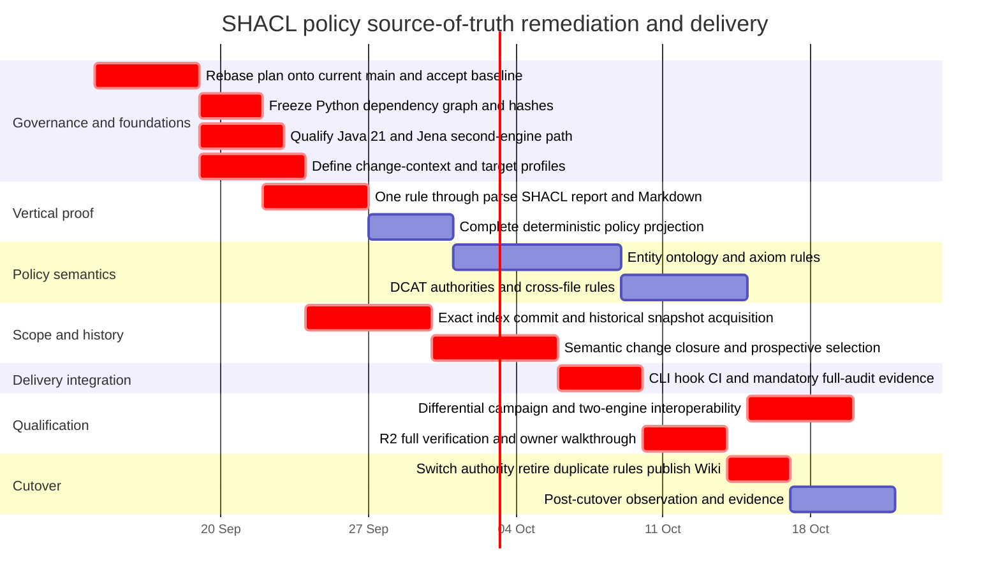

# Verification of the SHACL Policy Source-of-Truth Implementation Plan

## Executive summary

**Overall verdict: AMBER — the plan is technically credible and substantially aligned with its stated goal, but I would not approve it for implementation unchanged.** It is likely to achieve the desired outcome **after several bounded amendments**, principally around change-context ownership, prospective targeting, reproducible dependency qualification, second-engine provisioning, and preservation of a mandatory whole-corpus audit signal. The underlying architecture—canonical SHACL, graph-level validation, Git-aware snapshot selection, deterministic policy generation, and explicit cutover—is sound. fileciteturn0file0

The supplied repository URL appears to contain an extra `repository` suffix; the actual public repository is `Hadden-Industries/universal-ontology`. The plan was written against commit `b32d7cff65e57a4d4ea68334350e27b8ef5038ef`, whereas the repository has subsequently moved to at least `13a3c36ef5bfe7d56aa7a09facc395da7631c502` on 11 September 2026. The latter merge adds SDLC evidence-freshness behaviour, so configuration and baseline assumptions in the 9 September plan require a fresh rebase/check before implementation. fileciteturn24file0L3-L7

The plan's goal is unusually well articulated:

> “Author graph-level editing requirements once in SHACL, generate the Wiki policy from that source, enforce policy on prospective entity changes by default, and support manual audits of any chosen ontology version.”

It explicitly says that no implementation had started when the plan was written. Issue #31 independently states the same intended outcome and, importantly, labels its acceptance criteria as **candidate** criteria until actual owner acceptance. It also expressly says that creating the Issue does not establish an accepted baseline, implementation evidence, or Wiki publication. fileciteturn26file0L3-L6

My assessment separates **plan adequacy** from **implementation status**:

| Goal | Plan coverage | Current implementation status | Assessment |
|---|---|---|---|
| SHACL is the single authority for graph editing rules | Strong: canonical TTL modules, metadata contract, renderer, cutover removal of duplicated Python rules | Not implemented | **Strong design, conditional** |
| Wiki Editing Policy is generated from that authority | Strong: deterministic renderer, freshness checking, publication/readback stage | Not implemented | **Strong design** |
| Added/changed entities are enforced without forcing legacy cleanup | Strong intent; Git/index/snapshot design is detailed | Existing runner selects changed *paths* but validates working-tree files and whole-document legacy rules | **Needs one design amendment before implementation** |
| Any chosen ontology version can be manually audited | Explicit `--at-revision`, explicit files, policy revision concept, coherent corpus modes | Current runner has no corresponding historical snapshot validation semantics | **Plausible, but unresolved context rules remain** |
| Cross-file/global constraints see complete context | Explicit five-source coherent corpus and authority snapshots | Legacy uniqueness is per file | **Plan fixes a real current limitation** |
| Independent qualification proves correctness | pySHACL + Meta-SHACL + Jena + negative controls | No SHACL implementation yet | **Incomplete toolchain specification** |
| Reproducibility/trust | Explicit local inputs, no live imports/SERVICE/SHACL-JS; provenance planned | Direct Python pins proposed, but no required transitive hash lock; Jena runtime provisioning omitted | **Material gap** |
| Operational cutover removes duplicate authority | Explicit finite differential period and legacy retirement | Existing XML/Python checker remains authoritative | **Good migration design** |

The most important conclusion is therefore:

**The goal is achievable with this repository and the proposed technology. The plan already solves most of the hard semantic problems. But “as written” it does not yet close every acceptance path it claims to close. I recommend a conditional GO after the P0 amendments below, not a rewrite of the plan.**

Issue #31 itself supports that interpretation: AC-001 through AC-010 require canonical rule ownership, prospective-vs-manual scoping, complete graph context, actual staged bytes, deterministic policy generation, independent validation, reproducibility, controlled cutover, and operational evidence—not merely passing unit tests. fileciteturn26file0L6-L6

## Repository baseline, structure and delivery architecture

### Repository metadata

The repository is a public semantic-web/ontology project. GitHub's organisation listing identifies **XSLT** as its primary language; the operational/tooling layer also contains substantial JavaScript and Python, while the ontology itself is represented in OWL/RDF/XML and related RDF forms. The repository exposes `core`, `extended`, `reference-data`, `iso-31073`, `iso-iec11179-3`, `scripts`, `src`, and `tests` as major top-level areas. citeturn6search1 citeturn5view0

At the plan's inspected revision, the runtime/tooling contract was:

| Surface | Inspected value / role |
|---|---|
| Python | `3.14.7` from `.python-version` fileciteturn19file0L2-L5 |
| Node | `24.20.0` from `.node-version` fileciteturn20file0L2-L5 |
| npm | `npm@12.0.2` through root `package.json` |
| Python RDF dependency | `rdflib>=7.6.0` already exists; `lxml`, `defusedxml`, `xmlunittest` support the current XML validator fileciteturn8file0L2-L5 |
| Planned SHACL dependency | `pyshacl==0.40.1`, with an exact RDFLib 7.6.0 proposal |
| JavaScript test/build stack | Jest, lint/format tooling, Vite, browser/build tooling, MCP components through root npm scripts fileciteturn7file0L2-L5 |
| Primary ontology documents | `core/universal-core.owl`, `extended/universal-extended.owl`, `reference-data/reference-data.owl`, `iso-31073/iso-31073.owl`, `iso-iec11179-3/iso-iec11179-3.owl` fileciteturn35file0L2-L5 |

The existing development instructions deliberately centralise ontology checking in `scripts/validate_ontologies.py`, with the same runner reused from pre-commit and GitHub Actions. That is an important asset for the proposed migration: the plan does not need to invent a second delivery path. fileciteturn29file0L2-L6

### Key implementation modules

The current validation path is approximately:

```text
Git staged diff / PR base-head
        |
        v
scripts/validate_ontologies.py
        |
        v
tests/universalontologytest.py
        |
        v
XML/RDF-XML structural assertions
```

The plan changes that to:

```text
Git index / exact commits / explicit historical snapshot
        |
        v
snapshot + semantic entity-change layer
        |
        +----------------------+
        |                      |
        v                      v
canonical SHACL policy    coherent ontology/context graphs
        |                      |
        +----------+-----------+
                   v
             SHACL engine
                   |
           native RDF report
             /             \
            v               v
   contributor summary   deterministic
                         policy Markdown
```

That is architecturally appropriate. It keeps repository mechanics outside the constraint language while making ontology rules themselves data. The uploaded plan assigns canonical rule ownership to `policy/*.ttl`, repository-specific acquisition/change handling to `scripts/ontology_policy/`, keeps `scripts/validate_ontologies.py` as the operational façade, and gives Wiki projection to `scripts/render_editing_policy.py`. Issue #31 describes the same separation: reuse RDFLib for parsing/query/isomorphism, use pySHACL for validation, and keep residual custom code limited to snapshot/change/report integration and deterministic policy projection. fileciteturn26file0L6-L6

### Dependencies and CI

At the inspected revision there were six GitHub workflow files: CodeQL, ontology validation, SDLC control tests, SDLC Issue acceptance, SDLC PR validation, and MCP distribution verification. fileciteturn30file0L2-L7

The ontology workflow has a particularly useful property: it performs a **planning/selection step before installing ontology-validation dependencies**, installs those dependencies only when validation is applicable, runs `tests/test_validate_ontologies.py` when the validator itself changes, and then validates selected ontology files. That should be preserved. fileciteturn15file0

The current SDLC full profile also contains a mandatory `Ontology source invariants` command covering all five current ontology files, alongside JavaScript tests, Python tests, SDLC tests, linting, formatting, build, JSON-LD generation and MCP packaging. This becomes important later: the SHACL plan proposes replacing the unconditional whole-file gate with prospective comparison while retaining full-source audits as diagnostics. fileciteturn31file0L2-L6

## Documented goal, success criteria and architecture fit

The plan and Issue #31 are notably better than a conventional “replace validator with SHACL” proposal because they define externally observable success. Issue #31's acceptance framework can be condensed into the following traceability model. fileciteturn26file0L6-L6

| Acceptance area | Required observable behaviour | Plan mechanism | Fit |
|---|---|---|---|
| Canonical ownership | Every graph rule has one named SHACL entry; migrated XML/Python rules disappear after cutover | Policy TTL modules, stable IDs, metadata shapes, Slice 008 retirement | **Good** |
| Semantic correctness | Accepted examples and boundaries, not legacy behaviour, define the oracle | Independently authored fixtures and differential ledger | **Good** |
| Prospective/manual scope | Legacy defect is visible manually but does not alone block unrelated new changes | Semantic change selection + focus-specific validation + manual audit modes | **Good concept; target contract needs tightening** |
| Complete context | Cross-file collisions/references are visible without mixing incompatible historical releases | Coherent corpus loader + authority snapshots | **Good** |
| Faithful change detection | Actual staged/commit bytes, graph-isomorphic comparison and blank-node closure determine changes | Slice 005 snapshot/change subsystem | **Good; crucial fix to current runner** |
| Generated policy | Entire policy projection is deterministic and stale generated content fails checks | Renderer + metadata shapes + `--check` | **Good** |
| Independent assurance | Meta-SHACL, negative controls, second engine and corpus diagnostics establish different claims | Slice 007 | **Good intent; second-engine runtime omitted** |
| Reproducibility | Explicit inputs, no live imports/SERVICE/code execution, failures cannot become passes | Local snapshots and fail-closed runner | **Partial until dependency locking is concrete** |
| Controlled cutover | Differences are dispositioned; Wiki is published/read back separately; no fallback authority remains | Slices 007–008 | **Good** |
| Useful outcome | Real diagnostics, current-source audit, policy-edit/repair walkthrough, post-cutover observation | Slice 008 completion evidence | **Good, provided current-source audit remains mandatory evidence** |

There are several especially sound decisions.

First, the plan correctly moves from **serialization-oriented XML validation to RDF graph validation**. The existing checker dynamically determines namespaces, merges fragmented `rdf:Description` nodes into primary entity nodes, removes selected punned declarations and performs many assertions over XML children. Those operations are evidence that the current validator is compensating for RDF/XML presentation rather than operating directly on RDF graph identity. fileciteturn37file0L2-L6

Second, the plan correctly treats **legacy behaviour as evidence rather than automatically as policy truth**. For example, the existing checker globally requires `schema:position` to be typed as `xsd:integer`, whereas the proposed policy restricts that rule to `owl:Axiom`; it also maintains identifier uniqueness within a single parsed file, whereas the proposed semantics require collision checking across a coherent corpus. fileciteturn38file0L2-L2

Third, the prospective/manual split is technically feasible with the selected engine. pySHACL supports focus-node filtering, explicit shape selection, and their combination; in combined mode selected focus nodes can be fed directly to selected shapes without requiring the shapes themselves to contain normal target declarations. That is a strong match for “full graph as context, changed subjects as focus”. citeturn3search1

Fourth, the plan's warnings design is necessary. Under the 2017 SHACL Recommendation, severity categorises results but does not itself alter validation semantics; a warning is still a validation result, and the specification's example report can be `sh:conforms false` for a warning. pySHACL separately provides `allow_warnings`/`allow_infos`. Therefore the plan is right to distinguish the **native validation report** from the repository's **MUST-only merge decision** rather than treating raw `sh:conforms` as the complete contribution policy. citeturn3search0turn3search1

The remaining issue is not SHACL's capability. It is making the boundary between SHACL semantics and repository-provided change context precise enough that policy is not accidentally duplicated in Python.

## Mapping current code to the planned goal

The following mapping uses the inspected plan revision. Line ranges refer to the source at `b32d7cff65e57a4d4ea68334350e27b8ef5038ef`.

| Goal / concern | Existing implementation evidence | Planned destination | Assessment |
|---|---|---|---|
| Select ontology-related changes | `scripts/validate_ontologies.py`, `TARGET_PATTERN`, roughly lines 16–31; `read_git_changes`, roughly 76–98 | Keep source-selection contract; extend it to exact staged/commit blobs | **Reusable foundation** fileciteturn35file0L2-L6 |
| Select all five current sources when validator changes | `CURRENT_ONTOLOGY_PATHS` and `VALIDATOR_INPUT_PATHS`, roughly lines 34–50; `select_ontology_validation` | Expand trigger set to policy/fixtures/snapshots/dependencies | **Good existing pattern** fileciteturn35file0L2-L6 |
| Validate staged changes | `--staged` calls `git diff --cached`, but selected paths are subsequently checked with `Path(path).is_file()` and passed by filename to the legacy subprocess | Slice 005 reads staged blobs from Git index | **Current correctness gap explicitly fixed by plan** fileciteturn36file0L2-L6 |
| Validate requested base/head | Current code resolves exact commits and verifies the checkout equals requested `head` | Read both blobs from exact Git objects without depending on checkout contents | **Good fail-closed basis** fileciteturn36file0L2-L6 |
| Pre-commit enforcement | `.githooks/pre-commit` finds `.venv` on Windows/POSIX and invokes retained runner with `--staged` | Same entrypoint, new SHACL internals | **Strong migration choice** fileciteturn29file0L2-L6 |
| Current rule authority | `UniversalOntologyTest.run_on_path` contains XML structure, language, ID, labels, ontology-version and DCAT rules | `policy/*.ttl` plus explicit human-only metadata | **Correct authority migration** fileciteturn37file0L2-L6 fileciteturn38file0L2-L2 |
| Global identifier uniqueness | Legacy checker accumulates identifiers only inside the currently parsed document | SHACL/SPARQL against coherent five-source context | **Plan materially improves correctness** fileciteturn38file0L2-L2 |
| Preferred labels | Legacy checker enforces English presence, language uniqueness, local-name correspondence and matching same-language `rdfs:label` | Named entity SHACL/SPARQL rules | **Feasible; fixtures are essential because semantics intentionally change** fileciteturn38file0L2-L2 |
| DCAT rules | Existing code uses document-oriented iteration and, in places, first/early-valid-value logic | DCAT shapes test every supplied value and trusted authority membership | **Strong improvement** fileciteturn38file0L2-L2 |
| Warning handling | Runner treats **any emitted output** as failure | Exit `0` warning-only, `1` blocking policy result, `2` execution/context failure | **Necessary change** fileciteturn36file0L2-L6 |
| Full verification | Current full profile explicitly checks all five ontology documents | Prospective comparison becomes gate; full audit retained separately | **Needs stronger mandatory evidence contract** fileciteturn31file0L2-L6 |

The current output contract is a concrete reason the plan cannot merely substitute a SHACL executable under the existing runner:

```python
code, output = execute_validation(target_file, python_exec=args.python_exec)
if output.strip() or code != 0:
    validation_failures += 1
```

At present a warning, informational output, or otherwise successful validator that emits text is interpreted as failure. Slice 006 explicitly identifies this as code to remove. fileciteturn36file0L2-L6

There is also a subtle staged-content issue that the plan correctly catches. The current runner's **path selection** is staged-aware, but its **content acquisition** is not: after `git diff --cached` selects a pathname, it validates that pathname from the checkout. A staged version can therefore differ from what is validated. Slice 005's requirement to parse index blobs directly is not an enhancement; it is necessary for AC-005. fileciteturn36file0L2-L6

The existing runner tests give this migration a good foundation. They exercise real temporary Git repositories, missing refs, release-path families, renames, removals, staged selection, all-current mode, unusual filenames and fail-closed Git errors. Crucially, their own comment says the downstream invariant checker is replaced by a recorder stand-in and that this **does not prove ontology invariants**. This is honest and means the new SHACL fixture layer must remain separate from runner-selection tests rather than treating them as policy coverage. fileciteturn23file0L1-L2

## Test coverage, execution evidence and static analysis

### What could be executed or independently verified

I could not perform a fresh local clone-and-test run in this research environment. The attempted command was:

```text
git clone --filter=blob:none \
  https://github.com/Hadden-Industries/universal-ontology.git \
  /tmp/universal-ontology-test-clone
```

The environment returned:

```text
fatal: unable to access 'https://github.com/Hadden-Industries/universal-ontology.git/':
Could not resolve host: github.com
```

The available execution container also differs materially from the repository's declared environment: it has Python 3.13.5, Node 22.16.0 and npm 10.9.2 rather than Python 3.14.7, Node 24.20.0 and npm 12.0.2; `xmlunittest` and `pyshacl` are not installed there. Consequently, running reconstructed fragments would not constitute valid repository qualification.

There is, however, useful primary-source CI evidence. On commit `42b6f93f03b7114e3632c1abbc1503d26ca22e29`, GitHub Actions run `34165783456` completed the `OWL Differential Analysis` job successfully. The dependency-installation step, ontology-runner tests and selected ontology validation step all completed successfully; the unchanged-input reporting branch was skipped. fileciteturn34file0L2-L10

That proves the **existing** selection/legacy-validation delivery path was operational in GitHub Actions shortly before the plan. It does **not** prove any proposed SHACL behaviour, because no SHACL implementation exists in that run. Issue #31 similarly records package-resolution and static preparation evidence while explicitly distinguishing that from engine execution and full qualification. fileciteturn26file0L6-L6

### Coverage assessment

| Test/assurance class | Existing coverage | Plan coverage | Research conclusion |
|---|---|---|---|
| Git path/ref selection unit/integration tests | Strong | Reused/extended | **Good** |
| Actual staged-byte fidelity | Not present in current validator | Explicit real-index tests in Slice 005 | **Required RED case** |
| XML legacy rule tests | Operational, but rules and test engine are tightly coupled | Differential evidence only after migration | **Useful migration oracle, not policy truth** |
| SHACL rule fixtures | None yet | Positive/negative/boundary fixture families per rule | **Appropriate planned coverage** |
| Cross-file global constraints | Weak in legacy implementation | Explicit coherent-corpus fixtures | **Major planned improvement** |
| Historical snapshot audit | Selection supports historical-looking paths, but not policy-aware exact snapshot audit | Explicit in Slice 005 | **New functionality** |
| Renderer determinism/freshness | None | Explicit byte stability, stale output and metadata coverage | **Good** |
| Second-engine interoperability | None | Jena in Slice 007 | **Under-specified runtime** |
| Static analysis/lint/build | Existing full profile includes lint, format, build and generation | Retained | **Good** fileciteturn31file0L2-L6 |
| Code-coverage percentage | No policy-specific threshold or coverage gate identified | No numerical threshold proposed | **Gap: scenario coverage is good, measurable code/rule coverage is absent** |

The plan's **negative controls** are particularly valuable. Missing targets, weakened counts, altered severity, stale Markdown, policy mutation, zero selected targets and second-engine differences attack failure modes that ordinary “valid fixture / invalid fixture” tests would miss. Issue #31 makes those explicit in AC-007. fileciteturn26file0L6-L6

### Static analysis findings against the proposed technology

The selected primary engine is viable. pySHACL 0.40.1 was released on 28 July 2026, declares Python ≥3.9, supports SHACL Core and advanced features, has focus-node filtering and shape selection, and exposes Meta-SHACL. The metadata does not itself prove Python 3.14.7 compatibility, so the plan is correct to require execution qualification rather than infer compatibility from the minimum version. citeturn4search4turn4search5

RDFLib 7.6.0 was released on 13 February 2026 and provides RDF parsers plus SPARQL support. The lexical-normalisation concern in the plan is real: RDFLib documents optional normalisation of valid XSD literals and a global `NORMALIZE_LITERALS` default that can be overridden. Because several policy decisions distinguish exact lexical forms, especially UTC spellings, qualification must establish that parsing preserves the lexeme required by the rule. citeturn4search1turn4search3turn3search6

Apache Jena is also a sensible independent engine: its SHACL module implements SHACL Core, SHACL-SPARQL Constraints and SPARQL-based targets. However, the current Jena 6.2.0 distribution requires **Java 21 or later**. The implementation plan names Jena 6.2.0 but does not include Java 21 provisioning/pinning in its configuration-change table. That is the clearest external-toolchain omission in the plan. citeturn4search0turn4search6

After implementation, a minimum reproducible test sequence should resemble:

```text
npm run check:sdlc
npm run test:python
npm run test:sdlc

npm run test:ontology-policy
npm run test:policy-rendering
npm run check:editing-policy

npm run validate:ontologies -- --all-current
npm run validate:ontologies -- --staged
npm run validate:ontologies -- --at-revision <exact-commit> --all-current

npm test -- --runInBand
npm run lint
npm run format:check
node node_modules/vite/bin/vite.js build
npm run generate:jsonld
npm run mcp:package:build

npm run sdlc -- verify --keep-going
```

The first three policy-specific commands and the extended modes do not exist yet; they are proposed interfaces in the supplied plan and must not be interpreted as executed evidence.

## Gaps, failure modes and risk assessment

The following are the places where I believe the implementation plan, **as currently written**, does not yet guarantee its own success criteria.

| Priority | Gap | Failure mode | Likelihood | Impact | Risk |
|---|---|---|---|---|---|
| **P0** | Change-dependent applicability is not represented by an explicit canonical context contract | Python decides that something is “changed existing” and silently becomes a second source of policy semantics | Medium | High | **High** |
| **P0** | Prospective target profile is described operationally but not fixed as a precise canonical contract | Broad SHACL targets accidentally validate untouched legacy entities, or focus filtering omits intended shapes | Medium | High | **High** |
| **P0** | Python reproducibility stops at proposed direct pins | A future transitive dependency changes behaviour while `requirements.txt` still appears unchanged | Medium | High | **High** |
| **P0** | Jena qualification has no Java 21 toolchain/configuration provision | The mandatory second-engine evidence is unavailable or machine-dependent at Slice 007 | High | Medium–High | **High** |
| **P0/P1** | Full-source audit is “retained” but not clearly mandatory in final full-profile evidence | Prospective gate passes while a required AC-010 current-source diagnostic was never actually produced | Medium | High | **High** |
| **P1** | Historical single-file/coherent-corpus semantics are intentionally left to Slice 000 | “Audit any chosen ontology version” can mean different things for global constraints depending on operator invocation | Medium | Medium–High | **Medium/High** |
| **P1** | Authority snapshot provenance/rights are not yet resolved | DCAT registry constraints cannot be deployed reproducibly or legally as intended | Medium | Medium | **Medium** |
| **P1** | Repository has moved since the plan baseline | Exact config patches or consumer assumptions conflict with SDLC changes merged on 11 September | High | Medium | **Medium/High** |
| **P1** | Cross-platform engine qualification is requested but not tied to a concrete CI/runtime matrix | Windows/Python 3.14 behaviour differs from Linux qualification | Medium | Medium | **Medium** |
| **P2** | Performance tests exist conceptually but no acceptance threshold is specified | A semantically correct prospective validator is too slow for pre-commit use | Medium | Medium | **Medium** |

### Canonical ownership needs an explicit change-context vocabulary

The most important conceptual gap concerns rules such as “`dcterms:modified` is required for a changed existing entity”.

Whether an entity is **changed existing**, **new**, **deleted**, or **unchanged but dependency-affected** cannot be derived from the head RDF graph alone. It is a fact about two snapshots and repository history. The plan correctly assigns that computation to repository orchestration, but it does not fully specify how the resulting applicability becomes an input to the canonical SHACL rule.

Without a concrete contract, an implementation could accidentally become:

```text
Python:
    if changed_existing(entity):
        require_modified(entity)
```

That would meet the immediate output behaviour while violating the source-of-truth objective because Python would contain normative rule applicability.

The safer architecture is:

```text
Git snapshots
    |
    v
non-normative change classifier
    |
    v
validation-only RDF context
    |
    +-- policy:changeKind policy:ChangedExisting
    +-- policy:sourceRevision ...
    +-- policy:targetEntity ...
    |
    v
canonical SHACL shape decides the required property
```

The exact vocabulary can differ, but its role should be mandatory: **Python supplies facts; SHACL supplies the obligation.** The resulting context graph should be transient, deterministic, hashable and included in report provenance.

### Audit and prospective targeting need two explicit profiles

pySHACL's focus/shape-selection capability makes the design achievable. citeturn3search1 The plan should nevertheless specify exactly which of these two models it chooses:

| Mode | Data graph | Focus | Rule target semantics |
|---|---|---|---|
| Manual audit | Complete coherent selected corpus | All applicable policy targets | Native/canonical targets |
| Prospective enforcement | Same complete contextual graph | Semantic change set plus bounded dependency subjects | Explicit selected shapes + focus set or a validation-context target profile |

The rule definitions should not have one broad `sh:targetClass` arrangement that happens to be filtered in some callers and unfiltered in others without a tested profile contract. A mutation that removes target metadata must be caught independently, as Issue #31 already requires. fileciteturn26file0L6-L6

### Reproducibility is weaker than AC-008 unless Python transitives are frozen

The plan proposes exact direct versions for pySHACL and RDFLib, but its configuration table explicitly says that a hash lock would be a separate proposal and presumes no lockfile change. Meanwhile, Issue #31 acknowledges that exact transitive releases and rights remain qualification gates. fileciteturn26file0L6-L6

That is insufficient for a strong “same policy + same source = same qualified implementation” claim. pySHACL itself depends on RDFLib-family components and other packages. Direct pins alone do not prevent a later compatible transitive release from changing behaviour.

This does **not** require adopting a large package manager. A repository-owned constraints/lock file with exact versions and hashes, generated and reviewed through the existing `.venv` path, would close the gap.

### Jena needs to become an actual reproducible consumer

Jena 6.2.0 requires Java 21+, yet the plan's exact configuration review table contains `requirements.txt`, `package.json`, policy files, ontology workflow, `.sdlc/verification.json`, tests and Wiki publication—but no Java runtime declaration or provisioning step. citeturn4search6

Because second-engine agreement is part of AC-007 rather than optional developer convenience, Jena cannot depend on “whatever Java happens to be on the runner”. The plan should add either:

1. an exact CI Java 21 setup and pinned Jena artefact verification; or
2. a hermetic approved second-engine invocation with equivalent immutable provenance.

This can remain qualification-only; Jena need not become a production runtime.

### The prospective gate must not silently erase whole-corpus assurance

Current `.sdlc/verification.json` explicitly validates all five ontology sources in the full profile. fileciteturn31file0L2-L6 The new plan proposes replacing that **blocking** whole-file gate with the same explicit current comparison used by contribution validation and says full-source audits remain separately identified diagnostics.

The intention is correct—old defects should not block unrelated edits—but the wording permits an implementation where the full audit is merely something somebody *could* run.

That would weaken AC-010, which explicitly requires full current-source audit results.

The better contract is:

```text
Full R2 verification
    prospective enforcement result      -> blocking
    complete current-source audit       -> mandatory evidence, non-blocking for legacy findings
    engine/context failure in either    -> blocking execution failure
```

In other words, **non-blocking does not mean optional**.

### Current repository drift must be absorbed before exact configuration approval

The plan's inspected baseline predates the current main branch. The current head is a 11 September merge that strengthened SDLC evidence freshness and R2 full-verification invariants. fileciteturn24file0L3-L7 The current `.sdlc/verification.json` still has the ontology full check, but the lifecycle controls around accepted plans/evidence have moved. fileciteturn31file0L2-L6

Therefore Slice 000 should begin by rebasing its proposed configuration surface onto current main, not by applying a patch prepared against `b32d7cff...`.

This is not a fundamental architecture problem. It is simply required to make “as written” executable against the repository that now exists.

## Remediation priorities, additional tests and operational metrics

I would amend the existing plan rather than replace it.

### Concrete remediation

| Priority | Amendment | Completion criterion | Effort |
|---|---|---|---|
| **P0** | Define a deterministic RDF validation/change-context contract | Added/changed/deleted/dependency state enters validation as provenance-bearing facts; SHACL, not Python, owns resulting metadata obligations | **Medium, 2–4 engineer-days** |
| **P0** | Define separate audit and prospective target profiles | Positive and mutation tests prove exact target sets, including zero-target negative controls and unchanged legacy exclusions | **Medium, 2–4 days**, largely overlapping Slice 005 |
| **P0** | Add exact transitive Python dependency locking/hashes | Clean `.venv` install resolves exactly reviewed artefacts; altered/unpinned transitive input fails qualification | **Low–Medium, 1–2 days** |
| **P0** | Add Java 21 + exact Jena 6.2.0 qualification contract | Clean CI/qualification runner executes the same representative corpus and reports engine/version identity | **Medium, 1–3 days** |
| **P0/P1** | Make complete current-source audit mandatory non-blocking evidence | Every full R2 run emits a full audit report; old findings do not block prospective gate, machinery errors do | **Medium, 1–3 days** |
| **P1** | Rebase Slice 000/configuration proposals onto current main | Exact proposed patches are generated from current HEAD and current SDLC consumers before approval | **Low, 1–2 days** |
| **P1** | Freeze authority snapshot provenance/rights and transformations | Raw bytes, source identity, rights decision, hashes, member count and deterministic derived set all reconcile | **Medium–High, 2–5 days**, potentially approval-bound |
| **P1** | Qualify Python 3.14 SHACL path on Linux and Windows | Same accepted fixtures and canonical reports pass on both supported execution surfaces | **Medium, 1–3 days** |
| **P2** | Add explicit performance acceptance thresholds after baseline measurement | Pre-commit and complete-audit budgets are recorded and regressions become visible | **Low, <1 day after measurements** |

Most of this work naturally belongs inside the existing slices, so these numbers should not simply be added to the original estimate. The genuinely unbudgeted or under-specified work is chiefly transitive locking, Java/Jena provisioning, mandatory full-audit integration and a more explicit change-context contract.

### Additional tests I recommend

| Test | Why it is necessary | Expected invariant |
|---|---|---|
| **Policy applicability mutation test** | Prevents normative “changed existing” logic migrating into Python | Removing/changing SHACL applicability causes fixture failure |
| **Staged/index divergence** | Directly tests today's content-acquisition weakness | Index bytes determine result, regardless of worktree bytes |
| **Graph-isomorphic serialization rewrite** | Enforces semantic rather than lexical change detection | RDF/XML/Turtle/blank-node relabelling alone produces no changed entity |
| **Cross-file untouched collision** | Tests complete context | Edited entity colliding with unchanged holder is rejected |
| **Historical cross-version isolation** | Prevents artificial uniqueness populations | Only one coherent release/version family is loaded |
| **Empty-target kill test** | A missing target is an easy false-green failure | Expected target count of zero where nonzero is required is execution/qualification failure |
| **Warning-only case** | Verifies SHACL-vs-merge status separation | Warning is reported; repository process exits `0`; blocking violations still exit `1` |
| **Context-loss test** | Tests fail-closed behaviour | Missing sibling ontology/authority/change base cannot report full conformance |
| **Policy renderer mutation test** | Prevents undocumented executable constraints | New/changed active shape must appear in generated policy or freshness check fails |
| **Jena/pySHACL semantic parity fixture** | Tests the selected portable SHACL subset | Rule ID/focus/path/value/severity agree after documented normalisation |
| **RDF lexical preservation** | Guards date/UTC rules against RDFLib normalisation | Accepted and rejected lexical forms survive the parser boundary as designed |
| **Dependency lock perturbation** | Proves reproducibility control actually controls | Unreviewed dependency version/hash cannot enter qualification |
| **Deletion/reference test** | Tests bounded dependency selection | Deleted entity has no new metadata duty; surviving invalid references are still checked |
| **Legacy-defect exclusion test** | Proves no forced cleanup | Unchanged pre-existing violation appears in audit but does not block an unrelated edit |

### Metrics that should be emitted by every serious validation run

The plan already proposes several of these; I recommend making them machine-readable and testing their presence:

| Metric | Purpose |
|---|---|
| Policy graph hash and policy revision | Establish exact normative input |
| Data snapshot/base/head/index hashes | Establish exact ontology input |
| Authority snapshot identities/hashes | Establish trusted external context |
| Selected focus-node count by classification | Detect target disappearance |
| Applicable rule count and rule IDs | Detect shape-selection drift |
| Results by severity and rule ID | Operational trend and warning visibility |
| Manual-audit total findings separately from prospective blockers | Prevent legacy debt being confused with changed-code failure |
| Context exclusions / unavailable rules | Prevent “not evaluated” becoming “passed” |
| pySHACL and Jena exact versions | Reproduce engine decisions |
| Cross-engine parity count/differences | Make interoperability evidence measurable |
| Parser/SHACL/change-selection/rendering elapsed time | Identify regressions by subsystem |
| Peak memory for current corpus | Protect local/pre-commit usability |
| Renderer output hash | Demonstrate deterministic documentation |
| Fixture rule coverage | Require each active rule to have positive, negative and boundary evidence |
| Rule-to-document coverage | Require every executable and human clause to be represented in generated policy |

A particularly useful quality metric would be:

```text
active_policy_rules
= rules_with_positive_fixture
= rules_with_negative_fixture
= rules_with_generated_documentation
= rules_with_stable_report_identity
```

Any inequality should fail qualification, while boundary-fixture counts can vary legitimately by rule.

## Effort and remediation-adjusted delivery timeline

The plan estimates **23–43 engineer-days**, excluding approvals and optional ontology remediation. That range is reasonable for the semantic scope described: the expensive work is not writing Turtle but proving snapshot fidelity, graph closure, historical context, DCAT authority semantics, policy projection and interoperability.

I would retain the estimate as the project's base estimate but add a **3–7 engineer-day contingency** for the gaps identified above, giving a planning envelope of approximately **26–50 engineer-days** before approval delays. The upper end becomes more likely if authority rights/provenance or pySHACL/Jena differences reveal new policy decisions. This does not include the separately proposed ontology-release-promotion increment.

A remediation-adjusted sequence would be:



Several lanes can overlap once the target vocabulary and report contract are frozen: ordinary rule families can proceed while Git snapshot mechanics are completed. The plan already recognises that coupling and correctly keeps cutover, interoperability qualification and Wiki publication sequential.

### Final determination

**The implementation plan is architecturally sound and substantially complete, but it does not yet warrant the statement “following it exactly will achieve AC-001–AC-010”.**

The strongest parts are:

- the explicit separation between canonical SHACL semantics and repository mechanics;
- independently authored fixture oracles rather than automatic legacy equivalence;
- exact staged/commit snapshot intent;
- coherent cross-file validation;
- deterministic generated documentation;
- explicit no-cleanup prospective scope;
- finite differential migration followed by removal of duplicate authority;
- second-engine and negative-control thinking;
- separate authorization/readback for Wiki publication.

The changes required before implementation are bounded rather than architectural: **formalise the RDF change-context/target contract, require reproducible transitive dependencies, provision Java 21/Jena explicitly, retain a mandatory non-blocking full-source audit in final assurance, and rebase the exact configuration proposal onto current main.**

With those amendments, I would rate the plan **highly likely to achieve its stated goal**. Without them, the most serious failure mode is a superficially successful migration in which SHACL contains most constraints but Python still owns some applicability semantics, historical/prospective target scope is not fully reproducible, or the second-engine/full-audit assurance required by the acceptance criteria is simply not executed.