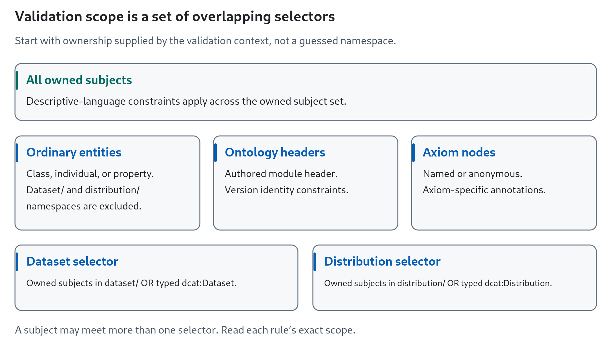
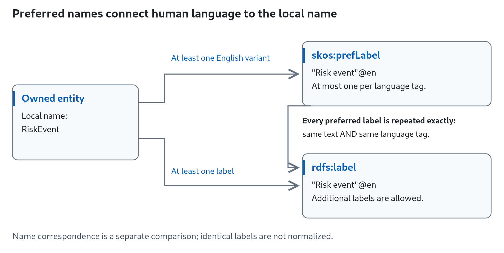
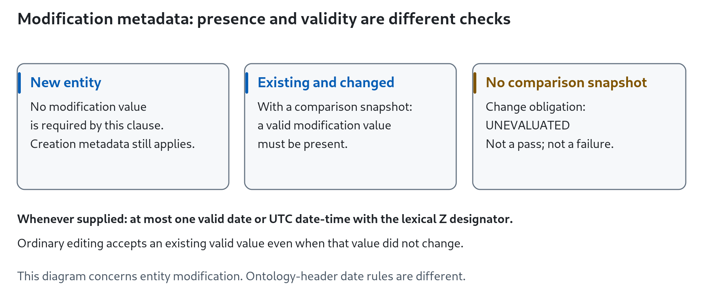
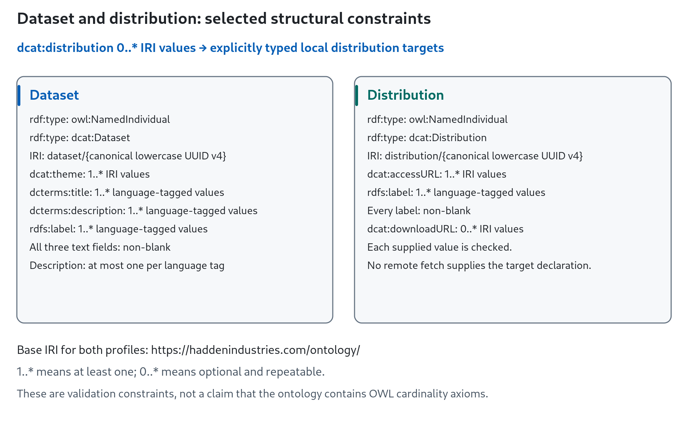

# Universal Ontology Editing Policy — expanded technical reference

**Design-review export of the supplied snapshot, not a deployed Wiki page.**

For ontology editors, reviewers and validation maintainers. All 35 source clauses are retained here. Clause text and executable-constraint bullets are unchanged; headings, order, navigation and disclosure are presentation changes. The source publication statement below is preserved from the supplied snapshot, not a claim that this prototype was regenerated from the repository policy graph.

Structural editing requirements for every owned entity, ontology header and axiom in each latest active ontology version and in every replacement candidate. Human conceptual review remains separate and is documented here as explicit human clauses.

Generated from the canonical policy graph (policy identity `sha256:250753977dc6cb2711e0fcc7fd1d1c63a44e6b0ea831488affaaf2fac6f10ecb`). Do not edit this page by hand; change the policy sources under [`policy/`](https://github.com/Hadden-Industries/universal-ontology/tree/main/policy) in the repository and regenerate. The enforced policy is the one in the repository; when this page and the repository differ, the repository governs.

### Read the rule without confusing its dimensions

**Normative strength** tells you whether a requirement is a MUST or a SHOULD. **Presence** tells you whether a property is required, optional or conditional. **Assessment** distinguishes executable checks from human obligations. **Evaluation state** can be unevaluated when necessary context is absent. These are separate dimensions: an optional property can have MUST constraints on every supplied value, and a human MUST remains an obligation without an executable check.

**Navigation:** [Human review](#human-review) · [Scope map](#scope-map) · [Naming](#naming) · [Labels and definitions](#labels-definitions) · [Entity metadata](#entity-metadata) · [Optional annotations](#optional-annotations) · [Datasets](#datasets) · [Distributions](#distributions) · [Ontology header](#ontology-header) · [Axiom annotations](#axiom-annotations).

### Scope map

<picture>
  <source media="(prefers-color-scheme: dark)" srcset="assets/validation-scope-dark.png">
  
</picture>

**Text equivalent:** ownership defines the starting subject set. The descriptive-language rule reaches every owned subject. Ordinary entity selectors exclude the dataset/ and distribution/ namespaces. Dataset and distribution selectors use the namespace **or** explicit type; header and axiom selectors have their own scopes. These selectors are not a mutually exclusive decision tree. The exact “Applies to” statement of every rule remains below.

### Human review

Obligations whose truth is established by human review, not by SHACL.

**Orientation:** Human-only clauses are visible requirements, not an audit appendix. Mixed obligations also remain under their owning clauses, including contributors, optional annotations and definitions.

#### Search for an existing concept before adding one

**Clause:** `EP-HUMAN-CONCEPT-REUSE` · **Normative strength:** MUST; human review

Before creating a new Class, NamedIndividual or property, search the latest active ontologies for an existing concept with the same meaning, including synonyms and differently spelled designations. If a concept exists, reuse it; if a broader concept exists, add the new one beneath it. A graph that passes every executable rule can still duplicate an existing concept, so this obligation is discharged only by the reviewer's search and judgement, which the pull request must describe.

**Review obligation:** this clause is discharged by human review and recorded in the pull request; no executable check establishes it.

**Original clause heading:** EP-HUMAN-CONCEPT-REUSE — Search for an existing concept before adding one (MUST, human review)

**Source:** Editing Policy Wiki W02 (lines 27-29)

[Back to technical navigation](#technical-reference) · [Contributor guide](Editing-Policy#contributor-guide)

### Naming

Local-name grammar of owned entities.

#### Class local names are PascalCase

**Clause:** `EP-CLASS-NAME` · **Normative strength:** MUST

The local name of every owned Class (the part after the last `/` or `#`) is ASCII PascalCase: an uppercase letter followed by letters and digits only, for example `RiskEvent`. `risk_event`, `riskEvent` and names with underscores fail. Foreign class declarations present in a module document are not owned and are not checked.

**Applies to:** every owned Class

**Executable constraints:**

- the entity: The Class local name is ASCII PascalCase. (SPARQL-based check; see the policy source)

**Original clause heading:** EP-CLASS-NAME — Class local names are PascalCase (MUST)

**Source:** Editing Policy Wiki W03 (lines 33-35); DEC-013

#### NamedIndividual local names are PascalCase with an optional class prefix

**Clause:** `EP-INDIVIDUAL-NAME` · **Normative strength:** MUST

The local name of every owned NamedIndividual is ASCII PascalCase, optionally preceded by the PascalCase local name of one of the individual's explicitly asserted classes and an underscore: `Red` and `Colour_Red` are both valid for an individual typed `Colour`. A prefix that is not an asserted class, an empty suffix, or stripping an arbitrary first underscore fails; an inferred superclass never supplies the prefix. DCAT dataset and distribution individuals follow their own profile and are not targeted.

**Applies to:** every owned NamedIndividual outside the DCAT dataset/ and distribution/ namespaces

**Executable constraints:**

- the entity: The NamedIndividual local name is PascalCase, or AssertedClass\_PascalCase. (SPARQL-based check; see the policy source)

**Original clause heading:** EP-INDIVIDUAL-NAME — NamedIndividual local names are PascalCase with an optional class prefix (MUST)

**Source:** Editing Policy Wiki W03 (lines 33-35); DEC-003; DEC-013

#### Property local names are camelCase

**Clause:** `EP-PROPERTY-NAME` · **Normative strength:** MUST

In every module that does not follow ISO naming, the local name of an owned ObjectProperty or DatatypeProperty is ASCII camelCase (a lowercase letter followed by letters and digits), optionally preceded by a PascalCase prefix and an underscore: `hasPart` and `Thing_hasPart` pass; `thing_hasPart`, `HasPart` and `has_part` fail. Modules flagged as ISO naming are assessed by the separate ISO recommendation instead.

**Applies to:** every owned ObjectProperty and DatatypeProperty

**Executable constraints:**

- the entity: The property local name is camelCase, optionally with a PascalCase\_ prefix. (SPARQL-based check; see the policy source)

**Original clause heading:** EP-PROPERTY-NAME — Property local names are camelCase (MUST)

**Source:** Editing Policy Wiki W04 (line 37); DEC-002; DEC-013

#### ISO property local names should be lower snake\_case

**Clause:** `EP-PROPERTY-NAME-ISO` · **Normative strength:** SHOULD

In modules flagged as ISO naming, the whole local name of an owned property should be lower snake_case as written in the standard, for example `registration_status`. Any other spelling, including a capitalised prefix, is reported as a warning and never blocks.

**Applies to:** every owned ObjectProperty and DatatypeProperty

**Executable constraints:**

- the entity: The ISO property local name should be lower snake\_case. (SPARQL-based check; see the policy source) — recommendation (SHOULD), reported as a warning

**Original clause heading:** EP-PROPERTY-NAME-ISO — ISO property local names should be lower snake\_case (SHOULD)

**Source:** Editing Policy Wiki W04 (line 37); DEC-002; DEC-013

[Back to technical navigation](#technical-reference) · [Contributor guide](Editing-Policy#contributor-guide)

### Labels, definitions and descriptive text

Language-tagged designations and descriptions of owned entities.

<picture>
  <source media="(prefers-color-scheme: dark)" srcset="assets/label-correspondence-dark.png">
  
</picture>

**Text equivalent:** at least one English preferred label corresponds to the local name using the defined normalization. Separately, every preferred-label literal must appear as an ordinary label with identical text and language tag. These are different equality conditions.

#### Labels

**Clause:** `EP-LABEL` · **Normative strength:** MUST

Every owned entity has at least one `rdfs:label`, and every label is a language-tagged literal. Several labels in the same language are allowed on one entity, and two different entities may share a label such as `"Bank"@en`; identical label triples collapse in RDF, so per-entity duplicates cannot occur.

**Applies to:** every owned Class, NamedIndividual, ObjectProperty and DatatypeProperty in the validated module set, outside the DCAT dataset/ and distribution/ namespaces

**Executable constraints:**

- `rdfs:label`: at least one value
- `rdfs:label`: datatype `rdf:langString`

**Original clause heading:** EP-LABEL — Labels (MUST)

**Source:** Editing Policy Wiki W09 (lines 65-73); DEC-006; DEC-024

#### Preferred labels

**Clause:** `EP-PREFLABEL-LANGUAGE` · **Normative strength:** MUST

Every owned entity has at least one `skos:prefLabel` in an English language variant (`en`, `en-GB`, `en-US`, ...). Preferred labels are language-tagged, at most one per language tag, and other languages remain allowed alongside the English one.

**Applies to:** every owned Class, NamedIndividual, ObjectProperty and DatatypeProperty in the validated module set, outside the DCAT dataset/ and distribution/ namespaces

**Executable constraints:**

- `skos:prefLabel`: datatype `rdf:langString`
- `skos:prefLabel`: at most one value per language

**Original clause heading:** EP-PREFLABEL-LANGUAGE — Preferred labels (MUST)

**Source:** Editing Policy Wiki W12 (lines 92-94); DEC-014

#### An English preferred label corresponds to the local name

**Clause:** `EP-PREFLABEL-IRI` · **Normative strength:** MUST

At least one English `skos:prefLabel` corresponds to the entity's local name: after removing spaces and punctuation and comparing without regard to case, the label equals the local name (underscores removed) or the local name after an optional `PascalCase_` prefix. A leading digit in the label may be written as its English word, so `3D Model` and `Three D Model` both correspond to `ThreeDModel`, and `Red` corresponds to `Colour_Red`. Additional English spellings and other languages may differ freely: `Colour`@en-GB and `Color`@en-US may coexist on `Colour`.

**Applies to:** every owned Class, NamedIndividual, ObjectProperty and DatatypeProperty in the validated module set, outside the DCAT dataset/ and distribution/ namespaces

**Executable constraints:**

- the entity: No English skos:prefLabel corresponds to the local name. (SPARQL-based check; see the policy source)

**Original clause heading:** EP-PREFLABEL-IRI — An English preferred label corresponds to the local name (MUST)

**Source:** Editing Policy Wiki W11 (lines 84-90); DEC-003; DEC-013; DEC-014

#### Every preferred label is also a label

**Clause:** `EP-PREFLABEL-LABEL` · **Normative strength:** MUST

Each `skos:prefLabel` literal also appears as an `rdfs:label` of the same entity with exactly the same text and language tag. A preferred label whose text or language differs from every label, even by case or punctuation, fails. Extra labels beyond the preferred ones are allowed.

**Applies to:** every owned Class, NamedIndividual, ObjectProperty and DatatypeProperty in the validated module set, outside the DCAT dataset/ and distribution/ namespaces

**Executable constraints:**

- the entity: This skos:prefLabel has no identical rdfs:label. (SPARQL-based check; see the policy source)

**Original clause heading:** EP-PREFLABEL-LABEL — Every preferred label is also a label (MUST)

**Source:** Editing Policy Wiki W09 (lines 65-73); DEC-004; DEC-024

#### Definitions

**Clause:** `EP-DEFINITION` · **Normative strength:** MUST

Every owned Class and NamedIndividual has at least one `skos:definition`. Properties may omit a definition. Whenever a definition is present on any owned entity it is language-tagged and there is at most one per language. Whether a definition is conceptually adequate remains a human review question.

**Applies to:** every owned Class, NamedIndividual, ObjectProperty and DatatypeProperty in the validated module set, outside the DCAT dataset/ and distribution/ namespaces

**Executable constraints:**

- `skos:definition`: datatype `rdf:langString`
- `skos:definition`: at most one value per language
- the entity: A Class or NamedIndividual carries at least one skos:definition. (SPARQL-based check; see the policy source)

**Original clause heading:** EP-DEFINITION — Definitions (MUST)

**Source:** Editing Policy Wiki W10 (lines 75-82); DEC-022; DEC-023

#### Descriptive text is language-tagged

**Clause:** `EP-DESCRIPTIVE-LANGUAGE` · **Normative strength:** MUST

On every owned subject (entities, the module header and owned axiom annotations), each value of the sixteen descriptive predicates is a language-tagged literal: `dcterms:alternative`, `dcterms:description`, `dcterms:title`, `rdfs:comment`, `rdfs:label`, `skos:altLabel`, `skos:changeNote`, `skos:definition`, `skos:editorialNote`, `skos:example`, `skos:hiddenLabel`, `skos:historyNote`, `skos:note`, `skos:prefLabel`, `skos:scopeNote` and `uc:acronym`. An untagged `skos:editorialNote` on an owned subject fails; foreign support terms and other predicates carry no such obligation.

**Applies to:** every owned subject: entities, the module's ontology header and owned axiom nodes

**Executable constraints:**

- the entity: Descriptive text on an owned subject is a language-tagged literal. (SPARQL-based check; see the policy source)

**Original clause heading:** EP-DESCRIPTIVE-LANGUAGE — Descriptive text is language-tagged (MUST)

**Source:** Legacy validator P03 (line 213); DEC-023

#### Descriptions are unique per language

**Clause:** `EP-DESCRIPTION-LANGUAGE` · **Normative strength:** MUST

`dcterms:description` is optional on owned entities. When present, there is at most one description per language tag; two distinct English descriptions fail, while descriptions in different languages pass. Datasets and distributions have their own description requirements in the DCAT profile.

**Applies to:** every owned Class, NamedIndividual, ObjectProperty and DatatypeProperty in the validated module set, outside the DCAT dataset/ and distribution/ namespaces

**Executable constraints:**

- `dcterms:description`: at most one value per language

**Original clause heading:** EP-DESCRIPTION-LANGUAGE — Descriptions are unique per language (MUST)

**Source:** Legacy validator P22 (line 544); DEC-023

[Back to technical navigation](#technical-reference) · [Contributor guide](Editing-Policy#contributor-guide)

### Entity metadata

Metadata every owned Class, NamedIndividual, ObjectProperty and DatatypeProperty must carry.

**Orientation:** Presence is conditional for modification metadata and optional for contributors at graph level. Read the human contributor instruction as well as its value-shape constraints.

<picture>
  <source media="(prefers-color-scheme: dark)" srcset="assets/modification-obligation-dark.png">
  
</picture>

**Text equivalent:** a new entity needs no modification value. A changed existing entity requires one when the change obligation can be evaluated. Without the comparison snapshot, that obligation is unevaluated. Any supplied value still has to be valid, and an unchanged valid value is accepted in ordinary editing.

#### UUID identifier

**Clause:** `EP-ENTITY-UUID` · **Normative strength:** MUST

Every owned Class, NamedIndividual, ObjectProperty and DatatypeProperty has at least one `dcterms:identifier` that is a version-4 UUID URN, for example `urn:uuid:905770f1-45ca-4738-8eb6-a2e84935c74c`. The version nibble must be `4` and the variant nibble `8`, `9`, `a` or `b`; a version-1 UUID or a wrong variant does not qualify even if a lenient parser would accept it. Additional identifiers of other kinds are allowed alongside the qualifying UUID.

**Applies to:** every owned Class, NamedIndividual, ObjectProperty and DatatypeProperty in the validated module set, outside the DCAT dataset/ and distribution/ namespaces

**Original clause heading:** EP-ENTITY-UUID — UUID identifier (MUST)

**Source:** Editing Policy Wiki W07 (lines 59-61); DEC-005; DEC-015

#### Identifier uniqueness

**Clause:** `EP-IDENTIFIER-UNIQUE` · **Normative strength:** MUST

Two distinct owned entities in the validated module set never share an IRI-valued `dcterms:identifier`. IRI identifiers are compared as RDF terms; UUID URNs are compared without regard to hexadecimal letter case, so `urn:uuid:...AB...` and `urn:uuid:...ab...` are the same identifier. Literal identifiers (enumeration codes such as weekday numbers or currency codes, which are meaningful only within their own scheme) are outside this rule, as they were for the legacy validator. Repeated assertions of one identifier on the same entity are not a second holder, and superseded versions are never combined with the current set. Both holders of an exactly repeated identifier are reported; for a case-variant UUID the holder whose spelling contains uppercase letters is reported.

**Applies to:** owned entities whose identifier another owned entity also holds

**Executable constraints:**

- the entity: Another owned entity holds the same identifier. (SPARQL-based check; see the policy source)

**Original clause heading:** EP-IDENTIFIER-UNIQUE — Identifier uniqueness (MUST)

**Source:** Editing Policy Wiki W08 (line 63); DEC-015 as amended by Max on 2026-09-12 (literal identifiers exempt)

#### Creator

**Clause:** `EP-ENTITY-CREATOR` · **Normative strength:** MUST

Every owned entity has exactly one `dcterms:creator`, an IRI in the canonical ORCID form `https://orcid.org/0000-0000-0000-000X` (four groups of four characters, digits throughout except that the final character may be an uppercase `X`; no query, fragment or trailing slash). This is an offline format check only: a well-formed ORCID with an incorrect checksum passes, and neither registration nor the person's identity is verified.

**Applies to:** every owned Class, NamedIndividual, ObjectProperty and DatatypeProperty in the validated module set, outside the DCAT dataset/ and distribution/ namespaces

**Executable constraints:**

- `dcterms:creator`: exactly one value
- `dcterms:creator`: node kind `sh:IRI`
- `dcterms:creator`: matches the pattern `^https://orcid\.org/[0-9]{4}-[0-9]{4}-[0-9]{4}-[0-9]{3}[0-9X]$`

**Original clause heading:** EP-ENTITY-CREATOR — Creator (MUST)

**Source:** Editing Policy Wiki W06 (lines 51-57); DEC-022; DEC-026

#### Creation timestamp

**Clause:** `EP-ENTITY-CREATED` · **Normative strength:** MUST

Every owned Class, NamedIndividual, ObjectProperty and DatatypeProperty has exactly one `dcterms:created` value. The value is an `xsd:dateTime` with a real calendar date and time, written in UTC with the lexical `Z` designator (for example `2026-01-02T03:04:05Z`). A missing value, two different values, a plain string, an impossible date such as 30 February, a numeric offset such as `+00:00`, or a date without a time all fail.

**Applies to:** every owned Class, NamedIndividual, ObjectProperty and DatatypeProperty in the validated module set, outside the DCAT dataset/ and distribution/ namespaces

**Executable constraints:**

- `dcterms:created`: exactly one value
- `dcterms:created`: datatype `xsd:dateTime`
- `dcterms:created`: matches the pattern `^-?[0-9]{4,}-[0-9]{2}-[0-9]{2}T[0-9]{2}:[0-9]{2}:[0-9]{2}(\.[0-9]+)?Z$`

**Original clause heading:** EP-ENTITY-CREATED — Creation timestamp (MUST)

**Source:** Editing Policy Wiki W05 (lines 41-49); DEC-022

#### Modification timestamp

**Clause:** `EP-MODIFIED` · **Normative strength:** MUST

An owned entity carries at most one `dcterms:modified` value. When present it is either an `xsd:date` written `YYYY-MM-DD` or an `xsd:dateTime` with a real calendar date and time written in UTC with the lexical `Z` designator. An existing entity whose content changed relative to the comparison snapshot must carry a valid `dcterms:modified`; a valid value that did not change is accepted in ordinary editing, and a newly added entity needs no value. When a run has no comparison snapshot the change obligation is reported as unevaluated rather than invented.

**Applies to:** every owned Class, NamedIndividual, ObjectProperty and DatatypeProperty in the validated module set, outside the DCAT dataset/ and distribution/ namespaces

**Executable constraints:**

- `dcterms:modified`: at most one value
- the entity: An existing entity whose content changed carries a dcterms:modified value. (SPARQL-based check; see the policy source)

**Original clause heading:** EP-MODIFIED — Modification timestamp (MUST)

**Source:** Editing Policy Wiki W17 (lines 129-139); DEC-016; DEC-017; DEC-022

#### Contributors

**Clause:** `EP-CONTRIBUTOR` · **Normative strength:** MUST

`dcterms:contributor` is optional and may repeat. Every supplied value is an IRI in the canonical ORCID form, checked offline exactly as for the creator. When a person other than the creator changes an entity, they add themselves as a contributor; that instruction is a human obligation and contributors are never inferred from Git identity.

**Applies to:** every owned Class, NamedIndividual, ObjectProperty and DatatypeProperty in the validated module set, outside the DCAT dataset/ and distribution/ namespaces

**Executable constraints:**

- `dcterms:contributor`: node kind `sh:IRI`
- `dcterms:contributor`: matches the pattern `^https://orcid\.org/[0-9]{4}-[0-9]{4}-[0-9]{4}-[0-9]{3}[0-9X]$`

**Original clause heading:** EP-CONTRIBUTOR — Contributors (MUST)

**Source:** Editing Policy Wiki W18 (lines 141-147); DEC-026

[Back to technical navigation](#technical-reference) · [Contributor guide](Editing-Policy#contributor-guide)

### Optional annotations

Annotations that may be absent or repeated, with the constraints that apply when they are present.

**Orientation:** “Optional” describes presence. It does not make a constraint on a supplied value optional.

#### Optional annotations

**Clause:** `EP-OPTIONAL-ANNOTATIONS` · **Normative strength:** MUST

`dcterms:references`, `dcterms:source` and `rdfs:seeAlso` are optional and may repeat; no value shape is imposed on them. An acronym (`uc:acronym`) is optional and, when present, language-tagged; the same acronym on two entities is allowed. When a definition is derived from an external source, the editor should cite it with `dcterms:source`; external derivation cannot be detected from the graph, so that recommendation is a human obligation.

**Applies to:** every owned Class, NamedIndividual, ObjectProperty and DatatypeProperty in the validated module set, outside the DCAT dataset/ and distribution/ namespaces

**Executable constraints:**

- `uc:acronym`: datatype `rdf:langString`

**Original clause heading:** EP-OPTIONAL-ANNOTATIONS — Optional annotations (MUST)

**Source:** Editing Policy Wiki W13-W16 (lines 98-125); DEC-023; DEC-024

[Back to technical navigation](#technical-reference) · [Contributor guide](Editing-Policy#contributor-guide)

### Datasets

The DCAT dataset profile for owned dataset individuals.

<picture>
  <source media="(prefers-color-scheme: dark)" srcset="assets/dcat-profile-constraints-dark.png">
  
</picture>

**Text equivalent:** dataset and distribution records each have their dedicated IRI and two explicit types. Dataset links to distributions are optional and repeatable; targets must be declared in the local validated module set. A distribution requires one or more access URLs. The diagram selects structural constraints; every additional rule is retained below. `0..*` means optional and repeatable; `1..*` means at least one.

#### Dataset type and IRI

**Clause:** `EP-DATASET-TYPE-IRI` · **Normative strength:** MUST

A dataset is explicitly typed both `owl:NamedIndividual` and `dcat:Dataset`, and its IRI is `https://haddenindustries.com/ontology/dataset/` followed by a canonical lowercase version-4 UUID. A subject in that namespace missing a type, or a `dcat:Dataset` outside it, fails; an uppercase or non-version-4 suffix fails. Dataset individuals follow this profile instead of the generic PascalCase naming rules.

**Applies to:** every owned subject in the dataset/ namespace or explicitly typed dcat:Dataset

**Executable constraints:**

- `rdf:type`: includes the value `dcat:Dataset`
- `rdf:type`: includes the value `owl:NamedIndividual`
- the entity: node kind `sh:IRI`
- the entity: matches the pattern `^https://haddenindustries\.com/ontology/dataset/[0-9a-f]{8}-[0-9a-f]{4}-4[0-9a-f]{3}-[89ab][0-9a-f]{3}-[0-9a-f]{12}$`

**Original clause heading:** EP-DATASET-TYPE-IRI — Dataset type and IRI (MUST)

**Source:** Editing Policy Wiki W19 (lines 151-161, 222-227); DEC-012

#### Required dataset metadata

**Clause:** `EP-DATASET-REQUIRED` · **Normative strength:** MUST

A dataset has at least one `dcat:theme` and every theme is an IRI; at least one `dcterms:title`, one `dcterms:description` and one `rdfs:label`, each language-tagged and not blank; and at most one description per language. Distinct titles or labels in the same language remain allowed.

**Applies to:** every owned subject in the dataset/ namespace or explicitly typed dcat:Dataset

**Executable constraints:**

- `dcterms:description`: at least one value
- `dcterms:description`: datatype `rdf:langString`
- `dcterms:description`: matches the pattern `\S`
- `dcterms:description`: at most one value per language
- `rdfs:label`: at least one value
- `rdfs:label`: datatype `rdf:langString`
- `rdfs:label`: matches the pattern `\S`
- `dcat:theme`: at least one value
- `dcat:theme`: node kind `sh:IRI`
- `dcterms:title`: at least one value
- `dcterms:title`: datatype `rdf:langString`
- `dcterms:title`: matches the pattern `\S`

**Original clause heading:** EP-DATASET-REQUIRED — Required dataset metadata (MUST)

**Source:** Editing Policy Wiki W20-W22 (lines 164-194); DEC-023; DEC-024

#### Dataset distributions

**Clause:** `EP-DATASET-DISTRIBUTION` · **Normative strength:** MUST

`dcat:distribution` is optional and may repeat. Every value is an IRI that the validated module set explicitly types both `owl:NamedIndividual` and `dcat:Distribution`; the declaration must be present in the local context, never fetched. A literal, an untyped target or a target of another type fails.

**Applies to:** every owned subject in the dataset/ namespace or explicitly typed dcat:Dataset

**Executable constraints:**

- `dcat:distribution`: node kind `sh:IRI`

**Original clause heading:** EP-DATASET-DISTRIBUTION — Dataset distributions (MUST)

**Source:** Editing Policy Wiki W23 (lines 198-204); DEC-008

#### Landing pages

**Clause:** `EP-DATASET-LANDING` · **Normative strength:** SHOULD; human review

`dcat:landingPage` is optional and may repeat. Point it at the original data provider's page for the dataset rather than an intermediary. Whether a page belongs to the original provider is a human judgement; no cardinality, IRI shape or ownership check is executed.

**Review obligation:** this clause is discharged by human review and recorded in the pull request; no executable check establishes it.

**Original clause heading:** EP-DATASET-LANDING — Landing pages (SHOULD, human review)

**Source:** Editing Policy Wiki W24 (lines 206-212); DEC-008

#### Access rights cardinality

**Clause:** `EP-DATASET-ACCESS-RIGHTS` · **Normative strength:** MUST

`dcterms:accessRights` is optional; a dataset carries at most one value.

**Applies to:** every owned subject in the dataset/ namespace or explicitly typed dcat:Dataset

**Executable constraints:**

- `dcterms:accessRights`: at most one value

**Original clause heading:** EP-DATASET-ACCESS-RIGHTS — Access rights cardinality (MUST)

**Source:** Editing Policy Wiki W25 (lines 214-220); DEC-008

#### Access rights should be an IRI

**Clause:** `EP-DATASET-ACCESS-RIGHTS-IRI` · **Normative strength:** SHOULD

When present, `dcterms:accessRights` should be an IRI such as a term of the EU access-right authority table; a literal is reported as a warning. No membership in a particular vocabulary is required.

**Applies to:** every owned subject in the dataset/ namespace or explicitly typed dcat:Dataset

**Executable constraints:**

- `dcterms:accessRights`: node kind `sh:IRI` — recommendation (SHOULD), reported as a warning

**Original clause heading:** EP-DATASET-ACCESS-RIGHTS-IRI — Access rights should be an IRI (SHOULD)

**Source:** Editing Policy Wiki W25 (lines 214-220); DEC-008

[Back to technical navigation](#technical-reference) · [Contributor guide](Editing-Policy#contributor-guide)

### Distributions

The DCAT distribution profile for owned distribution individuals.

**Orientation:** Optional fields can carry mandatory constraints. Pinned vocabulary membership is stronger than looking like a valid URL.

#### Distribution type, IRI and required metadata

**Clause:** `EP-DISTRIBUTION-REQUIRED` · **Normative strength:** MUST

A distribution is explicitly typed both `owl:NamedIndividual` and `dcat:Distribution`; its IRI is `https://haddenindustries.com/ontology/distribution/` followed by a canonical lowercase version-4 UUID. It has at least one `dcat:accessURL`, every access URL is an IRI, and at least one language-tagged, non-blank `rdfs:label`. Every supplied value is checked: a valid first access URL cannot hide an invalid second one.

**Applies to:** every owned subject in the distribution/ namespace or explicitly typed dcat:Distribution

**Executable constraints:**

- `dcat:accessURL`: at least one value
- `dcat:accessURL`: node kind `sh:IRI`
- `rdf:type`: includes the value `dcat:Distribution`
- `rdf:type`: includes the value `owl:NamedIndividual`
- `rdfs:label`: at least one value
- `rdfs:label`: datatype `rdf:langString`
- `rdfs:label`: matches the pattern `\S`
- the entity: node kind `sh:IRI`
- the entity: matches the pattern `^https://haddenindustries\.com/ontology/distribution/[0-9a-f]{8}-[0-9a-f]{4}-4[0-9a-f]{3}-[89ab][0-9a-f]{3}-[0-9a-f]{12}$`

**Original clause heading:** EP-DISTRIBUTION-REQUIRED — Distribution type, IRI and required metadata (MUST)

**Source:** Editing Policy Wiki W19 and W26 (lines 222-247); DEC-012; DEC-024

#### Download URLs

**Clause:** `EP-DISTRIBUTION-DOWNLOAD` · **Normative strength:** MUST

`dcat:downloadURL` is optional and may repeat; every value is an IRI. The predicate is the standard `dcat:downloadURL` (the earlier `downloadUrl` spelling is not accepted as an alias).

**Applies to:** every owned subject in the distribution/ namespace or explicitly typed dcat:Distribution

**Executable constraints:**

- `dcat:downloadURL`: node kind `sh:IRI`

**Original clause heading:** EP-DISTRIBUTION-DOWNLOAD — Download URLs (MUST)

**Source:** Editing Policy Wiki W27 (lines 251-257); DEC-008; DEC-011

#### Media type

**Clause:** `EP-DISTRIBUTION-MEDIA` · **Normative strength:** MUST

`dcat:mediaType` is optional; at most one value, and it is an IRI that is a member of the pinned IANA Media Types snapshot (for example `https://www.iana.org/assignments/media-types/image/gif`). A fabricated IRI under the correct prefix, a literal, or two values fail.

**Applies to:** every owned subject in the distribution/ namespace or explicitly typed dcat:Distribution

**Executable constraints:**

- `dcat:mediaType`: at most one value
- `dcat:mediaType`: node kind `sh:IRI`
- the entity: dcat:mediaType is a member of the pinned IANA Media Types snapshot. (SPARQL-based check; see the policy source)

**Original clause heading:** EP-DISTRIBUTION-MEDIA — Media type (MUST)

**Source:** Editing Policy Wiki W28 (lines 259-265); DEC-008

#### Format cardinality

**Clause:** `EP-DISTRIBUTION-FORMAT` · **Normative strength:** MUST

`dcterms:format` is optional; a distribution carries at most one value.

**Applies to:** every owned subject in the distribution/ namespace or explicitly typed dcat:Distribution

**Executable constraints:**

- `dcterms:format`: at most one value

**Original clause heading:** EP-DISTRIBUTION-FORMAT — Format cardinality (MUST)

**Source:** Editing Policy Wiki W29 (lines 267-273); DEC-008

#### Format should be an EU file type

**Clause:** `EP-DISTRIBUTION-FORMAT-EU` · **Normative strength:** SHOULD

When present, `dcterms:format` should be a member of the pinned EU Vocabularies File Type snapshot (for example `http://publications.europa.eu/resource/authority/file-type/GIF`); a non-member is reported as a warning.

**Applies to:** every owned subject in the distribution/ namespace or explicitly typed dcat:Distribution

**Executable constraints:**

- the entity: dcterms:format should be a member of the pinned EU file-type snapshot. (SPARQL-based check; see the policy source) — recommendation (SHOULD), reported as a warning

**Original clause heading:** EP-DISTRIBUTION-FORMAT-EU — Format should be an EU file type (SHOULD)

**Source:** Editing Policy Wiki W29 (lines 267-273); DEC-008

#### Languages

**Clause:** `EP-DISTRIBUTION-LANGUAGE` · **Normative strength:** MUST

`dcterms:language` is optional and may repeat; every value is a member of the pinned Library of Congress ISO 639-1 snapshot (for example `http://id.loc.gov/vocabulary/iso639-1/en`). A plausible but unregistered code, a term of another vocabulary, or a literal fails. Authority IRIs are compared exactly as supplied, without http/https aliasing.

**Applies to:** every owned subject in the distribution/ namespace or explicitly typed dcat:Distribution

**Executable constraints:**

- the entity: Every dcterms:language is a member of the pinned LOC ISO 639-1 snapshot. (SPARQL-based check; see the policy source)

**Original clause heading:** EP-DISTRIBUTION-LANGUAGE — Languages (MUST)

**Source:** Editing Policy Wiki W30 (lines 275-281); DEC-008

#### Licence

**Clause:** `EP-DISTRIBUTION-LICENCE` · **Normative strength:** MUST

`dcterms:license` is optional; at most one value, and it is an IRI. Membership in SPDX or any other list is not required.

**Applies to:** every owned subject in the distribution/ namespace or explicitly typed dcat:Distribution

**Executable constraints:**

- `dcterms:license`: at most one value
- `dcterms:license`: node kind `sh:IRI`

**Original clause heading:** EP-DISTRIBUTION-LICENCE — Licence (MUST)

**Source:** Editing Policy Wiki W31 (lines 283-289); DEC-008

#### Rights should be IRIs

**Clause:** `EP-DISTRIBUTION-RIGHTS` · **Normative strength:** SHOULD

`dcterms:rights` is optional and may repeat; each value should be an IRI. A literal is reported as a warning and no maximum is imposed.

**Applies to:** every owned subject in the distribution/ namespace or explicitly typed dcat:Distribution

**Executable constraints:**

- `dcterms:rights`: node kind `sh:IRI` — recommendation (SHOULD), reported as a warning

**Original clause heading:** EP-DISTRIBUTION-RIGHTS — Rights should be IRIs (SHOULD)

**Source:** Editing Policy Wiki W32 (lines 291-297); DEC-008

[Back to technical navigation](#technical-reference) · [Contributor guide](Editing-Policy#contributor-guide)

### Ontology header

Version identity of each authored module document.

**Orientation:** This is a module-document rule, not the entity-modification rule. The permitted date forms differ.

#### Version identity

**Clause:** `EP-ONT-VERSION` · **Normative strength:** MUST

Each authored module document has one `owl:Ontology` header with exactly one IRI-valued `owl:versionIRI` and exactly one `owl:versionInfo`. The version info is a valid calendar date written `YYYY-MM-DD`; the final path segment of the version IRI (an existing trailing slash is allowed) is that date written `YYYYMMDD`. An optional `dcterms:modified` on the header has at most one value, an `xsd:date` written `YYYY-MM-DD` or `YYYY-MM-DDZ`, whose calendar date equals the version info; a numeric offset or an `xsd:dateTime` fails. Imported headers belong to other modules and never cause a false multiple-header result.

**Applies to:** the owl:Ontology header of each authored module document

**Executable constraints:**

- `owl:versionInfo`: exactly one value
- `owl:versionInfo`: datatype `xsd:string`
- `owl:versionInfo`: matches the pattern `^[0-9]{4}-[0-9]{2}-[0-9]{2}$`
- `owl:versionIRI`: exactly one value
- `owl:versionIRI`: node kind `sh:IRI`
- `dcterms:modified`: at most one value
- `dcterms:modified`: datatype `xsd:date`
- `dcterms:modified`: matches the pattern `^[0-9]{4}-[0-9]{2}-[0-9]{2}Z?$`
- the entity: The owl:versionIRI ends in the owl:versionInfo date written YYYYMMDD. (SPARQL-based check; see the policy source)
- the entity: The header dcterms:modified date equals the owl:versionInfo date. (SPARQL-based check; see the policy source)
- the entity: The owl:versionInfo is a real calendar date. (SPARQL-based check; see the policy source)

**Original clause heading:** EP-ONT-VERSION — Version identity (MUST)

**Source:** Editing Policy Wiki W01 (lines 18-23); DEC-001; DEC-025; DEC-027

[Back to technical navigation](#technical-reference) · [Contributor guide](Editing-Policy#contributor-guide)

### Axiom annotations

Constraints on owned owl:Axiom annotation nodes.

**Orientation:** The exact predicate IRI matters. Do not change the http scheme to https.

#### Axiom position is an integer

**Clause:** `EP-AXIOM-POSITION` · **Normative strength:** MUST

On every owned `owl:Axiom` annotation node, named or anonymous, each `http://schema.org/position` value is an `xsd:integer`. The same predicate on a node that is not an axiom is outside this rule. The predicate is the actual `http://schema.org/` term, not an `https://` look-alike.

**Applies to:** every owned owl:Axiom annotation node, named or anonymous

**Executable constraints:**

- `schema:position`: datatype `xsd:integer`

**Original clause heading:** EP-AXIOM-POSITION — Axiom position is an integer (MUST)

**Source:** Editing Policy Wiki W33 (lines 301-307); DEC-007

[Back to technical navigation](#technical-reference) · [Contributor guide](Editing-Policy#contributor-guide)

