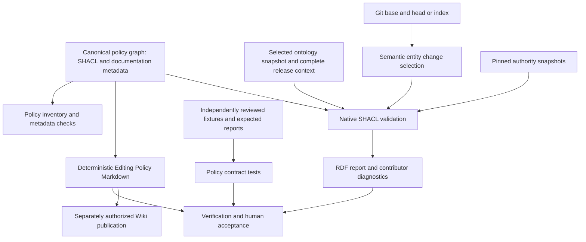

# SHACL policy source of truth: change dossier and proposed design

Status: draft for Max's review, 9 September 2026. This records accepted user
decisions and proposed engineering decisions separately. It is not an accepted
Issue snapshot, implementation authorization, or operational policy.

Companion: [implementation plan](../plans/2026-09-09-shacl-policy-source-of-truth.md).
Decision owner and intended acceptance owner: Max.

## Purpose and authority

Make the editing policy's graph constraints executable SHACL, and generate its
human-readable Wiki representation from the same policy source. Preserve human
judgment for conceptual quality. Run the default checks on entities added or
changed after adoption; allow a manual audit of any selected ontology version,
including the latest sources, to identify existing defects for correction.

Max subsequently requested an automated path from working ontology files to
versioned `src/` artifacts, with structural and release-history checks. The proposed
boundary is to reuse this migration's read-only validation and comparison
capabilities in a separately accepted release-promotion increment. The desired
capability is recorded now; its temporal rules and delivery scope remain proposals.

The current request authorizes research, synthesis and planning. The supplied CSV
and subsequent answers settle the decisions recorded below; the research reports
are recommendations, not approvals of all their examples. Repository instructions
require exact approval before configuration changes, including policy files.
The planning documents do not change operational policy or ontology data. Max later
authorized repository tooling initialization and the exact local SDLC skill
activation; their results are recorded below. An accepted baseline must precede
R2 implementation.

This work uses the repository's `sdlc-route`, `motivation-to-evidence`,
`quality-attribute-scenarios` and `thin-implementation-plan` instructions where
their outputs help this decision. Discovery/planning skills supply design support;
the repository-adapted `.sdlc/skills/test-driven-development/SKILL.md` is the sole
future implementation procedure. This is one useful change, not an SDLC pilot.

## Sources and present evidence

Repository inspected: `b32d7cff65e57a4d4ea68334350e27b8ef5038ef`, branch
`feat/shacl-policy-source-of-truth`. The working tree was clean before this work.
Research began on 8 September and the dossier was completed on 9 September 2026.

| ID      | Source and identity                                                                                                                                                                                                                                                                                              | Use and limits                                                                                                                                                                              |
| ------- | ---------------------------------------------------------------------------------------------------------------------------------------------------------------------------------------------------------------------------------------------------------------------------------------------------------------- | ------------------------------------------------------------------------------------------------------------------------------------------------------------------------------------------- |
| SRC-001 | User's current request and three subsequent scope/naming answers                                                                                                                                                                                                                                                 | Authorizes this planning task and the recorded domain decisions.                                                                                                                            |
| SRC-002 | `Assessment of Migrating the Universal Ontology Validation Suite from Python to SHACL.md`, supplied in Downloads; SHA-256 `7ab3cc2b66f73e38a7124f49b8b659312e6e5788790f896edd5f30f01435b2e0`                                                                                                                     | Initial feasibility assessment. Its differential scenarios are described analyses, not executed SHACL qualification.                                                                        |
| SRC-003 | `Deep Research Report_ Migrating Universal Ontology Validation from PythonXML Tests to SHACL.md`, supplied in Downloads; SHA-256 `cbef7ea57f52f2493fb870ade01fc60dd56cb88341579d084722e3b3207542b8`                                                                                                              | Canonical policy proposal, rule mapping and migration options. The implementation examples need correction and tests.                                                                       |
| SRC-004 | `SHACL decisions.csv`, supplied in Downloads; SHA-256 `669189a18410d94ee3a4b204559e68d123c9525ecf6311e021a492ec6b2dd422`                                                                                                                                                                                         | Eight explicit decisions, transcribed below. No dependency installation or Wiki publication authority.                                                                                      |
| SRC-005 | [Editing Policy](https://github.com/Hadden-Industries/universal-ontology/wiki/Editing-Policy), retrieved during this task; page reports last edit 29 June 2026                                                                                                                                                   | Current published clauses checked against supplied reports. Capture the immutable Wiki revision and source bytes at baseline preparation; the displayed edit date is not a commit identity. |
| SRC-006 | [Legacy validator](../../tests/universalontologytest.py), [runner](../../scripts/validate_ontologies.py), [runner tests](../../tests/test_validate_ontologies.py), [workflow](../../.github/workflows/ontology-validation.yml), [.githooks/pre-commit](../../.githooks/pre-commit) at the inspected commit       | Current source behavior and integration contracts; no new SHACL runtime evidence.                                                                                                           |
| SRC-007 | [SDLC guide](../sdlc/howto.md), [principles](../sdlc/engineering-principles.md), [review policy](../../REVIEW.md), [adoption](../sdlc/adoption.md), [.sdlc/PACKAGE_STATUS.json](../../.sdlc/PACKAGE_STATUS.json)                                                                                                 | Repository-local SDLC 1.0.0, pre-release, deployed within the recorded host scope. No version/status change is proposed.                                                                    |
| SRC-008 | Max's follow-on request for automated promotion and release-date/change checks                                                                                                                                                                                                                                   | Establishes a desired release capability. Max explicitly left its inclusion in this migration open; exact timestamp formulas and automatic writes are not accepted policy.                  |
| SRC-009 | [Source inventory](../../scripts/build/sourceInventory.js), [website build](../../scripts/build/createWebsiteConfig.js), [alias generation](../../scripts/build/ontologyAliases.js), [deployment runner](../../scripts/upload_to_s3.py), working reference-data file and `src/universal/reference-data/20260714` | Current build/promotion boundary. Source inspection and a native RDF parse; no claim that a local version is the last live deployment.                                                      |

The five current sources total 2,924,783 bytes. This is a file-size observation,
not a triple count, runtime benchmark or conformance result:

| Source                              |     Bytes | Declared ontology namespace                                       |
| ----------------------------------- | --------: | ----------------------------------------------------------------- |
| `core/universal-core.owl`           |   364,744 | `https://haddenindustries.com/ontology/universal/core/`           |
| `extended/universal-extended.owl`   |   711,156 | `https://haddenindustries.com/ontology/universal/extended/`       |
| `reference-data/reference-data.owl` | 1,112,516 | `https://haddenindustries.com/ontology/universal/reference-data/` |
| `iso-31073/iso-31073.owl`           |   177,331 | `https://haddenindustries.com/ontology/iso/31073/ed-1/`           |
| `iso-iec11179-3/iso-iec11179-3.owl` |   559,036 | `https://haddenindustries.com/ontology/iso-iec/11179/-3/ed-4/`    |

Source inspection confirms the material drift identified in the reports. It also
finds integration behavior that must be preserved or deliberately changed:

- The runner already recognizes changes to its own inputs and selects all five
  current sources. It handles deletions and exact Git refs and rejects a checkout
  that differs from the requested head. Its pre-install `--plan` mode needs no RDF
  dependencies. Extend these controls; do not replace them with filename guesses.
- Staged mode selects paths from the index but the existing validator reads their
  working-tree contents. The new snapshot reader must validate the actual index
  blobs, with HEAD as the comparison, so an unstaged correction cannot hide a
  staged violation. This is an observed source discrepancy, not an executed repro.
- The runner treats any subprocess output as failure, even with exit zero.
  That contract must change when warnings and structured successful reports exist.
- The public Wiki spells `dcat:downloadUrl`; current ontology data declares and
  uses the standard `dcat:downloadURL`. Source IRIs are case-sensitive. The proposed
  correction is explicit in DEC-011, not an alias in a validator.
- Initial inspection found no `.venv`, `node_modules` or activated `.agents/skills`.
  After Max requested tooling initialization, `npm run setup:development` stopped
  because host npm was 11.19.0 rather than the declared 12.0.2. Running the same
  entry point through `npm exec --yes --package=npm@12.0.2 -- npm run setup:development`
  installed locked npm dependencies and the existing Python/SDLC requirements in
  this worktree's new `.venv`. Python reports 3.14.7; `pip check` passes. Node is
  24.20.0. No runtime-version or dependency declaration was edited.
- Setup's final configuration transaction hit the sandbox's protected `.codex`
  directory. Automatic approval review rejected a privileged `setup:sdlc` retry
  because it required exact configuration/skill activation approval. Read-only
  `npm run check:sdlc` nevertheless confirmed the existing generated Codex
  configuration was current, narrowing the remaining action to local skills.
  Max subsequently updated host npm to 12.0.2 and explicitly approved that
  activation. `npm run setup:skills` then succeeded: all 17 installed files match
  the approved SHA-256 preview, with no extra files, and all six native YAML
  metadata records set `allow_implicit_invocation: false`. The Codex configuration
  check still passes. Local activation is complete; host loading and hook trust
  are separate claims.
  `npm run sdlc -- --help` now succeeds. `npm run sdlc -- status` reports missing
  `.sdlc/runtime/active.json`; no active lifecycle or accepted baseline is claimed.
  These are setup checks, not full SDLC verification or SHACL qualification.
- PowerShell HTTPS retrieval failed TLS negotiation during the initial research;
  the web tool supplied the cited primary-source research.
- The working reference-data file and the explicit main-checkout path supplied by
  Max have identical SHA-256 `b7259439915a2673b7a4f50aa4715ac1f05b81aa8f5bd227a3ae79dfe45dbd93`.
  The inspected `src/universal/reference-data/20260714` differs, with SHA-256
  `02190521ed2c20b301097f87ce7ab39d6128e8c0a0487650e97c37796cd79fcc`.
  Both declare version 2026-07-14. The working graph's
  `ElectronicMailAddressToPersonRelationshipType` has modified timestamp
  `2026-08-30T19:56:14Z`, later than its ontology-level 2026-07-14 date. A native
  RDFLib 7.6.0 parse confirms the subject/value and reads 9,293 triples. This is
  a concrete candidate release inconsistency under the proposed new rule, not a
  failed accepted SHACL rule or a complete semantic release comparison.
- The website build inventories extensionless ontology artifacts under `src/`.
  Its alias generator selects the greatest eight-digit filename per directory;
  universal-module `latest-unstable` aliases rewrite internal import references.
  Adding a dated artifact can therefore change the next build's selected release.
  The inspected setup/build/deployment entry points contain no working-file
  promotion step. Building assets and uploading `dist/` are separate operations.

## Risk route

**Risk class:** R2 for the migration. This preparatory task produces reviewable
drafts; it does not claim that the R2 implementation gate has been passed.

**Decision owner:** Max.

**Reasoning:** Changing the authoritative contribution policy, merge gate and
separately published Wiki is a public-contract and cross-system workflow change.
False acceptance can admit bad ontology data; false rejection can prevent valid
contributions. Git and blank-node semantics add uncertainty. No R3 obligation has
been established.

**Potential blast radius:** Ontology contributors, reviewers, the five current
modules, historical audit consumers, CI and pre-commit users, and Wiki readers.
Imported support vocabularies must not acquire Hadden metadata obligations.

**Reversibility:** Code and generated documentation are versioned. Reversal is not
automatically harmless after intentional policy changes: the old validator rejects
some newly accepted cases. Suspend cutover or forward-fix the accepted policy;
never silently restore the old policy as an equivalent fallback.

**Principal unknowns:** Exact closure of an entity change; authoritative release
corpora; undocumented XML checks/exclusions; engine lexical behavior; registry
snapshot rights and retrieval; manual Wiki publication authority.

**Required artifacts:** This draft dossier and linked plan; an actually accepted
Issue revision and protected baseline before implementation; independent fixtures;
software-selection/rights evidence; frozen verification and review records;
cutover and publication receipts. Reuse the same dossier throughout.

**Required specialist lenses:** Test-oracle review for targets, prospective scope,
term equality and changes; operability/migration review for snapshots, cutover and
Wiki recovery. One ordinary review includes semantic names and native reuse.
Independent verification is required for R2. Specialist work may be combined where
independence and competence remain adequate; this plan does not dispatch agents.

**Required verification:** Selected `full` profile on the final implementation,
plus the policy-specific acceptance matrix. Profile commands and intended scope
must be updated only with exact approval. A full diagnostic audit may report old
violations without making them default merge blockers.

**Required human approvals:** Dossier/design/baseline acceptance, exact policy and
configuration diffs, any ontology remediation, software/data rights decisions,
required independent review, and separately authorized GitHub writes, commits,
pushes, merge/cutover and Wiki publication. No shim override is requested.

**Maximum sensible autonomy:** Complete discovery and draft planning; prepare exact
future diffs and evidence within accepted scope. Do not implement or infer an
accepted baseline from this document's existence.

**Next lifecycle step:** Review this dossier's proposed decisions, then prepare the
accepted Issue/baseline through the repository's existing lifecycle when authorized.

## Motivation, outcomes and evidence

| ID / status                   | Statement and source                                                                                                   | Confidence, contrary evidence and risk                                                                                                                                 |
| ----------------------------- | ---------------------------------------------------------------------------------------------------------------------- | ---------------------------------------------------------------------------------------------------------------------------------------------------------------------- |
| MOT-001 / stakeholder concern | Max wants structural policy, tests and Wiki to remain aligned. SRC-001/003.                                            | Direct statement; high confidence in the need. Co-location alone cannot prove semantic alignment.                                                                      |
| MOT-002 / observed assessment | Wiki and validator express different rules in the eight CSV areas. SRC-004/006.                                        | Source-backed; runtime examples remain to be executed. Blind transliteration would preserve the discrepancy.                                                           |
| MOT-003 / hypothesis          | Canonical SHACL plus deterministic documentation will reduce synchronization work.                                     | Plausible, not measured. Complicated SPARQL or poor prose can increase authoring effort.                                                                               |
| MOT-004 / accepted constraint | Default enforcement is prospective; manual audits must work on any chosen version. SRC-001.                            | Explicit answer. A requirement to clean every old entity before cutover would violate this scope.                                                                      |
| MOT-005 / proposed goal       | Contributors can understand a failing rule, locate its source and repair it without reading procedural XML assertions. | Needs actual contributor acceptance, not only report-schema tests.                                                                                                     |
| MOT-006 / stakeholder concern | Max wants working ontology files promoted automatically after structural and release-history checks. SRC-008/009.      | Direct request; the August entity edit beneath a July ontology version demonstrates a relevant case. Increment placement and exact temporal semantics need acceptance. |

| Outcome                                                 | Beneficiary, baseline and target                                                                                                                                                                                                                   | Measure/window, causal hypothesis, trade-off and owner                                                                                                                                                                       |
| ------------------------------------------------------- | -------------------------------------------------------------------------------------------------------------------------------------------------------------------------------------------------------------------------------------------------- | ---------------------------------------------------------------------------------------------------------------------------------------------------------------------------------------------------------------------------- |
| OUT-001: one maintained structural policy               | Contributors/reviewers. Baseline: separately authored Wiki and XML assertions, eight recorded discrepancies. Target: every in-scope rule has one canonical entry and a generated Wiki section; no unexplained mismatch at cutover.                 | Inventory and controlled rule-edit experiment before cutover; reassess after the first real policy change. Generation removes manual synchronization, while independent examples check semantics. Max accepts results.       |
| OUT-002: useful validation without retrospective gating | Existing maintainers and new contributors. Baseline: changed files receive whole-file XML checks. Target: a new/changed entity fails when nonconforming; an untouched old defect does not alone block; a manual latest-version audit reveals both. | Paired Git fixtures and a real full-source diagnostic run, before cutover and on the first post-adoption contribution. Change detection enables scope but adds cost and can miss dependencies. Max owns the scope trade-off. |
| OUT-003: actionable and reproducible diagnostics        | Contributors and Wiki readers. Baseline: assertion/subprocess output; no measured repair time. Target: each violation identifies rule, node, source provenance and remedy; repeated runs reproduce the same report meaning and generated bytes.    | Contributor walkthrough and reproducibility fixtures before cutover; observe the first real repair/policy update. Do not claim time savings without measurements. Max accepts usability; integrator records runtime/memory.  |

Doing nothing preserves the current runtime and effort but leaves the documented
drift. Moving tests to SHACL while continuing to edit the Wiki separately improves
graph validation but leaves two policy authorities. The selected proposal is a
canonical policy graph with independently tested semantics and generated views.
No causal productivity claim or synthetic adoption benchmark is made.

## Accepted decisions

These decisions are binding inputs to the draft. Additional interpretation is
identified separately; acceptance of one row does not approve configuration files.

| ID      | Accepted decision                                                                                                                                                                       | Observable consequence                                                                                                                                                                                                                   |
| ------- | --------------------------------------------------------------------------------------------------------------------------------------------------------------------------------------- | ---------------------------------------------------------------------------------------------------------------------------------------------------------------------------------------------------------------------------------------- |
| DEC-001 | Check ontology `dcterms:modified` only if it exists.                                                                                                                                    | Absence alone passes ontology-version validation. A present value must satisfy the agreed alignment/type rules; empty/malformed presence is not treated as absence. This differs from requiring `modified` on a changed existing entity. |
| DEC-002 | Lower snake_case is a SHOULD for ISO properties; non-ISO camelCase remains a MUST.                                                                                                      | ISO naming recommendations are visible, non-blocking warnings. No global weakening of property naming. Exact permissible prefix handling is DEC-013.                                                                                     |
| DEC-003 | A NamedIndividual may have `<class-local-name>_` as a collision-avoidance prefix; it must match its class exactly. Max clarified that any explicitly declared class type may supply it. | `Colour_Red` typed `Colour` passes; `Size_Red` typed only `Colour` fails. Use asserted class membership, not a superclass inferred from it; do not strip an arbitrary prefix.                                                            |
| DEC-004 | Every `skos:prefLabel` must have an exact `rdfs:label` in the same language, matching the Python test's intent.                                                                         | Extra alternative labels remain valid. `sh:equals` would be too strong because it requires both value sets to coincide.                                                                                                                  |
| DEC-005 | UUID identifier requirements also apply to ObjectProperty and DatatypeProperty.                                                                                                         | All four entity kinds receive the identifier rule when in enforcement scope. Actual UUIDv4 version/variant bits must be checked.                                                                                                         |
| DEC-006 | `rdfs:label` uniqueness is text/language per entity.                                                                                                                                    | Two entities may both have `"Bank"@en`. Identical repeated RDF triples are already one graph statement; source duplicate rejection would be a separate, unaccepted XML-lint requirement.                                                 |
| DEC-007 | `schema:position` typing applies within `owl:Axiom` only.                                                                                                                               | Integer-typed positions on axioms pass; wrong types there fail. Occurrences on other nodes do not fail this rule. The current predicate namespace is `http://schema.org/`.                                                               |
| DEC-008 | Add every Wiki Dataset/Distribution optional-property value constraint.                                                                                                                 | Optional absence stays valid. Mandatory cardinality/value constraints still fail when the property occurs; recommendations remain warnings. Registry membership is not replaced by a prefix regex.                                       |
| DEC-009 | Manual checks must support any selected version, including latest; by default check entities added or changed after adoption.                                                           | Provide snapshot audit and prospective change modes. Do not require wholesale remediation or run every historical release in one union.                                                                                                  |

DEC-003's follow-up and DEC-002's ISO-only clarification were received explicitly
in this task. DEC-009 uses Max's requested scope instead of the reports' proposed
all-current-entity cutover gate.

## Proposed decisions for baseline review

These are concrete recommendations, not claimed user approvals. They can be
accepted together with the dossier or revised before the affected slice.

| ID      | Proposed resolution                                                                                                                                                                                                                                                                                   | Why it matters / affected slice                                                                                                                                                                                                                                                            |
| ------- | ----------------------------------------------------------------------------------------------------------------------------------------------------------------------------------------------------------------------------------------------------------------------------------------------------- | ------------------------------------------------------------------------------------------------------------------------------------------------------------------------------------------------------------------------------------------------------------------------------------------ |
| DEC-010 | Interpret default scope as the current accepted base/head change set after an adoption baseline, not an ever-growing cohort of every entity touched since adoption. An existing entity touched in a new change receives all its applicable static rules.                                              | Best matches normal incremental CI and Max's wording. Resolve before SLICE-005; record the adoption Git boundary without a clock-based heuristic.                                                                                                                                          |
| DEC-011 | Correct the generated policy to the standard, already-used `dcat:downloadURL`.                                                                                                                                                                                                                        | DCAT and current source agree; no alias accepting `downloadUrl`. If the owner wants the latter as an additional prohibited-predicate rule, approve it explicitly.                                                                                                                          |
| DEC-012 | Treat generic named-entity metadata as applying to the five module namespaces. Dataset/Distribution use their specific profiles; ISO scope includes both `iso/` and `iso-iec/` with proper path boundaries. Do not silently inherit the legacy label-namespace exclusion or remove punned types.      | Avoid false obligations on imported resources and contradictory PascalCase/UUID rules on DCAT individuals. Inventory and approve any `ontology/label/` policy separately in SLICE-000.                                                                                                     |
| DEC-013 | Retain the published capitalized-prefix exception for property/label correspondence, but do not import Python's unconditional first-underscore stripping. Lower snake_case is recommended, not mandatory, on the ISO property local name; no independent ISO casing prohibition is invented.          | Prefix behavior and exact lower-snake token grammar need owner-reviewed examples; DEC-003 is not a property class-prefix rule. SLICE-003.                                                                                                                                                  |
| DEC-014 | Require an English preferred label with exact, case-insensitive language tag `en` or `en-gb`. Apply local-name correspondence to those English labels; use the current ASCII/punctuation/digit transformation only after its examples are accepted.                                                   | `en-US` does not satisfy the exact-language obligation. The prose's digit/QName explanation and the Python transformation differ; an RDF IRI tail is not inherently an XML QName. SLICE-003.                                                                                               |
| DEC-015 | Identifier uniqueness spans distinct project-owned subjects in one coherent selected release corpus. Compare identifier RDF terms; duplicate assertions about the same subject do not create a second holder. Other identifiers remain allowed alongside a qualifying UUIDv4 URN.                     | A touched subject colliding with an untouched subject fails. Different historical versions are not combined. Decide normalization of UUID spelling and literal-vs-IRI identifiers explicitly during inventory. SLICE-004.                                                                  |
| DEC-016 | An entity change includes its outgoing assertions, recursively attached blank-node structures/RDF lists, and axiom annotations whose `owl:annotatedSource` is the entity. Shared blank-node changes affect every owner. Ignore RDF reformatting, prefix spelling, triple order and blank-node labels. | Compare small rooted closures with native graph isomorphism. Incoming links alone do not require `modified` on their objects; affected reference invariants still receive dependency checks. Inference changes are outside this initial regime. SLICE-005.                                 |
| DEC-017 | For the general editing profile, propose the minimum existing requirement: changed existing entities have well-formed `modified`. Keep stronger release-history rules explicitly scoped and accepted.                                                                                                 | A pre-existing valid value suffices under this proposed minimum, not under the release freshness proposal below. Max's follow-on requests stronger publication checks; it does not yet settle their exact formula or whether to impose them on every editing check. SLICE-005 and DEC-021. |
| DEC-018 | Retain source-specific lint only for individually accepted serialization rules; use the native RDF/XML parser for graph loading. No new cycle bans, OWL consistency rules, ORCID existence checks or `sh:closed` restrictions.                                                                        | Avoid scope expansion from illustrative report examples. The XML default namespace and literal `rdf:about` checks need an explicit keep/retire disposition in SLICE-000.                                                                                                                   |
| DEC-019 | Use pySHACL/RDFLib for execution, a bounded SHACL profile and a small Markdown renderer; use Apache Jena as the proposed independent interoperability engine.                                                                                                                                         | Research and residual custom gaps below. Compatibility and rights checks remain prerequisites to installation and exact pins. SLICE-001/007.                                                                                                                                               |
| DEC-020 | Generate the entire Editing Policy from one policy graph, including curated human-review clauses. Publish the reviewed Markdown to the Wiki in a separately authorized step.                                                                                                                          | No runtime free-form text generation, two-way synchronization or unattended bot credentials in the initial scope. SLICE-002/008.                                                                                                                                                           |
| DEC-021 | Keep shared read-only validation and explicit snapshot comparison in this migration; deliver release-policy qualification and automatic promotion into `src/` as a separate accepted increment.                                                                                                       | Avoid coupling editing-policy cutover to artifact writing, release authority or deployment. Release graph predicates belong to the same canonical policy source and generated documentation, with explicit applicability; temporal formulas below remain proposals.                        |

## Requirements and acceptance criteria

Every row traces to OUT-001/002/003 and the accepted/proposed decisions above.
These `REQ`/`AC` IDs describe the migration. The `EP-*` rule IDs in the plan identify
individual editing rules; do not conflate the two registries.

| Requirement                                   | Acceptance criterion and independent evidence                                                                                                                                                                                                                                                                                                                                                                                                                              |
| --------------------------------------------- | -------------------------------------------------------------------------------------------------------------------------------------------------------------------------------------------------------------------------------------------------------------------------------------------------------------------------------------------------------------------------------------------------------------------------------------------------------------------------- |
| REQ-001: canonical policy ownership           | AC-001: each inventoried graph rule has a stable named SHACL entry, documentary metadata and a fixture link; every procedural/human clause has an explicit execution classification. No maintained XML/Python copy of migrated graph predicates remains after cutover. Inventory review and negative coverage checks.                                                                                                                                                      |
| REQ-002: intended policy semantics            | AC-002: all eight CSV decisions and the three follow-up answers have positive, negative and boundary evidence where applicable; every additional policy difference has an accepted disposition. Expected results come from reviewed examples, not from evaluating the shape under test.                                                                                                                                                                                    |
| REQ-003: default and manual scopes            | AC-003: an untouched legacy violation is visible in a manual audit but does not alone block the default change run; the same entity fails after a meaningful edit; every selected historical input and selected policy version is identified in the report.                                                                                                                                                                                                                |
| REQ-004: complete graph context               | AC-004: a changed node's cross-file duplicate and an invalid reference to an unchanged node are detected; imported declarations are not unintended focus nodes; no archived/current-version mixture produces invented uniqueness failures.                                                                                                                                                                                                                                 |
| REQ-005: faithful Git/entity changes          | AC-005: actual staged bytes are checked; serialization-only edits do not trigger `modified`; outgoing, nested blank-node and axiom changes do; deleted nodes are not required to carry new metadata; affected surviving references are checked. Comparison consumes explicit snapshots independently of their physical paths and retains added/changed/deleted classifications and input identities. Missing refs and incomplete corpora fail as execution/context errors. |
| REQ-006: generated readable policy            | AC-006: deterministic generation covers every active requirement; a hand edit to generated Markdown fails the freshness check; unsupported constraint metadata fails generation instead of disappearing. Max reviews representative sections for semantic fidelity and usability.                                                                                                                                                                                          |
| REQ-007: independent validation proof         | AC-007: native parse/Meta-SHACL, metadata checks, rule fixtures, source audits and a second engine establish their distinct claims. Sensitivity tests catch removed targets, weakened counts and changed severity. No zero-test or zero-target false success.                                                                                                                                                                                                              |
| REQ-008: reproducibility and trust boundaries | AC-008: offline validation uses explicit local inputs and pinned authority snapshots; no imports, SPARQL SERVICE, SHACL-JS, rule execution or untrusted-code execution occurs. Malformed inputs, missing snapshots, engine failures and interrupted runs cannot become a conformance pass.                                                                                                                                                                                 |
| REQ-009: controlled migration and publication | AC-009: every legacy/SHACL mismatch is dispositioned; default enforcement changes only at the accepted cutover; generated Wiki revision/content is read back after an authorized publish. Failed publication leaves the repository policy authoritative and the stale Wiki status visible.                                                                                                                                                                                 |
| REQ-010: operational and product outcome      | AC-010: reports contain useful rule/node/provenance/action information; full current-source diagnostics and real post-adoption use are retained; Max accepts the policy authoring/repair walkthrough. Passing tests alone do not close the outcome.                                                                                                                                                                                                                        |

## Quality scenarios

These are proposed acceptance bounds. They do not invent measured SLOs. Max owns
threshold acceptance; the integrator records signals. Missing measurements remain
visible until SLICE-001/007.

| ID / priority             | Source, stimulus, artifact and environment                                                       | Required response and measure                                                                                                                                          | Verification, operational signal and rationale                                                                                                    |
| ------------------------- | ------------------------------------------------------------------------------------------------ | ---------------------------------------------------------------------------------------------------------------------------------------------------------------------- | ------------------------------------------------------------------------------------------------------------------------------------------------- |
| QA-001 / hard             | Contributor stages an invalid entity but leaves a valid unstaged copy; local hook                | Reject the staged graph, identify the staged input; leave index/worktree unchanged.                                                                                    | Real temporary Git fixture through the runner; report mode/base/input hashes. AC-003/005.                                                         |
| QA-002 / hard             | Contributor changes only XML prefixes/order or blank-node labels; incremental CI                 | No changed entity solely from this rewrite; identical static graph findings.                                                                                           | Paired RDF/XML/Turtle and blank-node fixtures; changed-focus counts. AC-005.                                                                      |
| QA-003 / hard             | A policy edit removes a target, relaxes a constraint or drops a generated section; policy CI     | Independent contract/freshness test fails for the intended reason; reviewed text and executable rule remain linked.                                                    | Targeted negative controls, coverage inventory and human semantic review. AC-001/006/007.                                                         |
| QA-004 / hard             | PR-supplied RDF or SPARQL attempts network retrieval, or an authority snapshot is absent         | No network request; report unsupported/unsafe policy or missing context as an error. Never infer vocabulary membership from a URL prefix.                              | Bounded parser/query tests at real ingress, offline run; attempted-fetch/error events. AC-008.                                                    |
| QA-005 / hard             | Identical inputs run twice on Windows and Linux                                                  | Generated UTF-8/LF Markdown is byte-identical; validation result meaning, severities and target sets agree despite blank-node identifiers/result order.                | Compare outputs from qualified runtimes; archive identities and differences. AC-006/007/008.                                                      |
| QA-006 / hard             | Latest corpus contains old defects, while a changed entity is valid; default CI and manual audit | Default gate reports its actual focused scope and passes; manual audit lists all relevant violations and exits nonzero when violations exist.                          | Paired acceptance fixture and real corpus audit. AC-003/010.                                                                                      |
| QA-007 / existing control | Five current source files plus approved snapshots on the normal CI runner                        | Measure time/memory; complete within the existing ontology verification timeout of 600 seconds. This is the current control ceiling, not a claimed performance target. | Record parse, scope, Core/SPARQL and reporting times in SLICE-001/007. Replan before accepting any timeout change; do not downgrade dependencies. |
| QA-008 / hard             | Wiki publication is interrupted or its page changes concurrently                                 | No force overwrite; retain approved output and old/new Wiki commit identities; reconcile/retry only the approved content.                                              | Disposable Wiki-Git exercise then authorized readback; stale/matching publication status. AC-009.                                                 |

## Software selection research and remaining qualification

This refresh tests the supplied reports against maintained capabilities, release
information, source interfaces and licence texts. It selects proposed components;
it is not a successful install, benchmark or complete dependency clearance.

| Candidate                               | Current evidence / supported use                                                                                                                                                                                                                                                                                                                                                                                                                                                                                                                    | Decision and residual gap                                                                                                                                                                                                                                                                                   |
| --------------------------------------- | --------------------------------------------------------------------------------------------------------------------------------------------------------------------------------------------------------------------------------------------------------------------------------------------------------------------------------------------------------------------------------------------------------------------------------------------------------------------------------------------------------------------------------------------------- | ----------------------------------------------------------------------------------------------------------------------------------------------------------------------------------------------------------------------------------------------------------------------------------------------------------- |
| pySHACL 0.40.1                          | Latest release identified as 28 July 2026. Python API, Core/SPARQL, Meta-SHACL, AF targets, RDF reports and focus/shape selection are documented. Apache-2.0 licence text inspected at the release tag. [Release](https://github.com/RDFLib/pySHACL/releases/tag/v0.40.1), [API](https://raw.githubusercontent.com/RDFLib/pySHACL/v0.40.1/README.md), [licence](https://raw.githubusercontent.com/RDFLib/pySHACL/v0.40.1/LICENSE.txt).                                                                                                              | Proposed primary engine. Keep repository Python 3.14.7; prove exact compatibility rather than downgrade it. Qualify literal handling and blank-node selection. No JS, server or Oxigraph extra is initially needed.                                                                                         |
| RDFLib 7.6.0                            | Current stable line identified by its release information; already allowed by `requirements.txt`. Existing public parsing/SPARQL/isomorphism capabilities meet graph needs. BSD-3-Clause text inspected. [Releases](https://github.com/RDFLib/rdflib/releases), [licence](https://raw.githubusercontent.com/RDFLib/rdflib/7.6.0/LICENSE).                                                                                                                                                                                                           | Reuse it; do not write a parser or canonicalization algorithm. Propose exact qualification with pySHACL before changing the current lower-bound requirement. No claim that the future 8.x alpha is a stable adoption.                                                                                       |
| Apache Jena 6.2.0                       | Current official release; Java 21 minimum, Core/SPARQL and SPARQL targets documented. Release LICENSE inspected; downloadable checksums/signatures exist. [Release](https://jena.apache.org/download/), [SHACL API/CLI](https://jena.apache.org/documentation/shacl/), [licence](https://raw.githubusercontent.com/apache/jena/jena-6.2.0/LICENSE).                                                                                                                                                                                                 | Proposed independent engine on policy changes and cutover fixtures, not a second mandatory runtime on every ontology edit. Use its native CLI; qualify the selected supported JDK and retain distribution NOTICE/licence evidence before installation.                                                      |
| TopBraid SHACL API 1.5.0                | Maven Central identifies 1.5.0 with Java 21 and Jena 6.0.0; upstream documents Core/SPARQL/AF and Apache-2.0. [Published artifact](https://central.sonatype.com/artifact/org.topbraid/shacl), [capabilities](https://github.com/TopQuadrant/shacl).                                                                                                                                                                                                                                                                                                 | Credible alternative to Jena for the second engine. Direct current Jena supplies the selected features without another API layer. Do not substitute moving-master dependency versions for this published POM. Reconsider if qualification identifies a concrete feature gap.                                |
| Eclipse RDF4J SHACL                     | Current docs include standalone validation, transaction validation, SPARQL constraints and target extensions. [Documentation](https://rdf4j.org/documentation/programming/shacl/).                                                                                                                                                                                                                                                                                                                                                                  | Not rejected as Core-only: that would be stale. No transactional store is requested, and this would introduce another stack without a demonstrated benefit. No version pin/installation is proposed; exact release/terms must be researched if reconsidered.                                                |
| pyLODE 3.6.0                            | PyPI release 17 August 2026; BSD-3-Clause release licence inspected. Native `valpub` renders SHACL to HTML. Exact release source offers `make_html`; its CLI produces HTML, with no Markdown output interface in the inspected release. [Release](https://pypi.org/project/pylode/3.6.0/), [profile source](https://raw.githubusercontent.com/RDFLib/pyLODE/3.6.0/pylode/profiles/valpub.py), [CLI](https://raw.githubusercontent.com/RDFLib/pyLODE/3.6.0/pylode/cli.py), [licence](https://raw.githubusercontent.com/RDFLib/pyLODE/3.6.0/LICENSE). | Good optional HTML reference documentation. Using it for Wiki policy needs HTML conversion plus custom normative/procedural section behavior. Proposed direct RDF-to-Markdown renderer implements that specific residual projection; do not fork pyLODE or build a general ontology documentation platform. |
| WIDOCO / existing repository generators | WIDOCO documents ontology-oriented HTML generation. Existing repository generators build product ontology views/JSON-LD rather than editing-policy prose. [WIDOCO](https://github.com/dgarijo/Widoco).                                                                                                                                                                                                                                                                                                                                              | No inspected native path satisfies this narrow Wiki Markdown contract. Reject for this deliverable, not as generally unsuitable software. A later HTML deliverable warrants fresh selection.                                                                                                                |

Before adoption, inspect the exact resolved distributions, transitive dependencies,
licences, NOTICE files, hashes and any non-standard riders, with Max's applicable
rights decision recorded. Do not add a lock tool merely to fill a process field:
use the repository's pip-based dependency path and present the smallest exact
reproducibility change for approval. Engine distribution and authority-data
redistribution are distinct rights questions.

IANA's protocol registries are offered under CC0; the Library of Congress describes
its linked-data set as public domain. The specific EU authority download's rights
and notices still need verification before vendoring. General site access is not
that clearance. [IANA terms](https://www.iana.org/help/licensing-terms),
[LOC terms](https://id.loc.gov/about/),
[EU legal notices](https://op.europa.eu/en/web/about-us/legal-notices).

The remaining custom work is limited to repository input/snapshot selection,
mapping accepted entity-change context to native validation, deterministic policy
Markdown, report/provenance presentation and authority snapshot ingestion where
an existing consumer does not already provide it. Constraint execution, RDF/SPARQL
parsing, graph comparison and standard report comparisons belong to native tools.

## Proposed architecture

### Policy ownership and profile

Use a logical canonical policy graph split by domain, not by Core versus SPARQL.
Keep each rule's executable constraint and explanatory metadata together. Named
IRIs identify reportable rules; anonymous logical/path helpers remain acceptable.
Use SHACL's existing `sh:name`, `sh:description`, `sh:message`, `sh:order` and
`sh:group` where they fit, plus existing provenance terms. Add only metadata needed
for stable requirement IDs, execution classification, rationale and curated prose.

The proposed execution profile is SHACL 2017 Core plus SHACL-SPARQL, with the
specific SHACL-AF SPARQL-target feature for namespace/explicit-type selection.
This is a deliberate, bounded extension proposal, not a claim of Core-only
portability. Both proposed engines document that targeting capability. It avoids
reimplementing the same namespace/type policy in Python. No AF rules/functions,
SHACL-JS, arbitrary plugins or draft-only 1.2 constructs are included. The current
SHACL 1.2 Core publication is still a Working Draft dated 28 August 2026.
[Core status](https://www.w3.org/TR/shacl12-core/),
[AF targeting](https://www.w3.org/TR/shacl-af/).

Targets use explicit namespace boundaries and asserted types where intended.
`inference='none'` disables pre-inference; it does not change the standard
subclass-aware semantics of `sh:targetClass` or `sh:class`. Exact asserted-type
requirements need explicit predicates/tests. Keep all statements in the context
graph, including imported declarations and punning; scope targets, not graph data.
Do not add a SPARQL guard beside unconstrained Core property shapes and assume it
guards them. Target coverage is a first-slice acceptance test.

### Modes, graph context and history

`changes` is the prospective mode. Resolve exact base/head or index snapshots;
compute new and changed named entities, ontology metadata nodes and owned axiom
changes. Validate the selected entities against all applicable rules, using a
coherent full release graph as context. Never truncate context to changed triples.
Also check surviving reference owners affected by removals/type changes, limited
to the affected relational constraints: this must not turn into a full metadata
audit of every unchanged referrer.

`audit` is the manual snapshot mode. It validates all requested subjects in any
chosen source revision/version, under a separately identified policy revision.
Default to the current policy even for old ontology data; allow an explicit older
policy selection when that policy exists. Read historical blobs as data, never
execute historical scripts or switch/overwrite the user's checkout. If a source
belongs to a historical release, select that release's sibling modules/import
context explicitly. An isolated-file run must declare the reduced scope and cannot
claim repository-wide uniqueness. `--all-current` means the five source modules,
not every file under `src/`, `dist/` and archive directories.

No Git comparison is available in a plain snapshot audit, so report the
changed-entity `modified` obligation as not evaluated. Its static datatype and
cardinality rules still run. An explicit base/head audit may evaluate change rules.
Default incremental checks never substitute a manual whole-corpus gate.

Native pySHACL focus filtering is suitable for named entities. The inspected
0.40.1 implementation coerces focus selections to IRIs, so do not feed it blank
node labels and claim axiom coverage. Reach owned axiom constraints from named
owners using native property paths where possible. For an explicitly selected
standalone changed axiom, use standard `sh:targetNode` in a disposable in-memory
run graph with the same rule IRI; do not rename/skolemize ontology nodes or patch
pySHACL. This is an ongoing Git-context-to-SHACL input boundary, not a legacy
compatibility fallback. Qualify the binding and source identities before adoption.
[Engine selection source](https://raw.githubusercontent.com/RDFLib/pySHACL/v0.40.1/pyshacl/validator.py).

Use native RDFLib isomorphism on entity-rooted closures, including the root IRI and
owned axiom statements. Plain set subtraction over independently parsed blank-node
IDs is invalid; independent whole-graph canonical labels are not a persistent
identity scheme for changed subgraphs. Native comparison also has adverse-case
costs, so test shared/symmetric structures and bound execution through existing
controls. [Comparison implementation](https://raw.githubusercontent.com/RDFLib/rdflib/7.6.0/rdflib/compare.py).

### Release promotion as a subsequent consumer

Recommendation: make promotion a separately accepted delivery increment, using
the validator and entity-comparison contracts already needed by SLICE-005. This
migration supplies useful read-only capabilities even if promotion is deferred.
It must not acquire a speculative release framework, scheduler or artifact writer.
The subsequent work starts from MOT-006 and DEC-021, with an R2 route proposed for
its publication impact; its actual scope determines the final route.

| Concern                                                                                                     | Responsibility and policy authority                                                                                                       | Delivery boundary                                                                                          |
| ----------------------------------------------------------------------------------------------------------- | ----------------------------------------------------------------------------------------------------------------------------------------- | ---------------------------------------------------------------------------------------------------------- |
| Parse and structurally validate a candidate                                                                 | Native RDF parser and the canonical SHACL policy, with existing prospective/full-audit scope choices                                      | This migration.                                                                                            |
| Identify semantic changes between explicit snapshots                                                        | Native graph comparison with the accepted entity/axiom ownership definition; return added, changed and deleted subjects plus provenance   | This migration's existing history capability. Separate graph comparison from Git/path acquisition.         |
| Check candidate release dates, lineage and chronology                                                       | Explicitly scoped release constraints in the same canonical policy source; independently reviewed fixtures and generated release guidance | Subsequent release increment. Ordinary editing rules retain their accepted scope.                          |
| Resolve the prior published artifact, prepare a candidate, write versioned files and verify build consumers | Repository release orchestration, reusing supported Git/filesystem/build interfaces                                                       | Subsequent release increment, with exact configuration/write scope accepted before implementation.         |
| Deploy and confirm the publicly served version                                                              | Existing deployment path plus actual publication readback                                                                                 | A separately authorized release action. A file in `src/` or a successful build is not deployment evidence. |

The inspected example maps `reference-data/reference-data.owl` to a new
`src/universal/reference-data/YYYYMMDD` artifact. That mapping must be checked
against the ontology identity and approved module inventory, not inferred from an
arbitrary input IRI. Inputs are portable repository paths and explicit snapshots;
the Windows path in SRC-008 is an example, not a CI configuration value.

Keep three identities distinct: the adoption baseline, the editing base/head pair,
and the previous published ontology release. A previous release may predate
adoption. Comparing against it must not silently make all intervening pre-adoption
entities subject to retrospective editing-policy enforcement. The release increment
must accept its history-check scope explicitly and report a full structural audit
separately from the default prospective gate.

The release runner resolves immutable previous/candidate bytes and supplies bounded,
processor-owned comparison facts to native SHACL. These facts carry change kind,
previous dates and source identities; the ontology cannot assert its own validation
context. Keep previous and candidate ontology graphs distinct rather than unioning
two versions of the same subjects. Qualify the context representation through the
selected engine's supported APIs. Date predicates, severity and applicability
remain canonical policy; Git acquisition and file publication remain orchestration.
No Python copy of a release constraint or second prose catalogue is warranted.

#### Proposed temporal rules and their limits

These are recommendations for the release baseline, not new accepted MUSTs:

1. Require the candidate's ontology-level modified date for promotion and align it
   with the date encoded by `owl:versionInfo`, `owl:versionIRI` and the destination
   filename. This is a stricter release profile; DEC-001 still permits absence in
   the general editing profile. Check `owl:priorVersion` against the selected prior
   artifact, with an explicit first-release case.
2. Require the ontology date to be **no earlier than** the latest valid creation or
   modification date of entities owned by that module. Include creation because
   new entities need not have `modified`; exclude imported vocabulary timestamps
   and the ontology's own header from the entity aggregate. Invalid dates need
   findings, not silent exclusion from the maximum. This detects the August/July
   case in SRC-009. A maximum of present values does not establish completeness.
3. For an existing entity changed since the selected previous release, require a
   modified value after that previous release's agreed date boundary. Consider an
   additional comparison with the entity's previous modified value to prevent
   regression; settle it explicitly. Compare content independently of metadata
   freshness, so an edit retaining an old timestamp is still detected. A metadata
   correction itself remains a semantic change under DEC-016.
4. Treat additions, deletions, ontology annotations and import changes separately.
   A deletion leaves no surviving entity on which to set `modified`; ontology-level
   change evidence and version advancement must cover it. Additions may retain
   truthful older creation dates when existing concepts are first included. An
   import-only change can require a new ontology version even with unchanged local
   entity timestamps. Never fabricate entity edit dates from Git or filesystem time.
5. Define typed temporal comparison before implementation: UTC date extraction
   for dateTimes, date-only precision, equality, invalid/multiple values and any
   future-date rule. Do not sort raw literal strings or silently treat a date as a
   precise publication instant. Under the existing eight-digit version convention,
   a second different artifact on the same day collides; refuse overwrite and
   require an accepted versioning decision. Do not add a suffix unilaterally.

Exact equality to the greatest surviving entity timestamp is too restrictive as a
general formula: deleting that entity can reduce the maximum, while import or
ontology-description changes may leave it unchanged. Report the computed lower
bound and propose an explicit version/header update for review. Exact equality
would need additional, accepted change-event semantics covering those cases.

Content modification, formal issuance and actual deployment can occur at different
times. DCMI distinguishes `modified` from `issued`; OWL's version IRI identifies a
version, without imposing this repository's date convention. These standards
support keeping those meanings distinct; the proposed alignment/freshness formulas
are project policy. The previous artifact's declared version date is the initial
proposed comparison boundary. If Max intends the actual publication instant,
require a trustworthy publication record instead of substituting the filename or
Git commit time. [DCMI terms](https://www.dublincore.org/specifications/dublin-core/dcmi-terms/),
[OWL version identity](https://www.w3.org/TR/owl2-syntax/#Ontology_IRI_and_Version_IRI).

The eventual workflow should first produce a reproducible candidate and report,
then recheck the exact source/base/policy hashes before promotion. Reuse byte-identical
existing artifacts as an explicit no-op and reject a different artifact at an
existing version path. Plan multi-module candidates and their pinned imports as one
reviewable set; a partial write must never enter a publishable build. Build from
the frozen candidate set using existing consumers, verify aliases and derived
assets, and retain a release receipt. Neither a successful lint nor a file copy
alone establishes that the website, imports and query consumers serve the intended
release. Reuse the existing import-closure contract for any `-full` generation.

### Literal and diagnostic fidelity

Preserve RDF lexical forms before validation using the native RDFLib literal
normalization setting. Qualify this in the isolated validator process on `Z`
versus `+00:00`, invalid dates, numeric forms and both RDF/XML/Turtle inputs; do not
rewrite values to make them valid. The package defaults to normalization.
[Native setting](https://raw.githubusercontent.com/RDFLib/rdflib/7.6.0/rdflib/__init__.py).

Exact English matching needs `LCASE(LANG(...))` equality, not
`sh:languageIn ("en" "en-gb")`, which uses language-range matching. Preferred-label
correspondence uses RDF-term equality, not general string normalization.
[SHACL language constraint](https://www.w3.org/TR/shacl/#LanguageInConstraintComponent).

Keep mandatory and recommendation constraints in separate reportable shapes.
An optional property's `maxCount` may be mandatory while its preferred vocabulary
is a recommendation. Missing optional properties get no invented `minCount`.
Represent human/procedural clauses explicitly and retain their normative wording.

Preserve the native RDF report. Process status distinguishes violations, warnings,
execution/context errors and non-applicability. With native warning handling,
`sh:conforms` and the repository's MUST-only merge decision can differ; report both
truthfully. Never fail merely because success/warning text was printed. A source
file and subject locator suffice when no reliable line mapping exists; do not
invent XML line numbers for graph findings.

### Documentation, authorities and testing

Render simple structural facts directly from supported constraint parameters.
Do not maintain a second hand-written count/datatype sentence. Complex SPARQL and
human rules use curated prose co-located with the rule, with independently reviewed
fixtures and semantic review. Unknown constructs, missing reportable IDs and
unclassified executable rules fail policy QA instead of being omitted. Meta-SHACL
checks SHACL well-formedness; a small metadata shapes graph checks the renderer's
input contract. Neither proves domain intent.

Author expected fixtures separately from shapes. Reuse native expected-report
comparison where its contract fits; pySHACL documents a DASH expected-result path.
Review nested results and severity rather than treating output ordering/blank-node
IDs as semantic. Generated examples or test enumeration may assist authors but
cannot supply their own expected answers. Mutation/negative controls must show
that deleted targets and weakened mandatory rules are detected.

For authority membership, ingest local, versioned source snapshots and produce
deterministic membership sets for `sh:in` or supported graph constraints. Approved
policy selects the authority; the source registry owns its members. Never let
untrusted ontology assertions declare themselves registry members. Do not fetch
`owl:imports`, JSON-LD remote contexts or SPARQL `SERVICE` during validation. Refresh
authority data as a separate reviewed maintenance action, with hashes, retrieval
date, membership-count reconciliation and licence evidence. No recurring job is
created by this plan.

## Acceptance and unresolved evidence

The plan is detailed enough to review and sequence work. Baseline acceptance still
requires Max's disposition of DEC-010 through DEC-021, particularly the default
change-window interpretation, target/exclusion inventory, identifier comparison,
label/digit examples and timestamp semantics. Exact software installations,
configuration patches and Wiki credentials/publication remain separately reviewable.
DEC-021 accepts only the proposed increment boundary if approved; the future
release temporal rules require their own concrete acceptance before enforcement.

No SHACL prototype, full ontology audit, cross-engine run, corpus cleanup, native
SDLC verification, security scan, independent review or Wiki publication was
performed in this planning task. Existing dependencies and a working local `.venv`
are now installed at Max's request. CLI availability, dependency consistency,
existing Codex configuration freshness and a native reference-data parse were
checked. Max then explicitly approved local skill activation; its 17 installed
files and six invocation settings were verified against the approved preview.
These checks do not close the implementation evidence gaps or imply an active
accepted lifecycle.
